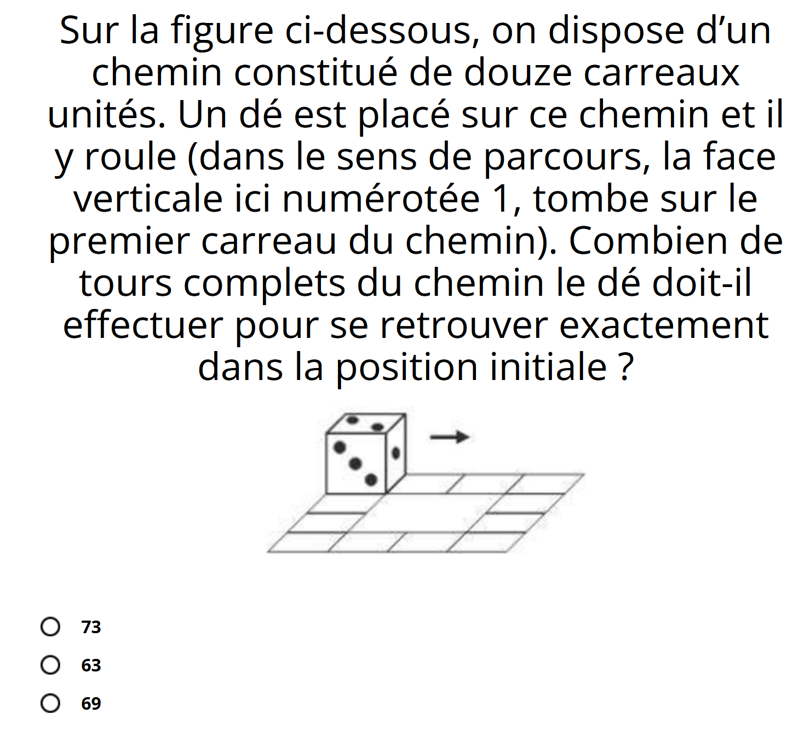

2023-09-06 : ENSAE
==================

**Notions à maîtriser**

* éléments de bases du langages (boucles, listes, tests, fonctions)
* classes (attributes, méthodes, opérateurs, héritages)
* graphes, arbre
* numpy (opérations standard, broadcasting)
* format de données (JSON, XML, HTML, csv)
* tests unitaires (package unittest, git, pull request)
* algorithmes
   * tri fusion
   * recherche dichotomique
   * graphes (composantes connexes, Kruskal)
   * programmation dynamique (chemin plus court dans un graphe, distance d'édition)
   * problème NP-complet tels que le voyageur de commerce

**Notions non abordées**

Elles le seront en seconde année et non en première année : manipulation de données, pandas, machine learning.

**Evaluation**

1 TD noté. Les classes seront abordées et un problème algorithmique.
Voir aussi les précédents énoncés : :ref:`l-exams`.

**Ressources**

* Ce site : `sdpython.github.io/doc/teachpyx/dev/ <https://sdpython.github.io/doc/teachpyx/dev/>`_
* :ref:`l-book-python`
* exercices sur le langage :ref:`l-python`
* exercices sur des algortihmes :ref:`l-algo`
* examens passés :ref:`l-exams`
* Site plus tout-à-fait maintenu `www.xavierdupre.fr <http://www.xavierdupre.fr>`_
* `Plan suivi en 2022
  <http://www.xavierdupre.fr/app/ensae_teaching_cs/helpsphinx3/questions/route_1A_2022.html#seance-1-7-9-introduction-dictionnaire>`_
* `Des aspects plus mathématiques d'algorithmes <https://sdpython.github.io/doc/mlstatpy/dev/>`_

**Problème**

Extrait de 
`Mathématiques: si vous réussissez ce test vous excellerez en classe de seconde
<https://etudiant.lefigaro.fr/article/mathematiques-si-vous-reussissez-ce-test-vous-excellerez-en-classe-de-seconde_ec867a84-4751-11ee-a6a9-64c9036b4094/>`_

**Getting Started**

* `cheat sheet python <https://perso.limsi.fr/pointal/_media/python:cours:mementopython3-english.pdf>`_
* `Anaconda <https://www.anaconda.com/>`_,
  `miniconda <https://docs.conda.io/projects/miniconda/en/latest/>`_,
  `mamba <https://mamba.readthedocs.io/en/latest/mamba-installation.html#mamba-install>`_
* `Visual Studio Code <https://code.visualstudio.com/>`_
* `git <https://git-scm.com/>`_, `github <https://github.com/>`_
* `notebook <https://jupyter.org/>`_

**Sujets connexes**

* Open source et économie du logiciel...
* Ingéniérie logicielle ou comment produire un logiciel fiable en collaboration...
* Notion de `test unitaire <https://fr.wikipedia.org/wiki/Test_unitaire>`_,
  `intégration continue <https://fr.wikipedia.org/wiki/Int%C3%A9gration_continue>`_.

**Demain**

* Intelligence artificielle et puissance de calcul, NVidia
* Objets connectés...
* Quantique...
