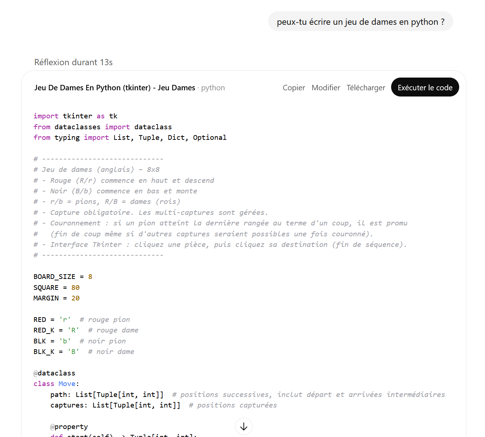

2025-09-03 : ENSAE
==================

**Objectif**

Vous permettre de maîtriser les outils nécessaires à la réalisation de vos
projets, à l'ENSAE et ce qui suivra.

Le langage python est un des plus simples et un des plus populaires.
Il est open source et fonctionne sur tous les systèmes d'exploitation.
Il permet d'accomplir à peu près toutes les tâches, que ce soit
des calculs numériques, la création d'un site web, l'automisation de
tâches répétitives et complexes.

**Notions à maîtriser**

* éléments de bases du langages (boucles, listes, tests, fonctions)
* classes (attributes, méthodes, opérateurs, héritages)
* graphes, arbre
* numpy (opérations standard, broadcasting)
* format de données (JSON, XML, HTML, csv)
* tests unitaires (package unittest, git, pull request)
* profiling
* algorithmes
   * tri fusion
   * recherche dichotomique
   * graphes (composantes connexes, Kruskal, ...)
   * programmation dynamique (chemin plus court dans un graphe, distance d'édition)
   * problème NP-complet tels que le voyageur de commerce
   * comment résoudre un sudoku
   * algorithme alpha-beta pour résoudre un jeu de réflexion (dames, échecs, othello, ...)

**Notions non abordées**

Manipulation de données, pandas, machine learning, elles le seront en seconde année et non en première année.

**Evaluation**

1 TD noté. Les classes seront abordées et un problème algorithmique.
Voir aussi les précédents énoncés : :ref:`l-exams`.

**Le Chat, ChatGPT, Gemini, ...**

Ces outils changent véritablement la façon d'écrire du code.
Ils permettent d'aller parfois trois à quatre fois plus vite
pour résoudre un problème. Ils peuvent fournir une bonne base pour écrire 
de la documentation, des tests unitaires, pour créer un graphique,
traduire un programme dans un autre langage, écrire un algorithme connu
dans un cadre précis.

Ils ne fournissent pas la solution mais une bonne base de départ qu'on peut retravailler
ou ajouter à d'autres bouts de code construits de la même façon.
Pour comprendre les réponses, il est important de connaître le langage
et quelques algorithmes.

La plupart du temps, on n'invente pas de nouveau, on assemble des algortihmes
existants ou on les adapte dans des cas où la version classique est trop longue,
ou ne prend pas en compte une contrainte particulière...

A qui appartient le code écrit ?

**Ressources**

* Ce site : `sdpython.github.io/doc/teachpyx/dev/ <https://sdpython.github.io/doc/teachpyx/dev/>`_
* :ref:`l-book-python`
* exercices sur le langage :ref:`l-python`
* exercices sur des algortihmes :ref:`l-algo`
* examens passés :ref:`l-exams`
* `Des aspects plus mathématiques d'algorithmes <https://sdpython.github.io/doc/mlstatpy/dev/>`_

**Getting Started**

* `cheat sheet python <https://perso.limsi.fr/pointal/_media/python:cours:mementopython3-english.pdf>`_
* `Anaconda <https://www.anaconda.com/>`_,
  `miniconda <https://docs.conda.io/projects/miniconda/en/latest/>`_,
  `mamba <https://mamba.readthedocs.io/en/latest/installation/mamba-installation.html>`_
* `Visual Studio Code <https://code.visualstudio.com/>`_
* `git <https://git-scm.com/>`_, `github <https://github.com/>`_
* `notebook <https://jupyter.org/>`_

**Feuilles de routes**

* :ref:`l-feuille-route-ensae-2024`
* :ref:`l-feuille-route-ensae-2025`
