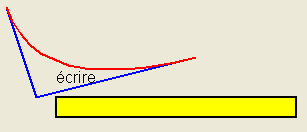
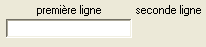
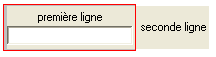
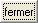
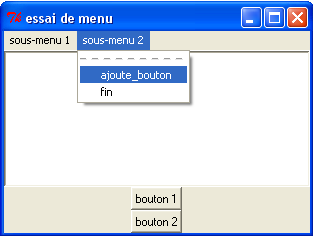
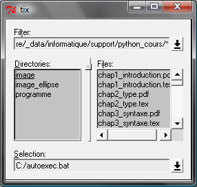
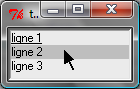
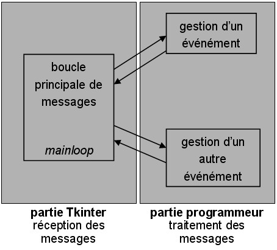
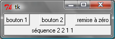

.. _l-tkinter:

.. _chap_tkinter:

.. _chap_interface:

=======
tkinter
=======

.. contents::
    :local:
    :depth: 2

Les interfaces graphiques servent à rendre les programmes plus conviviaux.
Elles sont pratiques à utiliser mais elles demandent un peu de temps pour
les concevoir. Un programme sans interface exécute des instructions les
unes à la suite des autres, le programme a un début - un point d'entrée -
et une fin. Avec une interface, le programme fonctionne de manière
différente. Il n'exécute plus successivement les instructions mais attend
un événement - pression d'une touche du clavier, clic de souris - pour exécuter
une fonction. C'est comme si le programme avait une multitude de points
d'entrée.

Il existe plusieurs modules permettant d'exploiter les interfaces graphiques.
Le plus simple est le module `tkinter <https://docs.python.org/3/library/tk.html>`_
présent lors de l'installation du langage *Python*. Ce module est simple mais limité.
Le module `wxPython <https://wxpython.org/>`_ est une alternative plus riche
mais il faut vérifier que sa dernière mise à jour est assez récente.
La plus connue est `PyQt5 <http://pyqt.sourceforge.net/Docs/PyQt5/>`_
(ou `PyQt4 <http://pyqt.sourceforge.net/Docs/PyQt4/>`_).
Le module `tkinter <https://docs.python.org/3/library/tk.html>`_
fait partie de la distribution standard de *Python* et sera disponible dans
toutes les verions de *Python*. Visuellement, *tkinter* est moins *joli*
que d'autres extensions mais il vaut mieux vérifier
la fréquence des mises à jour de leur code source avant d'en choisir une
`github/wxPython <https://github.com/wxWidgets/wxWidgets>`_
`github/PyQt5 <https://github.com/pyqt/python-qt5>`_.
La licence de `wxPython <https://github.com/wxWidgets/wxWidgets>`_ est plus souple.
D'autres alternatives sont disponibles à
`Other Graphical User Interface Packages <https://docs.python.org/3/library/othergui.html#other-gui-packages>`_.

Le fonctionnement des interfaces graphiques sous un module
ou un autre est presque identique. C'est pourquoi ce chapitre n'en présentera qu'un seul,
le module `tkinter <https://docs.python.org/3/library/tk.html>`_.
Pour d'autres modules, les noms de classes changent mais la logique reste la même :
il s'agit d'associer des événements à des parties du programme *Python*.

Les interfaces graphiques évoluent sans doute plus vite que les autres modules,
des composantes de plus en plus complexes apparaissent régulièrement.
Une excellente source de documentation sont les forums de discussion
qui sont un lieu où des programmeurs échangent questions et réponses.
Un message d'erreur entré sur un moteur de recherche Internet permet souvent
de tomber sur des échanges de ce type, sur des problèmes résolus par d'autres.
Le plus connu est `stackoverflow/tkinter <http://stackoverflow.com/questions/tagged/tkinter>`_.

.. _chap_interface_intro_section:

Introduction
============

Un programme muni d'une interface graphique fonctionne différemment d'un programme classique.
Un programme classique est une succession presque linéaire d'instructions.
Il y a un début ou *point d'entrée* du programme et aucun événement
extérieur ne vient troubler son déroulement.
Avec une interface graphique, le point d'entrée du programme est masqué :
il est pris en compte automatiquement. Du point de vue du programmeur,
le programme a plusieurs points d'entrée : une simple fenêtre avec deux boutons
propose deux façons de commencer et il faut prévoir une action associée
à chaque bouton.

La conception d'une interface graphique se déroule généralement selon
deux étapes. La première consiste à dessiner l'interface, c'est-à-dire
choisir une position pour les objets de la fenêtre (boutons, zone de
saisie, liste déroulante, ...). La seconde étape définit le fonctionnement
de la fenêtre, c'est-à-dire associer à chaque objet des fonctions
qui seront exécutées si un tel événement se réalise (pression d'un bouton,
pression d'une touche, ...).

Pour le moment, nous allons supposer que ces deux étapes sont scindées même
si elles sont parfois entremêlées lorsqu'un événement implique la modification de
l'apparence de la fenêtre. La section qui suit décrit des objets que propose le
module *tkinter*. La section suivante présente la manière de les disposer
dans une fenêtre. La section d'après décrit les événements et le moyen
de les relier à des fonctions du programme. Ce chapitre se termine par quelques
constructions courantes à propos des interfaces graphiques.

.. image:: images/entree.png
    :alt: Une fenêtre contenant deux boutons : ce sont deux points d'entrée du programme.

.. _interface_graphique_objet_s:
    		
Les objets
==========

.. index:: widget

Les interfaces graphiques sont composées d'*objets* ou *widgets* ou *contrôles*.
Comme ils reçoivent des événements, en un sens, ce sont ces objets qui pilotent
un programme ou qui le contrôlent.}. Ce paragraphe décrit les principales méthodes
qui permettent de modifier le contenu et l'apparence des objets.

Les exemples de codes des paragraphes qui suivent permettent de disposer les objets
dans une fenêtre qui ne s'affichera pas sans les quelques lignes de code
supplémentaires présentées au paragraphe :ref:`mainloop_fenetre_principale`
et l'utilisation d'une méthode
`pack <https://docs.python.org/3/library/tkinter.html#the-packer>`_
L'exemple suivant crée un objet :

::

    zone_texte = tkinter.Label (text = "zone de texte")

Et pour l'afficher, il faut l'enrober :

::

    import tkinter         # import de tkinter
    root = tkinter.Tk ()   # création de la fenêtre principale
    # ...
    obj = tkinter.Label (text = "zone de texte")
    # ...
    obj.pack ()            # on ajoute l'objet à la fenêtre principale
    root.mainloop ()       # on affiche enfin la fenêtre principal et on attend
                           # les événements (souris, clic, clavier)

Zone de texte
-------------

.. index:: Entry, zone de texte

Une zone de texte sert à insérer dans une fenêtre graphique une
légende indiquant ce qu'il faut insérer dans une zone de saisie
voisine comme le montre la figure qui suit. Une zone de texte
correspond à la classe ``Label``. Pour créer une zone de texte,
il suffit d'écrire la ligne suivante :

::

    zone_texte = tkinter.Label (text = "zone de texte")

Il est possible que le texte de cette zone de texte doive changer après
quelques temps. Dans ce cas, il faut appeler la méthode ``config`` comme suit :

::

    zone_texte = tkinter.Label (text = "premier texte")
    # ...
    # pour changer de texte
    zone_texte.config (text = "second texte")

.. image:: images/label.png

La zone de texte ou ``Label`` est associée à une zone de saisie.
La seconde image montre une zone de texte dans l'état ``DISABLED``.

L'exemple suivant montre deux zones de texte. La seconde est grisée
par rapport à la première. Pour obtenir cet état,
il suffit d'utiliser l'instruction suivante :

::

    zone_texte.config (state = tkinter.DISABLED)

Et pour revenir à un état normal :

::

    zone_texte.config (state = tkinter.NORMAL)

Ces deux dernières options sont communes à tous les objets d'une
interface graphique. Cette option sera rappelée au paragraphe
:ref:`methode_communes_interface`.

Bouton
------

.. index:: bouton

Un bouton a pour but de faire le lien entre une fonction et un clic de souris.
Un bouton correspond à la classe `Button <http://effbot.org/tkinterbook/button.htm>`_
Pour créer un bouton, il suffit d'écrire la ligne suivante :

::

    bouton = tkinter.Button (text = "zone de texte")

Il est possible que le texte de ce bouton doive changer après quelques temps.
Dans ce cas, il faut appeler la méthode
`config <http://effbot.org/tkinterbook/button.htm#Tkinter.Button.config-method>`_ comme suit :

::

    bouton = tkinter.Button (text = "premier texte")
    # ...
    # pour changer de texte
    bouton.config (text = "second texte")

.. list-table::
    :widths: 5 5 5
    :header-rows: 0

    * - .. image:: images/bouton.png
      - .. image:: images/bouton2.png
      - .. image:: images/bouton3.png
    * - Bouton non pressé
      - Bouton pressé
      - Bouton grisé

Le troisième bouton est grisé par rapport au premier.
Les boutons grisés ne peuvent pas être pressés.
Pour obtenir cet état, il suffit d'utiliser l'instruction suivante :

::

    bouton.config (state = tkinter.DISABLED)

Et pour revenir à un état normal :

::

    bouton.config (state = tkinter.NORMAL)

C'est pour cet objet que cette option est la plus intéressante car elle
permet d'interdire la possibilité pour l'utilisateur
de presser le bouton tout en le laissant visible.

Il est possible également d'associer une image à un bouton. Par exemple,
les trois lignes suivantes créent un bouton, charge une image au format
*gif* puis l'associe au bouton ``b``. Lors de l'affichage de la fenêtre,
le bouton ``b`` ne contient pas de texte mais une image.

.. list-table::
    :widths: 5 5
    :header-rows: 0

    * - ::

            b = tkinter.Button()
            im = tkinter.PhotoImage(file="chameau.gif")
            b.config(image=im)
      - .. image:: images/bbette2.png

Les images qu'il est possible de charger sont nécessairement au
format *GIF*, le seul que le module *tkinter* puisse lire.

.. _tkinter-entry:

Zone de saisie
--------------

.. index:: Entry, zone de saisie

Une zone de saisie a pour but de recevoir une information entrée
par l'utilisateur. Une zone de saisie correspond à la classe
`Entry <http://effbot.org/tkinterbook/entry.htm>`_ ;
pour en créer une, il suffit d'écrire la ligne suivante :

::

    saisie = tkinter.Entry ()

Pour modifier le contenu de la zone de saisie, il faut utiliser
la méthode `insert <http://effbot.org/tkinterbook/entry.htm#Tkinter.Entry.insert-method>`_
qui insère un texte à une position donnée.

::

    # le premier paramètre est la position
    # où insérer le texte (second paramètre)
    saisie.insert (pos, "contenu")

Pour obtenir le contenu de la zone de saisie, il faut utiliser la méthode
`get <http://effbot.org/tkinterbook/entry.htm#Tkinter.Entry.get-method>`_ :

::

    contenu = saisie.get ()

Pour supprimer le contenu de la zone de saisie, il faut utiliser la
méthode `delete <http://effbot.org/tkinterbook/entry.htm#Tkinter.Entry.delete-method>`_.
Cette méthode supprime le texte entre deux positions.

::

    # supprime le texte entre les positions pos1, pos2
    saisie.delete (pos1, pos2)

Par exemple, pour supprimer le contenu d'une zone de saisie,
on peut utiliser l'instruction suivante :

::

    saisie.delete (0, len(saisie.get()))

.. list-table::
    :widths: 5 5
    :header-rows: 0

    * - .. image:: images/saisie1.png
      - .. image:: images/saisie2.png
    * - Zone de saisie normale
      - Zone de saisie grisée

La seconde zone de saisie est grisée par rapport à la première.
Les zones de saisie grisées ne peuvent pas être modifiées. Pour obtenir
cet état, il suffit d'utiliser la méthode
`config <http://effbot.org/tkinterbook/entry.htm#Tkinter.Entry.config-method>`_
comme pour les précédents objets. Cette option sera rappelée au paragraphe
:ref:`methode_communes_interface`.

.. _tkinter-text:

Zone de saisie à plusieurs lignes
---------------------------------

.. index:: zone de saisie à plusieurs lignes, Text

Une zone de saisie à plusieurs lignes est identique à la précédente à ceci
près qu'elle autorise la saisie d'un texte sur plusieurs lignes. Cette zone
correspond à la classe `Text <http://effbot.org/tkinterbook/text.htm>`_.
Pour créer une telle zone, il suffit d'écrire la ligne suivante :

::

    saisie = tkinter.Text ()

Pour modifier le contenu de la zone de saisie, il faut utiliser la méthode
`insert <http://effbot.org/tkinterbook/text.htm#Tkinter.Text.insert-method>`_
qui insère un texte à une position donnée. La méthode diffère de celle
de la classe :ref:`Entry <tkinter-entry>` puisque la position d'insertion est
maintenant une chaîne de caractères contenant deux nombres séparés
par un point : le premier nombre désigne la ligne, le second la position sur cette ligne.

::

    # le premier paramètre est la position
    # où insérer le texte (second paramètre)
    pos = "0.0"
    saisie.insert (pos, "première ligne\nseconde ligne")

Pour obtenir le contenu de la zone de saisie, il faut utiliser la méthode
`get <http://effbot.org/tkinterbook/text.htm#Tkinter.Text.get-method>`_
qui retourne le texte entre deux positions. La position de fin n'est pas
connue, on utilise la chaîne de caractères ``"end"`` pour désigner la fin de la zone de saisie.

::

    # retourne le texte entre deux positions
    pos1 = "0.0"
    pos2 = "end"  # ou tkinter.END
    contenu = saisie.get (pos1, pos2)

Pour supprimer le contenu de la zone de saisie, il faut utiliser la méthode
`delete <http://effbot.org/tkinterbook/text.htm#Tkinter.Text.delete-method>`_.
Cette méthode supprime le texte entre deux positions.

::

    # supprime le texte entre les positions pos1, pos2
    saisie.delete (pos1, pos2)

Par exemple, pour supprimer le contenu d'une zone de saisie à
plusieurs lignes, on peut utiliser l'instruction suivante :

::

    saisie.delete ("0.0", "end")
    # on peut aussi utiliser
    # saisie.delete ("0.0", tkinter.END)

Pour modifier les dimensions de la zone de saisie à plusieurs lignes,
on utilise l'instruction suivante :

.. list-table::
    :widths: 5 5
    :header-rows: 0

    * - ::

            # modifie les dimensions de la zone
            # width <--> largeur
            # height <--> hauteur en lignes
            saisie.config (width = 10, height = 5)

      - * .. image:: images/text1.png

L'image précédente montre une zone de saisie à plusieurs lignes.
Pour griser cette zone, il suffit d'utiliser la méthode
`config <http://effbot.org/tkinterbook/text.htm#Tkinter.Text.config-method>`_
rappelée au paragraphe :ref:`methode_communes_interface`.

.. _tkinter-checkbutton:

Case à cocher
-------------

.. index:: CheckButton, case à cocher

Une case à cocher correspond à la classe
`Checkbutton <http://effbot.org/tkinterbook/checkbutton.htm>`_.
Pour créer une case à cocher, il suffit d'écrire la ligne suivante :

::

    # crée un objet entier pour récupérer la valeur de la case à cocher,
    # 0 pour non cochée, 1 pour cochée
    v    = tkinter.IntVar ()
    case = tkinter.Checkbutton (variable = v)

En fait, ce sont deux objets qui sont créés. Le premier, de type
`IntVar <http://effbot.org/tkinterbook/variable.htm>`_,
mémorise la valeur de la case à cocher. Le second objet, de type
`Checkbutton <http://effbot.org/tkinterbook/checkbutton.htm>`_, gère l'apparence
au niveau de l'interface graphique. La raison de ces deux objets est plus
évidente dans le cas de l'objet
:ref:`RadioButton <tkinter-checkbutton>` décrit au paragraphe suivant.
Pour savoir si la case est cochée ou non, il suffit d'exécuter l'instruction :

::

    v.get ()  # égal à 1 si la case est cochée, 0 sinon

Pour cocher et décocher la case, il faut utiliser les instructions suivantes :

::

    case.select ()      # pour cocher
    case.deselect ()    # pour décocher

Il est possible d'associer du texte à l'objet case à cocher :

::

    case.config (text = "case à cocher")

.. list-table::
    :widths: 5 5
    :header-rows: 0

    * - .. image:: images/check.png
      - .. image:: images/check2.png
    * - Cases à cocher cochée, non cochée, grisée
      - Case à cocher avec une légende

La troisième est grisée par rapport à la première. Les cases grisées ne peuvent pas être cochées.
Pour obtenir cet état, il suffit d'utiliser la méthode
`config <http://effbot.org/tkinterbook/checkbutton.htm#Tkinter.Checkbutton.config-method>`_
rappelée au paragraphe :ref:`methode_communes_interface`.

.. _tkinter-radiobutton:

Case ronde ou bouton radio
--------------------------

.. index:: RadioButton, bouton radio, IntVar

Une case ronde ou *bouton radio* correspond à la classe
`Radiobutton <http://effbot.org/tkinterbook/radiobutton.htm>`_.
Elles fonctionnent de manière semblable à des cases à cocher excepté le
fait qu'elles n'apparaissent jamais seules : elles fonctionnent en groupe.
Pour créer un groupe de trois cases rondes, il suffit d'écrire la ligne suivante :

::

    # crée un objet entier partagé pour récupérer le numéro du bouton radio activé
    v     = tkinter.IntVar ()
    case1 = tkinter.Radiobutton (variable = v, value = 10)
    case2 = tkinter.Radiobutton (variable = v, value = 20)
    case3 = tkinter.Radiobutton (variable = v, value = 30)

La variable ``v`` est partagée par les trois cases rondes.
L'option ``value`` du constructeur permet d'associer un bouton radio à
une valeur de ``v``. Si ``v == 10``, seul le premier bouton radio sera
sélectionné. Si ``v == 20``, seul le second bouton radio le sera. Si
deux valeurs sont identiques pour deux boutons radio, ils seront cochés
et décochés en même temps. Et pour savoir quel bouton radio est coché ou
non, il suffit d'exécuter l'instruction :

::

    v.get ()  #  retourne le numéro du bouton radio coché (ici, 10, 20 ou 30)

Pour cocher un des boutons radio, il faut utiliser l'instruction suivante :

::

    v.set (numero)  # numéro du bouton radio à cocher
                    # pour cet exemple, 10, 20 ou 30

Il est possible d'associer du texte à un bouton radio.

::

    case1.config (text = "premier bouton")
    case2.config (text = "second bouton")
    case3.config (text = "troisième bouton")

Visuellement, cela donne :

.. list-table::
    :widths: 5 5
    :header-rows: 0

    * - .. image:: images/radio.png
      - .. image:: images/radio2.png

Lorsqu'un bouton radio est grisé,
son état ne peut être modifié. La seconde image présente un groupe de bouton radio. Un
seul peut être sélectionné à la fois à moins que deux boutons ne soient associés à la même
valeur. Dans ce cas, ils agiront de pair.

.. _tkinter-list:

Liste
-----

.. index:: ListBox

Un objet liste contient une liste d'intitulés qu'il est possible de
sélectionner. Une liste correspond à la classe
`ListBox <http://effbot.org/tkinterbook/listbox.htm>`_.
Pour la créer, il suffit d'écrire la ligne suivante :

::

    li  = tkinter.Listbox ()

Pour modifier les dimensions de la zone de saisie à plusieurs lignes,
on utilise l'instruction suivante :

::

    # modifie les dimensions de la liste
    # width <--> largeur
    # height <--> hauteur en lignes
    li.config (width = 10, height = 5)

On peut insérer un élément dans la liste avec la méthode
`insert <http://effbot.org/tkinterbook/listbox.htm#Tkinter.Listbox.insert-method>`_ :

::

    pos = 0   # un entier, "end" ou tkinter.END pour insérer ce mot à la fin
    li.insert (pos, "première ligne")

On peut supprimer des intitulés de cette liste avec la méthode
`delete <http://effbot.org/tkinterbook/listbox.htm#Tkinter.Listbox.delete-method>`_.

::

    pos1 = 0    # un entier
    pos2 = None # un entier, "end" ou tkinter.END pour supprimer tous les éléments
                # de pos1 jusqu'au dernier
    li.delete (pos1, pos2 = None)

Les intitulés de cette liste peuvent ou non être sélectionnés. Cliquer sur un
intitulé le sélectionne mais la méthode
`select_set <http://effbot.org/tkinterbook/listbox.htm#Tkinter.Listbox.select_set-method>`_
permet aussi de le faire.

::

    pos1 = 0
    li.select_set (pos1, pos2 = None)
    # sélectionne tous les éléments entre les indices pos1 et
    # pos2 inclus ou seulement celui d'indice pos1 si pos2 == None

Réciproquement, il est possible d'enlever un intitulé de la sélection à
l'aide de la méthode
`select_clear <http://effbot.org/tkinterbook/listbox.htm#Tkinter.Listbox.select_clear-method>`_.

::

    pos1 = 0
    li.select_clear (pos1, pos2 = None)
    # retire la sélection de tous les éléments entre les indices
    # pos1 et pos2 inclus ou seulement celui d'indice pos1 si pos2 == None

La méthode
`curselection <http://effbot.org/tkinterbook/listbox.htm#Tkinter.Listbox.curselection-method>`_
permet d'obtenir la liste des indices des éléments sélectionnés.

::

    sel = li.curselection ()

La méthode
`get <http://effbot.org/tkinterbook/listbox.htm#Tkinter.Listbox.get-method>`_
permet récupérer un élément de la liste tandis que la méthode \codes{size} retourne le nombre d'éléments :\indextkk{size}\indextkk{get}

::

    for i in range (0, li.size()):
        print(li.get (i))

Exemple de liste. La seconde liste est grisée et ne peut être modifiée.

.. list-table::
    :widths: 5 5
    :header-rows: 0

    * - .. image:: images/list1.png
      - .. image:: images/list2.png

Pour obtenir l'état grisé, il faut appeler la méthode
`config <http://effbot.org/tkinterbook/listbox.htm#Tkinter.Listbox.config-method>`_
et rappelée au paragraphe :ref:`methode_communes_interface`.
Il est possible d'adjoindre une barre de défilement verticale. Il faut pour
cela inclure l'objet dans une sous-fenêtre
`Frame <http://effbot.org/tkinterbook/frame.htm>`_
qui est définie au paragraphe :ref:`interf_fraph_sous_gene`
comme dans l'exemple suivant :

::

    frame      = tkinter.Frame (parent)
    scrollbar  = tkinter.Scrollbar (frame)
    li         = tkinter.Listbox (frame, width = 88, height = 6, \
                                  yscrollcommand = scrollbar.set)
    scrollbar.config (command = li.yview)
    li.pack (side = tkinter.LEFT)
    scrollbar.pack (side = tkinter.RIGHT, fill = tkinter.Y)

Il suffit de transposer cet exemple pour ajouter une barre de défilement horizontale.
Toutefois, il est préférable d'utiliser un objet prédéfini présent dans le module
`tix <https://docs.python.org/3/library/tkinter.tix.html>`_
qui est une extension du module
`tkinter <https://docs.python.org/3/library/tk.html>`_.
Elle est présentée au paragraphe :ref:`chap_interface_exemple_programme`.

Lorsqu'on insère plusieurs objets
`ListBox <http://effbot.org/tkinterbook/listbox.htm>`_
dans une seule fenêtre, ces objets partagent par défaut la même sélection.
Autrement dit, lorsqu'on clique sur un élément de la seconde
`ListBox <http://effbot.org/tkinterbook/listbox.htm>`_,
l'élément sélectionné dans la première ne l'est plus. Afin de pouvoir
sélectionner un élément dans chaque
`ListBox <http://effbot.org/tkinterbook/listbox.htm>`_, il faut ajouter
dans les paramètres du constructeur l'option ``exportselection=0``
comme l'illustre l'exemple suivant :

::

    li = tkinter.Listbox (frame, width = 88, height = 6, exportselection=0)

Il existe des méthodes plus avancées qui permettent de modifier l'aspect
graphique d'un élément comme la méthode
`itemconfig <http://effbot.org/tkinterbook/listbox.htm#Tkinter.Listbox.itemconfig-method>`_.
Son utilisation est peu fréquente à moins de vouloir réaliser une belle
interface graphique. Le paragraphe :ref:`more_than_on_e_window_ref_liste`
montre l'utilisation qu'on peut en faire.

.. _chap_interface_exemple_programme:

Liste avec barre de défilement, Combobox
----------------------------------------
	
C'est une liste avec une barre de défilement incluse qui est présente dans l'extension
`ttk <https://docs.python.org/3/library/tkinter.ttk.html>`_
qui étend la liste des objets proposés par
`tkinter <https://docs.python.org/3/library/tk.html>`_.
C'est ce que fait l'objet
`ttk.Combobox <https://docs.python.org/3.6/library/tkinter.ttk.html?highlight=combobox#tkinter.ttk.Combobox>`_.

::

    import tkinter
    import tkinter.ttk as ttk

    root = tkinter.Tk()

    o = ttk.Combobox(root, values=["ligne 1", "ligne 2", "ligne 3", "ligne 4"])
    o.pack ()

    def print_file () :                     # voir le chapitre sur les événements
        print(o.get())

    b = tkinter.Button (root, text="print")
    b.config (command = print_file)         # idem
    b.pack ()

    root.mainloop()                         # idem

Les extensions `ttk <https://docs.python.org/3/library/tkinter.ttk.html>`_
et `tix <https://docs.python.org/3/library/tkinter.tix.html>`_
ne sont pas très bien documentés mais il existe de nombreuses
réponses sur les forums de discussions.

.. list-table::
    :widths: 5 5
    :header-rows: 0

    * - .. image:: images/combo1.png
      - .. image:: images/combo2.png

Canevas
-------

Pour dessiner, il faut utiliser un objet canevas,
correspondant à la classe
`Canvas <http://effbot.org/tkinterbook/canvas.htm>`_.
Pour la créer, il suffit d'écrire la ligne suivante :

::

    ca = tkinter.Canvas ()

Pour modifier les dimensions de la zone de saisie à plusieurs lignes,
on utilise l'instruction suivante :

::

    # modifie les dimensions du canevas
    # width <--> largeur en pixels
    # height <--> hauteur en pixels
    ca.config (width = 10, height = 5)

Cet objet permet de dessiner des lignes, des courbes, d'écrire du
texte grâce aux méthodes
`create_line <http://effbot.org/tkinterbook/canvas.htm#Tkinter.Canvas.create_line-method>`_,
`create_rectangle <http://effbot.org/tkinterbook/canvas.htm#Tkinter.Canvas.create_rectangle-method>`_,
`create_text <http://effbot.org/tkinterbook/canvas.htm#Tkinter.Canvas.create_text-method>`_.

::

      # dessine deux lignes du point 10,10 au point 40,100 et au point 200,60
      # de couleur bleue, d'épaisseur 2
    ca.create_line (10,10,40,100, 200,60, fill = "blue", width = 2)
      # dessine une courbe du point 10,10 au point 200,60
      # de couleur rouge, d'épaisseur 2, c'est une courbe de Bézier
      # pour laquelle le point  40,100 sert d'assise
    ca.create_line (10,10, 40,100, 200,60, smooth=1, fill = "red", width = 2)
      # dessine un rectangle plein de couleur jaune, de bord noir et d'épaisseur 2
    ca.create_rectangle (300,100,60,120, fill = "gray", width = 2)
      # écrit du texte de couleur noire au point 80,80 et avec la police arial
    ca.create_text (80,80, text = "écrire", fill = "black", font = "arial")

Visuellement, cela donne :

    	
Menus
-----

Les menus apparaissent en haut des fenêtres. La plupart des
applications arborent un menu commençant par *Fichier Edition Affichage...*
Le paragraphe :ref:`interface_label_menu` les décrit en détail.

.. _methode_communes_interface:

Méthodes communes
-----------------

Nous avons vu que tous les objets présentés dans ce
paragraphe possèdent une méthode
``config``
qui permet de définir l'état du widget (grisé ou normal)
voire de la faire disparaître
(voir paragraphe :ref:`disposition_paragraphe_python`).

::

    widget.config (state = tkinter.DISABLED) # grisé
    widget.config (state = tkinter.NORMAL)   # aspect normal

Elle permet également de modifier le texte d'un objet, sa position, ...
De nombreuses options sont communes à tous les objets et certaines
sont spécifiques. L'aide associée à cette méthode
n'est pas très explicite (par exemple ``help(tkinter.Label.config)``).
En fait, le constructeur et cette méthode ont les mêmes paramètres optionnels.
Il est équivalent de préciser ces options lors de l'appel au constructeur :

::

   l = tkinter.Label (text = "légende")

Ou de les modifier à l'aide de la méthode ``config`` :

::

   l = tkinter.Label ()
   l.config (text = "légende")

L'aide associée à la méthode \codes{config} n'a pas évolué depuis la version 2.5 de *Python* :

::

    Help on method configure in module tkinter:

    configure(self, cnf=None, **kw) unbound tkinter.Label method
        Configure resources of a widget.

        The values for resources are specified as keyword
        arguments. To get an overview about
        the allowed keyword arguments call the method keys.

Tandis que l'aide associée au constructeur d'un object :

.. runpython::
    :showcode:
    :process:

    import tkinter
    help(tkinter.Button.__init__)

Cette aide mentionne les options communes à tous les objets (ou widgets)
et les options spécifiques à cet objet. Toutes ont une valeur par
défaut qu'il est possible de changer soit dans le constructeur,
soit par la méthode ``config``. Quelques-unes ont été décrites,
d'autres permettent de modifier entre autres la police avec
laquelle est affiché le texte de l'objet (option ``font``),
la couleur du fond (option ``background``), l'alignement du texte,
à gauche, à droite, centré (option ``justify``), l'épaisseur du
bord (option ``borderwidth``), le fait qu'un objet reçoive le
*focus* (voir paragraphe :ref:`focus_paragraphebb`)
après la pression de la touche tabulation (option ``takefocus``).

.. _disposition_paragraphe_python:

Disposition des objets dans une fenêtre
=======================================

Emplacements
------------

Chacun des objets (ou widgets) présentés au paragraphe précédent
possède trois méthodes qui permettent de déterminer sa position dans
une fenêtre :
`pack <https://docs.python.org/3/library/tkinter.html#the-packer>`_,
`grid <http://effbot.org/tkinterbook/grid.htm>`_,
`place <http://effbot.org/tkinterbook/place.htm>`_.
Les deux premières permettent de disposer les objets sans se soucier
ni de leur dimension ni de leur position. La fenêtre gère cela
automatiquement. La dernière place les objets dans une fenêtre à
l'aide de coordonnées sans utiliser l'aide d'aucune grille. Dans
une fenêtre, tous les objets doivent être placés avec la même méthode.
Dans le cas contraire, les résultats risquent ne pas être ceux attendus.

Méthode pack
++++++++++++

Cette méthode empile les objets les uns à la suite des autres.
Par défaut, elle les empile les uns en dessous des autres.
Par exemple, l'exemple suivant produit l'empilement des objets.

::

    l = tkinter.Label (text = "première ligne")
    l.pack ()
    s = tkinter.Entry ()
    s.pack ()
    e = tkinter.Label (text = "seconde ligne")
    e.pack ()

Les objets sont empilés à l'aide de la méthode ``pack``
les uns en dessous des autres pour la première image, les uns à droite des
autres pour la seconde image.

.. list-table::
    :widths: 5 5
    :header-rows: 0

    * - .. image:: images/pack1.png
      - .. image:: images/pack2.png

On peut aussi les empiler les uns à droite des autres grâce à l'option ``side``.

::

    l = tkinter.Label (text = "première ligne")
    l.pack (side = tkinter.RIGHT)
    s = tkinter.Entry ()
    s.pack (side = tkinter.RIGHT)
    e = tkinter.Label (text = "seconde ligne")
    e.pack (side = tkinter.RIGHT)

La méthode ``pack`` possède trois options :

* ``side`` : à choisir entre ``tkinter.TOP`` (valeur par défaut),
   ``tkinter.LEFT``, ``tkinter.BOTTOM``, ``tkinter.RIGHT``
* ``expand`` : égale à ``True`` ou ``False`` (valeur par défaut),
  si cette option est vraie, l'objet occupe tout l'espace.
* ``fill`` : égale à ``None`` (valeur par défaut), ``X``, ``Y``,
  ``BOTH``, l'objet s'étend selon un axe (X ou Y ou les deux).

Il n'est pas toujours évident d'obtenir du premier coup le positionnement
des objets souhaités au départ et il faut tâtonner pour y arriver.
Lorsque un objet n'est plus nécessaire, il est possible de le faire
disparaître en appelant la méthode
`pack_forget <http://effbot.org/tkinterbook/pack.htm#Tkinter.Pack.pack_forget-method>`_.
Le rappel de la méthode `pack <http://effbot.org/tkinterbook/pack.htm#Tkinter.Pack.pack-method>`_
le fera réapparaître mais rarement au même endroit.

::

   s.pack_forget()   # disparition
   s.pack()          # insertion à un autre endroit

Méthode grid
++++++++++++

La méthode `grid <http://effbot.org/tkinterbook/grid.htm>`_
suppose que la fenêtre qui les contient est organisée selon une grille
dont chaque case peut recevoir un objet. L'exemple suivant place
trois objets dans les cases de coordonnées
*(0,0)*, *(1,0)* et *(0,1)*.

::

    l = tkinter.Label (text = "première ligne")
    l.grid (column = 0, row = 0)
    s = tkinter.Entry ()
    s.grid (column = 0, row = 1)
    e = tkinter.Label (text = "seconde ligne")
    e.grid (column = 1, row = 0)

Les objets sont placés dans une grille à l'aide de la méthode ``grid``.
Une fois que chaque objet a reçu une position, à l'affichage, il ne sera pas tenu
compte des lignes et colonnes vides.

La méthode `grid <http://effbot.org/tkinterbook/grid.htm>`_
possède plusieurs options, en voici cinq :

* ``column`` : colonne dans laquelle sera placée l'objet.
* ``columnspan`` : nombre de colonnes que doit occuper l'objet.
* ``row`` : ligne dans laquelle sera placée l'objet.
* ``rowspan`` : nombre de lignes que doit occuper l'objet.
* ``sticky`` : indique ce qu'il faut faire lorsque la case est plus grande
  que l'objet qu'elle doit contenir. Par défaut, l'objet est centré mais
  il est possible d'aligner l'objet sur un ou plusieurs bords en précisant
  que ``sticky="N"`` ou ``"S"`` ou ``"W"`` ou ``"E"``. Pour aligner l'objet
  sur un angle, il suffit de concaténer les deux lettres
  correspondant aux deux bords concernés. Il est aussi possible
  d'étendre l'objet d'un bord à l'autre en écrivant ``sticky="N+S"``
  ou ``sticky="E+W"``.

Enfin, comme pour la méthode `pack <https://docs.python.org/3/library/tkinter.html#the-packer>`_,
il existe une méthode `grid_forget <http://effbot.org/tkinterbook/grid.htm#Tkinter.Grid.grid_forget-method>`_
qui permet de faire disparaître les objets.

::

    s.grid_forget()  # disparition

Méthode place
+++++++++++++

La méthode `place <http://effbot.org/tkinterbook/place.htm>`_
est sans doute la plus simple à comprendre puisqu'elle permet
de placer chaque objet à une position définie par des coordonnées.
Elle peut être utilisée en parallèle avec les méthodes
`place <http://effbot.org/tkinterbook/place.htm>`_ et
`grid <http://effbot.org/tkinterbook/grid.htm>`_.

::

    l = tkinter.Label(text="première ligne")
    l.place (x=10, y=50)

La méthode `place_forget <http://effbot.org/tkinterbook/place.htm#Tkinter.Place.place_forget-method>`_
permet de faire disparaître un objet placer avec cette méthode.
L'inconvénient de cette méthode survient lorsqu'on cherche à modifier
l'emplacement d'un objet : il faut en général revoir les positions de
tous les autres éléments de la fenêtre. On procède souvent par tâtonnement
pour construire une fenêtre et disposer les objets. Ce travail est beaucoup
plus long avec la méthode `place <http://effbot.org/tkinterbook/place.htm>`_.

.. _interf_fraph_sous_gene:

Sous-fenêtre
------------

Les trois méthodes précédentes ne permettent pas toujours de placer
les éléments comme on le désire. On souhaite parfois regrouper les
objets dans des boîtes et placer celles-ci les unes par rapport aux autres.
C'est aussi la seule façon de réutiliser un groupe de contrôle ou widgets
dans plusieurs fenêtres sans avoir à dupliquer le code.
La figure suivante montre deux objets regroupés dans un rectangle avec à sa
gauche une zone de texte. Les boîtes sont des instances de la classe
`Frame <http://effbot.org/tkinterbook/frame.htm>`_.

Les deux premiers objets, une zone de texte au-dessus d'une zone de saisie,
sont regroupés dans une boîte rectangle rouge, invisible à l'écran.
A droite et centrée, une dernière zone de texte. Cet alignement est plus simple à réaliser
en regroupant les deux premiers objets dans un object
`Frame <http://effbot.org/tkinterbook/frame.htm>`_.
Pour créer une boîte, il suffit d'écrire la ligne suivante :

::

    f = tkinter.Frame ()

Ensuite, il faut pouvoir affecter un objet à cette boîte ``f``.
Pour cela, il suffit que ``f`` soit le premier paramètre du
constructeur de l'objet créé :

::

    l = tkinter.Label (f, text = "première ligne")

L'exemple qui suit correspond au code qui permet d'afficher
la fenêtre de la figure ci-dessus.

::

    f = tkinter.Frame ()
    l = tkinter.Label (f, text = "première ligne")
    l.pack ()                     # positionne l à l'intérieur de f
    s = tkinter.Entry (f)
    s.pack ()                     # positionne s à l'intérieur de f
    f.pack (side = tkinter.LEFT)  # positionne f à l'intérieur
                                  #   de la fenêtre principale
    e = tkinter.Label (text = "seconde ligne")
    e.pack_forget ()
    e.pack (side = tkinter.RIGHT) # positionne e à l'intérieur
                                  #   de la fenêtre principale

L'utilisation de ces blocs `Frame <http://effbot.org/tkinterbook/frame.htm>`_
est pratique lorsque le même ensemble de contrôles apparaît dans
plusieurs fenêtres différentes ou au sein de la même fenêtre.
Cette possibilité est envisagée au paragraphe
:ref:`more_than_on_e_window_ref`.

Evénements
==========

.. _mainloop_fenetre_principale:

Fenêtre principale
------------------

Tous les exemples des paragraphes précédents décrivent les
différents objets disponibles et comment les disposer dans une
fenêtre. Pour afficher cette fenêtre, il suffit d'ajouter au
programme les deux lignes suivantes :

::

    root = tkinter.Tk ()
    #  ici, on trouve le code qui définit les objets
    #  et leur positionnement
    root.mainloop ()

La première ligne permet d'obtenir un identificateur relié à
la fenêtre principale. La seconde ligne, outre le fait qu'elle
affiche cette fenêtre, lance ce qu'on appelle une
*boucle de messages*. Cette fonction récupère ou plutôt intercepte
les événements comme un clic de souris, la pression d'une touche.
Elle parcourt ensuite tous les objets qu'elle contient et regarde
si l'un de ces objets est intéressé par cet événement.
S'il est intéressé, cet objet prend l'événement et le traite.
On peut revenir ensuite à la fonction ``mainloop`` qui attend à
nouveau un événement. Cette fonction est définie par *tkinter*,
il reste à lui indiquer quels événements un objet désire intercepter
et ce qu'il est prévu de faire au cas où cet événement se produit.

.. _focus_paragraphebb:

Focus
-----

Une fenêtre peut contenir plusieurs zones de saisie, toutes capables
d'intercepter la pression d'une touche du clavier et d'ajouter
la lettre correspondante à la zone de saisie. Or la seule qui
ajoute effectivement une lettre à son contenu est celle qui a le
`focus <http://effbot.org/tkinterbook/tkinter-events-and-bindings.htm>`_.
La pression de la touche tabulation fait passer le focus d'un
objet à l'autre. La figure ci-dessous montre un bouton qui a le focus.
Lorsqu'on désire qu'un objet en particulier ait le focus,
il suffit d'appeler la méthode
`focus_set <http://effbot.org/tkinterbook/tkinter-events-and-bindings.htm>`_.

Ce bouton est entouré d'un cercle noir en pointillé, il a le *focus*.
Pour changer le *focus* :

::

    e = tkinter.Entry(root)
    e.pack()
    e.focus_set()

				

Lancer une fonction lorsqu'un bouton est pressé
-----------------------------------------------

La plupart de temps, le seul événement qu'on souhaite attraper
est la pression d'un bouton. Le code suivant permet de créer
un bouton dont l'identificateur est ``b``. Il a pour intitulé ``fonction change_legende``.
On définit ensuite une fonction ``change_legende`` qui change la légende
de ce bouton. L'avant-dernière ligne permet d'associer au bouton
``b`` la fonction ``change_legende`` qui est alors appelée lorsque
le bouton est pressé. La dernière ligne affiche la fenêtre principale
et lance l'application.

::

    import tkinter
    root = tkinter.Tk ()
    b = tkinter.Button (text = "fonction change_legende")
    b.pack ()

    def change_legende () :
        global b
        b.config (text = "nouvelle légende")

    b.config (command = change_legende)
    root.mainloop ()

Lorsque le bouton ``b`` est pressé, on vérifie qu'il change bien de
légende. La première fenêtre est celle qui apparaît lorsque le programme
est lancé. Comme le bouton change de légende la première
fois qu'il est pressé, l'apparence de la fenêtre change aussi, ce que montre la seconde image.

.. list-table::
    :widths: 5 5
    :header-rows: 0

    * - .. image:: images/comm1.png
      - .. image:: images/comm2.png

L'exemple précédent associe une fonction au bouton. Lorsque l'interface
devient conséquente, la lisibilité du programme en est réduite
car le nombre de fonctions associées à des boutons augmentent rapidement.
Pour éviter cela, il est possible d'associer au bouton une méthode de
classe comme le suggère l'exemple du paragraphe :ref:`more_than_on_e_window_ref`.
C'est même recommandé.

.. _parag_graph_bind:
				
Associer n'importe quel événement à un objet
--------------------------------------------

Le paragraphe précédent s'est intéressé à l'association entre une
fonction et la pression d'un bouton mais il est possible de faire
en sorte que le programme exécute une fonction au moindre
déplacement de la souris, à la pression d'une touche. Il est
possible d'associer une fonction au moindre événement susceptible
d'être intercepté par l'interface graphique.

On peut regrouper les événements en deux classes. La première classe
regroupe les événements provenant du clavier ou de la souris.
Ce sont des événements en quelque sorte *bruts*.
La seconde classe regroupe des événements produit par des objets
tels qu'un bouton. En effet, lorsque celui-ci détecte le clic
du bouton droit de la souris, il construit un événement *"pression du bouton"*
et c'est celui-ci qui va déclencher l'exécution d'une fonction.
Il n'est pas souvent nécessaire de revenir aux événements *bruts*
car les objets proposent d'eux-mêmes de pouvoir attacher des
fonctions à des événements liés à leur apparence.

Toutefois, pour un jeu par exemple, il est parfois nécessaire
d'avoir accès au mouvement de la souris et il faut revenir aux
événements *bruts*. Un événement est décrit par la classe
`Event <http://effbot.org/tkinterbook/tkinter-events-and-bindings.htm#events>`_
dont les attributs listés par la table suivante décrivent l'événement
qui sera la plupart du temps la pression d'une touche du clavier
ou le mouvement de la souris.

.. list-table::
    :widths: 5 10
    :header-rows: 0

    * - ``char``
      - Lorsqu'une touche a été pressée, cet attribut contient son code,
        il ne tient pas compte des touches dites muettes comme les touches ``shift``,
        ``ctrl``, ``alt``. Il tient pas compte non plus des touches
        ``return`` ou ``suppr``.
    * - ``keysym``
      - Lorsqu'une touche a été pressée, cet attribut contient son code, quelque
        soit la touche, muette ou non.
    * - ``num``
      - Contient un identificateur de l'objet ayant reçu l'événement.
    * - x,y
      - Coordonnées relatives de la souris par rapport au coin supérieur
        gauche de l'objet ayant reçu l'événement.
    * - ``x_root, y_root``
      - Coordonnées absolues de la souris par rapport au coin supérieur gauche de l'écran.
    * - ``widget``
      - Identifiant permettant d'accéder à l'objet ayant reçu l'événement.

La liste complète est accessible avec l'instruction suivante :

.. runpython::
    :showcode:
    :process:

    import tkinter
    help(tkinter.Event)

La méthode `bind <http://effbot.org/tkinterbook/tkinter-events-and-bindings.htm>`_
permet d'exécuter une fonction lorsqu'un certain événement donné est
intercepté par un objet donné. La fonction exécutée accepte un seul
paramètre de type `Event <http://effbot.org/tkinterbook/tkinter-events-and-bindings.htm#events>`_
qui est l'événement qui l'a déclenchée. Cette méthode a pour syntaxe :

::

    w.bind(ev, fonction)

``w`` est l'identificateur de l'objet devant intercepter l'événement désigné par la chaîne de
caractères ``ev`` dont les valeurs possibles sont décrites ci-dessous.
``fonction`` est la fonction qui est appelée lorsque l'événement survient. Cette fonction
ne prend qu'un paramètre de type
`Event <http://effbot.org/tkinterbook/tkinter-events-and-bindings.htm#events>`_.

.. list-table::
    :widths: 5 10
    :header-rows: 0

    * - ``<Key>``
      - Intercepter la pression de n'importe quelle touche du clavier.
    * - ``<Button-i>``
      - Intercepter la pression d'un bouton de la souris.
        ``i`` doit être remplacé par 1,2,3.
    * - ``<ButtonRelease-i>``
      - Intercepter le relâchement d'un bouton de la souris.
        ``i`` doit être remplacé par 1,2,3.
    * - ``<Double-Button-i>``
      - Intercepter la double pression d'un bouton de la souris.
        ``i`` doit être remplacé par 1,2,3.
    * - ``<Motion>``
      - Intercepter le mouvement de la souris, dès que le curseur bouge,
        la fonction liée à l'événement est appelée.
    * - ``<Enter>``
      - Intercepter un événement correspondant au fait que le curseur
        de la souris entre la zone graphique de l'objet.
    * - ``<Leave>``
      - Intercepter un événement correspondant au fait que le curseur de
        la souris sorte la zone graphique de l'objet.

La liste complète est accessible avec l'instruction suivante :

.. runpython::
    :showcode:
    :process:

    import tkinter
    help(tkinter.Label.bind)

L'exemple suivant utilise la méthode
`bind <http://effbot.org/tkinterbook/tkinter-events-and-bindings.htm>`_
pour que le seul bouton de la fenêtre intercepte toute pression d'une
touche, tout mouvement et toute pression du premier bouton de la souris
lorsque le curseur est au dessus de la zone graphique du bouton.

::

    import tkinter
    root = tkinter.Tk()
    b = tkinter.Button(text="appuyer sur une touche")
    b.pack()

    def affiche_touche_pressee (evt) :
        print("--------------------------- touche pressee")
        print("evt.char = ", evt.char)
        print("evt.keysym = ", evt.keysym)
        print("evt.num = ", evt.num)
        print("evt.x,evt.y = ", evt.x, ",", evt.y)
        print("evt.x_root,evt.y_root = ", evt.x_root, ",", evt.y_root)
        print("evt.widget = ", evt.widget)

    b.bind ("<Key>", affiche_touche_pressee)
    b.bind ("<Button-1>", affiche_touche_pressee)
    b.bind ("<Motion>", affiche_touche_pressee)
    b.focus_set ()

    root.mainloop ()

Ci-dessous, la fenêtre créée par ce programme :

.. image:: images/bind.png

Et l'affichage qui en résulte :

::

    evt.char =  ??
    evt.keysym =  ??
    evt.num =  1
    evt.x,evt.y =  105 , 13
    evt.x_root,evt.y_root =
                   292 , 239
    evt.widget =  .9261224

    evt.char =
    evt.keysym =  Return
    evt.num =  ??
    evt.x,evt.y =  105 , 13
    evt.x_root,evt.y_root =
                   292 , 239
    evt.widget =  .9261224

La pression d'une touche déclenche l'affichage des caractéristiques de l'événement.
La seconde colonne correspond à la pression du premier bouton de la souris.
La dernière colonne correspond à la pression de la touche ``Return``.

L'avant dernière ligne du programme fait intervenir la méthode
``focus_set``. Elle stipule que le bouton doit recevoir le *focus*.
C'est-à-dire que cet objet est celui qui peut intercepter les événements
liés au clavier. Sans cette instruction, cet objet n'y a pas accès,
ces événements sont dirigés vers la fenêtre principale qui ne s'en soucie
pas.

Les messages d'erreur liés aux événements ne sont pas forcément très explicites.
Ainsi l'instruction suivante adresse un événement inexistant.

::

    b.bind ("<button-1>", affiche_touche_pressee)

Lors de l'exécution, le programme déclenche la succession d'exceptions
suivantes qui signifie que l'événement ``<button-1>`` n'existe pas.

::

    Traceback (most recent call last):
      File "exemple_bind.py", line 17, in ?
        b.bind ("<button-1>", affiche_touche_pressee)
      File "c:\python26\lib\lib-tk\tkinter.py", line 933, in bind
        return self._bind(('bind', self._w), sequence, func, add)
      File "c:\python26\lib\lib-tk\tkinter.py", line 888, in _bind
        self.tk.call(what + (sequence, cmd))
    _tkinter.TclError: bad event type or keysym "button"

Il arrive parfois qu'un événement ne doive pas être associé à un
seul objet mais à tous ceux que la fenêtre contient. C'est
l'objectif de la méthode `bind_all <http://effbot.org/tkinterbook/tkinter-events-and-bindings.htm>`_.
Sa syntaxe est exactement la même que la méthode
`bind <http://effbot.org/tkinterbook/tkinter-events-and-bindings.htm>`_.

::

    b.bind_all ("<Button-1>", affiche_touche_pressee)

On utilise peu cette fonction, on préfère construire des objets propres
à un programme comme suggéré au paragraphe :ref:`more_than_on_e_window_ref_liste`.

De la même manière qu'il est possible d'associer un événement à un
objet d'une fenêtre, il est possible d'effectuer l'opération inverse
qui consiste à supprimer cette association.
La méthode `unbind <http://effbot.org/tkinterbook/tkinter-events-and-bindings.htm>`_
désactive un événement associé à un objet.
La méthode `unbind_all <http://effbot.org/tkinterbook/tkinter-events-and-bindings.htm>`_
désactive un événement associé pour tous les objets d'une fenêtre.

::

    w.unbind(ev)
    w.unbind_all(ev)

``w`` est l'identificateur de l'objet interceptant l'événement désigné par la chaîne de
caractères ``ev``. Après l'appel à la méthode *unbind*,
l'événement n'est plus intercepté par l'objet ``w``.
Après l'appel à la méthode *unbind_all*,
l'événement n'est plus intercepté par aucun objet.
\end{xsyntax}

Il est possible de définir des événements propres aux programmes.
Ceux-ci ne sont générés par aucun périphérique mais explicitement
par le programme lui-même. Ce mécanisme est presque toujours couplé
à l'utilisation de threads. Le paragraphe :ref:`thread_interface_graphique`
illustre ce principe à l'aide d'un exemple à base de thread.
Le paragraphe :ref:`resultat_communiquer_message` propose un exemple plus simple.

.. _interface_label_menu:

Menu
----

Les menus fonctionnent de la même manière que les boutons.
Chaque intitulé du menu est relié à une fonction qui sera
exécutée à la condition que l'utilisateur sélectionne cet
intitulé. L'objet `Menu <http://effbot.org/tkinterbook/menu.htm>`_
ne désigne pas le menu dans son ensemble mais seulement un niveau.
Par exemple, le menu présenté par la figure suivante est en fait un
assemblage de trois menus auquel on pourrait ajouter d'autres sous-menus.

.. image:: images/menut.png

La représentation d'un menu tient plus d'un graphe que d'une liste. Chaque intitulé
du menu peut être connecté à une fonction ou être le point d'entrée d'un nouveau sous-menu.
Pour créer un menu ou un sous-menu, il suffit de créer un objet de type
`Menu <http://effbot.org/tkinterbook/menu.htm>`_ :

::

    m = tkinter.Menu ()

Ce menu peut être le menu principal d'une fenêtre auquel cas,
il suffit de préciser à la fenêtre en question que son menu est
le suivant :

::

    root.config (menu = m)

``root`` est ici la fenêtre principale mais ce pourrait être également
une fenêtre de type `Toplevel <http://effbot.org/tkinterbook/Toplevel.htm>`_
Ce menu peut aussi être le sous-menu associé à un intitulé d'un menu
existant. La méthode
`add_cascade <http://effbot.org/tkinterbook/menu.htm#Tkinter.Menu.add_cascade-method>`_
permet d'ajouter un sous-menu associé à un label :

::

    mainmenu  = tkinter.Menu ()
    msousmenu = tkinter.Menu ()
    mainmenu.add_cascade (label = "sous-menu 1", menu = msousmenu)

En revanche, si on souhaite affecter une fonction à un menu, on utilisera
la méthode `add_command <http://effbot.org/tkinterbook/menu.htm#Tkinter.Menu.add_command-method>`_

::

    def fonction1 () :
        ....
    m = tkinter.Menu ()
    mainmenu.add_command (label = "fonction 1", command = fonction1)

L'exemple suivant regroupe les fonctionnalités présentées ci-dessus.

::

    import tkinter
    root = tkinter.Tk()

    e = tkinter.Text(width = 50, height = 10)
    e.pack()

    m = tkinter.Menu(root)

    sm1 = tkinter.Menu(root)
    sm2 = tkinter.Menu(root)

    m.add_cascade (label = "sous-menu 1", menu = sm1)
    m.add_cascade (label = "sous-menu 2", menu = sm2)

    nb = 0

    def affiche():
        print("fonction affiche")

    def calcul():
        print("fonction calcul ", 3 * 4)

    def ajoute_bouton () :
        global nb
        nb += 1
        b = tkinter.Button (text = "bouton " + str (nb))
        b.pack()

    sm1.add_command (label = "affiche",       command = affiche)
    sm1.add_command (label = "calcul",        command = calcul)
    sm2.add_command (label = "ajoute_bouton", command = ajoute_bouton)
    sm2.add_command (label = "fin",           command = root.destroy)

    root.config(menu = m, width = 200)
    root.title("essai de menu")
    root.mainloop()

Ce qui donne :

Chaque intitulé d'un menu est ajouté en fin de liste,
il est possible d'en supprimer certains à partir de leur position avec
la méthode `delete <http://effbot.org/tkinterbook/menu.htm#Tkinter.Menu.delete-method>`_.

::

    m = tkinter.Menu ()
    m.add_command (...)
    m.delete (1, 2) # supprime le second intitulé
                    # supprime les intitulés compris entre 1 et 2 exclu

.. _fonction_predefeinies_toot:

Fonctions prédéfinies
---------------------

Il est possible de détruire la fenêtre principale, ce qui mettra
fin au programme si celui-ci ne prévoit rien après la fonction
``mainloop``. La destruction de la fenêtre s'effectue par la
méthode ``destroy``. Le programme suivant crée une fenêtre avec
un seul bouton qui, s'il est pressé, mettra fin à l'application.

::

    import tkinter
    root = tkinter.Tk()
    tkinter.Button (text = "fin", command = root.destroy).pack ()
    root.mainloop()

La table suivante regroupe les fonctions les plus utilisées.
Celles-ci s'applique à une fenêtre de type
`Toplevel <http://effbot.org/tkinterbook/Toplevel.htm>`_
qui est aussi le type de la fenêtre principale.

.. list-table::
    :widths: 5 10
    :header-rows: 0

    * - `destroy() <http://effbot.org/tkinterbook/Toplevel.htm>`_
      - Détruit la fenêtre.
    * - `deiconify() <http://effbot.org/tkinterbook/wm.htm#Tkinter.Wm.deiconify-method>`_
      - La fenêtre reprend une taille normale.
    * - `geometry(s) <http://effbot.org/tkinterbook/wm.htm#Tkinter.Wm.geometry-method>`_
      - Modifie la taille de la fenêtre. ``s`` est une chaîne de
        caractères de type ``"wxh±x±y"``.
        ``w`` et ``h`` sont la largeur et la hauteur.
        ``x`` et ``y`` sont la position du coin supérieur haut à l'écran.
    * - `iconify() <http://effbot.org/tkinterbook/wm.htm#Tkinter.Wm.iconify-method>`_
      - La fenêtre se réduit à un icône.
    * - `resizable(w,h) <http://effbot.org/tkinterbook/wm.htm#Tkinter.Wm.resizable-method>`_
      - Spécifie si la fenêtre peut changer de taille.
        ``w`` et ``h`` sont des booléens.
    * - `title(s) <http://effbot.org/tkinterbook/wm.htm#Tkinter.Wm.title-method>`_
      - Change le titre de la fenêtre, ``s`` est une chaîne de caractères.
    * - `withdraw() <http://effbot.org/tkinterbook/wm.htm#Tkinter.Wm.withdraw-method>`_
      - Fait disparaître la fenêtre. La fonction inverse est
        `deiconify() <http://effbot.org/tkinterbook/wm.htm#Tkinter.Wm.deiconify-method>`_.

D'autres fenêtres et contrôles
------------------------------

*tkinter* ne propose pas beaucoup de *widgets*, pas autant
que la liste étendue qu'on trouve dans la plupart des applications.
Deux extensions complètent cette liste
`ttk <https://docs.python.org/3/library/tkinter.ttk.html>`_
et `tix <https://docs.python.org/3/library/tkinter.tix.html>`_.
On trouve notamment :

* `Combobox <https://docs.python.org/3/library/tkinter.ttk.html#ttk-combobox>`_
* `Notebook <https://docs.python.org/3/library/tkinter.ttk.html#ttk-notebook>`_
* `Progressbar <https://docs.python.org/3/library/tkinter.ttk.html#ttk-progressbar>`_
* `Treeview <https://docs.python.org/3/library/tkinter.ttk.html#treeview>`_

`tix <https://docs.python.org/3/library/tkinter.tix.html>`_ propose
des widgets un peu plus complexes :

* `DirTree <https://docs.python.org/3/library/tkinter.tix.html#tkinter.tix.DirTree>`_
* `FileSelectBox <https://docs.python.org/3/library/tkinter.tix.html#tkinter.tix.FileSelectBox>`_

Cette liste n'est pas exhaustive.

Créer une seconde boîte de dialogues
------------------------------------

Lorsqu'un programme doit utiliser plusieurs fenêtres et non
pas une seule, l'emploi de l'objet
`Toplevel <http://effbot.org/tkinterbook/Toplevel.htm>`_
est inévitable. L'instruction ``root = tkinter.Tk()``
crée la fenêtre principale, l'instruction ``win = tkinter.Toplevel()``
crée une seconde fenêtre qui fonctionne exactement comme la fenêtre
principale puisqu'elle dispose elle aussi d'une boucle de
messages via la méthode ``mainloop``.

::

    import tkinter
    win = tkinter.Toplevel()
    win.mainloop()

Un cas d'utilisation simple est par exemple un bouton pressé qui
fait apparaître une fenêtre permettant de sélectionner un fichier,
cette seconde fenêtre sera un objet
`Toplevel <http://effbot.org/tkinterbook/Toplevel.htm>`_.
Il n'est pas nécessaire de s'étendre plus sur cet objet, son comportement est
identique à celui de la fenêtre principale, les fonctions décrites
au paragraphe :ref:`fonction_predefeinies_toot` s'appliquent également
aux objets `Toplevel <http://effbot.org/tkinterbook/Toplevel.htm>`_.
Il reste néanmoins à préciser un dernier point. Tous les
objets précédemment décrits au paragraphe :ref:`interface_graphique_objet_s`
doivent inclure un paramètre supplémentaire dans leur
constructeur pour signifier qu'ils appartiennent à un objet
`Toplevel <http://effbot.org/tkinterbook/Toplevel.htm>`_
et non à la fenêtre principale. Par exemple, pour créer
une zone de texte, la syntaxe est la suivante :

::

    # zone_texte appartient à la fenêtre principale
    zone_texte = tkinter.Label (text = "premier texte")

Pour l'inclure à une fenêtre `Toplevel <http://effbot.org/tkinterbook/Toplevel.htm>`_,
cette syntaxe devient :

::

    # zone_texte appartient à la fenêtre top
    top = tkinter.Toplevel ()
    zone_texte = tkinter.Label (top, text = "premier texte")

Lors de la définition de chaque objet ou *widget*,
si le premier paramètre est de type
`Toplevel <http://effbot.org/tkinterbook/Toplevel.htm>`_,
alors ce paramètre sera affecté à la fenêtre passée en
premier argument et non à la fenêtre principale.
Ce principe est le même que celui de la sous-fenêtre
`Frame <http://effbot.org/tkinterbook/frame.htm>`_
(voir paragraphe :ref:`interf_fraph_sous_gene`).
La seule différence provient du fait que l'objet
`Toplevel <http://effbot.org/tkinterbook/Toplevel.htm>`_
est une fenêtre autonome qui peut attendre un message grâce à la méthode
``mainloop``, ce n'est pas le cas de l'objet
`Frame <http://effbot.org/tkinterbook/frame.htm>`_.

Toutefois, il est possible d'afficher plusieurs fenêtres
`Toplevel <http://effbot.org/tkinterbook/Toplevel.htm>`_ simultanément.
Le programme suivant en est un exemple :

::

    import tkinter

    class nouvelle_fenetre :
        resultat = []
        def top (self) :
            sec = tkinter.Toplevel ()
            tkinter.Label (sec, text="entrer quelque chose").pack ()
            saisie = tkinter.Entry (sec)
            saisie.pack()
            tkinter.Button (sec, text = "valider", command = sec.quit).pack ()
            sec.mainloop ()
            nouvelle_fenetre.resultat.append ( saisie.get () )
            sec.destroy ()

    root = tkinter.Tk() #fenetre principale
    a = tkinter.Button (text    = "fenêtre Toplevel",
                        command = nouvelle_fenetre ().top)
    a.pack()
    root.mainloop()

    for a in nouvelle_fenetre.resultat :
        print("contenu ", a)

Fenêtres standard
-----------------

Le module `tix <https://docs.python.org/3/library/tkinter.tix.html>`_
propose une fenêtre de sélection de fichiers identique à celle de
la figure suivante.
`tkinter <https://docs.python.org/3/library/tk.html>`_
a l'avantage d'être simple et ne nécessite pas un long apprentissage
pour le maîtriser mais il est limité. Pour ce type de fenêtres qu'on
retrouve dans la plupart des programmes, il existe presque toujours
des solutions toutes faites, via le module
`tix <https://docs.python.org/3/library/tkinter.tix.html>`_
par exemple. On trouve également de nombreux programmes sur
Internet par le biais de moteurs de recherche. Le programme ci-dessous
affiche une fenêtre qui permet de sélectionner un fichier.

::

    # -*- coding: utf-8 -*-
    """module contenant une boîte de dialogue permettant
    de sélectionner un fichier ou un répertoire,
    il utilise l'interface Tkinter"""
    import tkinter
    import os.path
    import os

    class FileSelection(object) :
        """classe permettant de sélectionner un fichier
        ou un répertoire à travers une boîte de dialogue"""

        def __init__(self, parent, titre = "Sélection de fichier", \
                        chemin = None, file = True, exist= True) :
            """
            initialise la classe

            @param      parent          parent
            @param      titre           titre de la fenêtre
            @param      chemin          fichier ou répertoire par défaut
            @param      file            True : fichier, False : répertoire
            @param      exist           True : le répertoire ou le fichier
                                               sélectionné doit exister"""
            self.parent = parent
            self.titre  = titre
            self.chemin = chemin
            self.file   = file
            self.exist  = exist

            if self.chemin is None:
                self.chemin = os.getcwd()

        def get_list(self) :
            """retourne la liste des fichiers et des répertoires(2 listes),
            répertoires seulement et [] si self.file == False"""
            if os.path.isdir(self.chemin):
                listf    = os.listdir(self.chemin)
            else :
                ch, fi   = os.path.split(self.chemin)
                listf    = os.listdir(ch)

            lifile  = []
            lidir   = []
            for l in listf:
                if os.path.isdir(self.chemin + "\\" + l) :
                    lidir.append(l)
                elif self.file:
                    lifile.append(l)

            lidir.sort()
            lifile.sort()
            return lidir, lifile

        def run(self) :
            """lance la boîte de dialogue et retourne la chaîne sélectionnée"""
            if self.parent is None:
                top         = tkinter.Toplevel()
                top.wm_title(self.titre)
            else:
                top = self.parent
            self.resultat = False

            fli = tkinter.Frame(top)
            scrollbar = tkinter.Scrollbar(fli)
            li = tkinter.Listbox(fli, width = 120, height = 15, \
                                  yscrollcommand = scrollbar.set)
            scrollbar.config(command = li.yview)
            ch      = tkinter.Entry(top, width = 120)
            f       = tkinter.Frame(top)
            prec    = tkinter.Button(f, text = "Précédent")
            suiv    = tkinter.Button(f, text = "Entre")
            annul   = tkinter.Button(f, text = "Annuler")
            ok      = tkinter.Button(f, text = "Ok")

            prec.grid(column = 0, row = 0)
            suiv.grid(column = 1, row = 0)
            annul.grid(column = 3, row = 0)
            ok.grid(column = 4, row = 0)
            li.pack(side = tkinter.LEFT)
            scrollbar.pack(side = tkinter.RIGHT, fill = tkinter.Y)
            fli.pack()
            ch.pack()
            f.pack()

            def update_chemin() :
                """mise à jour du chemin dans la boîte de dialogue"""
                s = ch.get()
                ch.delete(0, len(s))
                ch.insert(0, self.chemin)

            def update_list() :
                """mise à jour de la liste des fichiers et répertoires
                à partir de la chaîne dans la boîte de dialogue"""
                self.chemin     = ch.get()
                lidir, lifile   = self.get_list()
                li.delete(0, tkinter.END)
                if len(lidir) > 0 :
                    for l in lidir:
                        li.insert(tkinter.END, "+ "+ l)
                if len(lifile) > 0:
                    for l in lifile:
                        li.insert(tkinter.END, "  "+ l)

            def precedent() :
                """passe au répertoire précédent"""
                if os.path.isdir(self.chemin) :
                    ch, last    = os.path.split(self.chemin)
                    self.chemin = ch
                else :
                    ch, last    = os.path.split(self.chemin)
                    ch, last    = os.path.split(ch)
                    self.chemin = ch
                update_chemin()
                update_list()

            def suivant() :
                """rentre dans un répertoire"""
                sel = ch.get()
                if os.path.isdir(sel) :
                    self.chemin = sel
                    update_chemin()
                    update_list()

            def update_sel() :
                """mise à jour de la chaîne de caractères
                dans la boîte de dialogue à partir de la ligne
                sélectionnée dans la liste"""
                li.after(200, update_sel)
                sel = li.curselection()
                if len(sel) == 1 :
                    t = li.get(sel [0])
                    c = self.chemin + "\\" +  t [2:len(t)]
                    s = ch.get()
                    ch.delete(0, len(s))
                    ch.insert(0, c)

            def annuler() :
                """annule la recherche"""
                self.resultat = False
                top.destroy()
                top.quit()

            def accepter() :
                """accepte le résultat"""
                self.resultat    = True
                self.chemin = ch.get()
                top.destroy()
                top.quit()

            prec.config(command = precedent)
            suiv.config(command = suivant)
            annul.config(command = annuler)
            ok.config(command = accepter)

            update_chemin()
            update_list()
            update_sel()
            ch.focus_set()

            if self.parent is None:
                top.mainloop()

    if __name__ == "__main__" :

        def run(root) :
            r = FileSelection(root, "sélection d'un fichier", "c:\\")
            s = r.run()
            return r

        root = tkinter.Tk()
        win = run(root)
        root.mainloop()
        print("fichier sélectionné ", win.chemin)

Il faut comparer ce programme à celui qu'on écrirait avec
l'extension `tix <https://docs.python.org/3/library/tkinter.tix.html>`_ :

::

    import tkinter.tix as tix
    root = tix.Tk ()

    o = tix.FileSelectBox (root)
    o.pack ()

    def print_file () :
        print(o.cget ("value"))

    b = tix.Button (root, text = "print")
    b.config (command = print_file)
    b.pack ()

    root.mainloop ()

Constructions classiques
========================

L'objectif des paragraphes qui suivent est d'introduire quelques schémas
de construction d'interfaces qui reviennent fréquemment. La première règle
de programmation qu'il est préférable de suivre est d'isoler la partie
interface du reste du programme. La gestion événementielle a pour défaut
parfois de disséminer un traitement, un calcul à plusieurs endroits de
l'interface. C'est le cas par exemple de longs calculs dont on souhaite
connaître l'avancée. Le calcul est lancé par la pression d'un bouton puis
son déroulement est "espionné" par un événement régulier comme un compte à rebours.

Le principal problème des interfaces survient lors du traitement d'un événement :
pendant ce temps, l'interface n'est pas réactive et ne réagit plus aux
autres événements jusqu'à ce que le traitement de l'événement en cours
soit terminé. Pour contourner ce problème, il est possible soit de découper un
calcul en petites fonctions chacune très rapide, cela suppose que ce calcul
sera mené à bien par une succession d'événements. Il est également possible de
lancer un thread, principe décrit au paragraphe :ref:`thread_interface_graphique`.

C'est pourquoi la première règle est de bien scinder interface et calculs
scientifiques de façon à pouvoir rendre le programme plus lisible et ainsi
être en mesure d'isoler plus rapidement la source d'une erreur. Les
paragraphes qui suivent présentent quelques aspects récurrents qu'il est
parfois utile d'avoir en tête avant de se lancer.

Compte à rebours
----------------

.. index:: compte à rebours

Il est possible de demander à un objet d'appeler une fonction
après un certains laps de temps exprimé un millisecondes. Le programme
suivant crée un objet de type
`Label <http://effbot.org/tkinterbook/label.htm>`_.
Il contient une fonction qui change son contenu et lui affecte un
compte à rebours qui impose à l'objet de rappeler cette fonction
1000 millisecondes plus tard. Le résultat est un programme qui crée
la fenêtre ci-dessous et change son contenu toutes les secondes.

::

    import tkinter
    root = tkinter.Tk()
    l = tkinter.Label(text = "0 secondes")
    l.pack()
    sec = 0
    id = None

    def change_legende() :
        global l
        global sec
        global id
        sec += 1
        l.config(text = "%d secondes" % sec)
        id = l.after(1000, change_legende)

    l.after(1000, change_legende)

    root.mainloop()

L'intitulé de l'objet ``Label`` change toutes les secondes.

.. image:: images/after.png

La méthode `after <http://stackoverflow.com/questions/37748729/how-to-use-tkinter-after-method>`_
retourne un entier permettant d'identifier le compte à rebours
qu'il est possible d'interrompre en utilisant la méthode
`after_cancel <http://effbot.org/tkinterbook/widget.htm>`_.
Dans l'exemple précédent, il faudrait utiliser l'instruction
suivante :

::

    l.after_cancel (id)

.. _more_than_on_e_window_ref_liste:

Contrôles personnalisés : utilisation des classes
-------------------------------------------------

On peut personnifier un contrôle. Par exemple, on peut mettre en
évidence l'intitulé d'une liste sous le curseur de la souris.
Le moyen le plus simple est de créer une nouvelle classe qui
se substituera au classique
`ListBox <http://effbot.org/tkinterbook/listbox.htm>`_.
Il suffit que cette nouvelle classe hérite de
`ListBox <http://effbot.org/tkinterbook/listbox.htm>`_
en prenant soin de lui donner un constructeur reprenant les mêmes
paramètres que celui de la classe
`ListBox <http://effbot.org/tkinterbook/listbox.htm>`_.
De cette façon, il suffit de remplacer
`ListBox <http://effbot.org/tkinterbook/listbox.htm>`_
par ``MaListbox`` pour changer l'apparence d'une liste.

::

    import tkinter

    class MaListbox(tkinter.Listbox):
        def __init__(self, master = None, cnf=None, **kw):
            if cnf is None:
                cnf = {}
            tkinter.Listbox.__init__(self, master, cnf, **kw)
            self.bind("<Motion>", self.mouvement)
            self.pos = None  # mémoire l'ancienne position du curseur
        def mouvement(self, ev):
            pos = self.nearest(ev.y)  # nouvelle position du curseur
            if pos < 0 or pos >= self.size():
                return
            if self.pos != pos:
                if self.pos is not None:
                    self.itemconfig(self.pos, bg='')
                self.itemconfigure(pos, bg='gray')
                self.pos = pos

    root = tkinter.Tk()
    b = MaListbox()
    b.insert("end", "ligne 1")
    b.insert("end", "ligne 2")
    b.insert("end", "ligne 3")
    b.pack()
    b.focus_set()
    root.mainloop()

Dans ce cas précis, on fait en sorte que le contrôle intercepte le
mouvement du curseur. Lorsque celui-ci bouge, la méthode ``mouvement``
est appelée comme le constructeur de ``MaListbox`` l'a spécifié.
La méthode ``nearest`` permet de définir l'intitulé le plus proche du curseur.
La méthode ``itemconfig`` permet de changer le fond de cet intitulé en gris après avoir modifié le fond de l'intitulé précédent pour qu'il retrouve sa couleur d'avant. Le résultat est illustré la figure~\ref{listbox_curseur_soiut}.

L'intitulé sous le curseur de la souris a un fond gris.

.. _more_than_on_e_window_ref:

Fenêtres personnalisées : utilisation des classes
-------------------------------------------------

Cet exemple prolonge l'idée du paragraphe précédent. Lorsque l'interface
devient complexe, il peut être utile de créer ses propres fenêtres.
Jusqu'à présent, seules des fonctions ont été attachées à événement
comme la pression d'un bouton mais il est possible d'attacher la
méthode d'une classe ce que développe l'exemple qui suit.

::

    import tkinter

    class MaFenetre :
        def __init__(self, win) :
            self.win = win
            self.creation()

        def creation(self) :
            b1 = tkinter.Button(self.win, text="bouton 1", command=self.commande_bouton1)
            b2 = tkinter.Button(self.win, text="bouton 2", command=self.commande_bouton2)
            b3 = tkinter.Button(self.win, text="disparition", command=self.disparition)
            b1.grid(row=0, column=0)
            b2.grid(row=0, column=1)
            b3.grid(row=0, column=2)
            self.lab = tkinter.Label(self.win, text = "-")

        def commande_bouton1(self) :
            # on déplace l'objet lab de type Label
            self.lab.configure(text = "bouton 1 appuyé")
            self.lab.grid(row = 1, column = 0)

        def commande_bouton2(self) :
            # on déplace l'objet lab de type Label
            self.lab.configure(text = "bouton 2 appuyé")
            self.lab.grid(row = 1, column = 1)

        def disparition(self) :
            # on fait disparaître l'objet lab de type Label
            self.lab.grid_forget()

    if __name__ == "__main__" :
        root = tkinter.Tk()
        f = MaFenetre(root)
        root.mainloop()

Ce programme crée trois boutons et attache à chacun d'entre eux une
méthode de la classe ``MaFenetre``. Le constructeur de la classe prend
comme unique paramètre un pointeur sur un objet qui peut être la
fenêtre principale, un objet de type
`Frame <http://effbot.org/tkinterbook/frame.htm>`_ ou
`Toplevel <http://effbot.org/tkinterbook/Toplevel.htm>`_.
Cette construction permet de considérer cet ensemble de trois boutons comme
un objet à part entière ; de ce fait il peut être inséré plusieurs fois
comme le montre l'exemple suivant illustré par la figure qui suit.

::

    root = tkinter.Tk()
    f = tkinter.Frame()
    f.pack()
    MaFenetre(f)        # première instance
    g = tkinter.Frame()
    g.pack()
    MaFenetre(g)        # seconde instance
    root.mainloop()

La fenêtre est composée de deux instances de ``MaFenetre``.

.. image:: images/fenpers.png

Séquence d'événements
---------------------

Il est facile de faire réagir le programme en fonction
d'un événement, il suffit d'attacher cet événement à une
méthode ou une fonction. En revanche, faire réagir le programme
en fonction d'une séquence d'événements est plus complexe.
En effet, le premier d'événement de la séquence active une fonction,
il n'est pas possible d'attendre le second événement dans cette même
fonction, ce dernier ne sera observable que si on sort de cette
première fonction pour revenir à la fonction ``mainloop``, la seule capable
de saisir le prochain événement.

La figure qui suit précise la gestion des messages.
`tkinter <https://docs.python.org/3/library/tk.html>`_
se charge de la réception des messages puis de l'appel au traitement
correspondant indiqué par la méthode ou la fonction attachée à
l'événement. Le programmeur peut définir les traitements associés
à chaque événement. Ces deux parties sont scindées et à moins de
reprogrammer sa boucle de message, il n'est pas évident de consulter
les événements intervenus depuis le début du traitement de l'un d'eux.

La réception des événements est assurée par la fonction ``mainloop``
qui consiste à attendre le premier événement puis
à appeler la fonction ou la méthode qui lui est associée si elle existe.
Les classes offrent un moyen simple de gérer les séquences d'événements au
sein d'une fenêtre. Celle-ci fera l'objet d'une classe qui mémorise les
séquences d'événements. Tous les événements feront appel à des méthodes
différentes, chacune d'elles ajoutera l'événement à une liste. Après
cette ajout, une autre méthode sera appelée pour rechercher une séquence
d'événements particulière.

::

    import tkinter

    class MaFenetreSeq:
        def __init__(self, win):
            self.win = win
            self.creation()
            self.sequence = []

        def creation(self):
            b1 = tkinter.Button(self.win, text="bouton 1", command=self.commande_bouton1)
            b2 = tkinter.Button(self.win, text="bouton 2", command=self.commande_bouton2)
            b3 = tkinter.Button(self.win, text="remise à zéro", command=self.zero)
            b1.grid(row=0, column=0)
            b2.grid(row=0, column=1)
            b3.grid(row=0, column=2)
            self.lab = tkinter.Label(self.win, text = "-")

        def commande_bouton1(self):
            # ajoute 1 à la liste self.sequence
            self.sequence.append(1)
            self.controle()

        def commande_bouton2(self):
            # ajoute 2 à la liste self.sequence
            self.sequence.append(2)
            self.controle()

        def zero(self):
            # on vide la liste self.sequence
            self.sequence = []
            self.lab.grid_forget()

        def controle(self):
            # on compare la liste sequence entre [1,2,1] et [2,2,1,1]
            # dans ce cas, on fait apparaître l'objet lab
            l = len(self.sequence)
            if l >= 3 and self.sequence [l-3:] == [1,2,1]:
                self.lab.configure(text = "séquence 1 2 1")
                self.lab.grid(row = 1, column = 0)
            elif l >= 4 and self.sequence [l-4:] == [2,2,1,1]:
                self.lab.configure(text = "séquence 2 2 1 1")
                self.lab.grid(row = 1, column = 1)

    if __name__ == "__main__":
        root = tkinter.Tk()
        f = MaFenetreSeq(root)
        root.mainloop()

				
.. _resultat_communiquer_message:

Communiquer un résultat par message
-----------------------------------

Le module `tkinter <https://docs.python.org/3/library/tk.html>`_
permet de définir ses propres messages qui peuvent servir à communiquer
des informations. Une fonction est par exemple appelée lorsqu'un bouton
est pressé. Celle-ci, une fois terminée, retourne son résultat sous forme
de message envoyé à l'interface graphique. Ce message sera ensuite traité
comme tout autre message et pourra être intercepté ou non.

Le programme suivant utilise ce concept. La pression d'un bouton appelle une
fonction ``event_generate`` qui génère un message personnalisé
``<<perso>>`` avec comme paramètre ``rooty=-5``. A son tour, celui-ci est
attrapé et dirigé vers la fonction ``perso`` qui affiche l'attribut
``y_root`` de la classe `Event <http://effbot.org/tkinterbook/tkinter-events-and-bindings.htm#events>`_
qui a reçu la valeur \codes{-5} lors de l'appel de la fonction
``event_generate``. Ce procédé ne permet toutefois que de renvoyer que
quelques résultats entiers.

::

    import tkinter

    def affiche_touche_pressee():
        root.event_generate("<<perso>>", rooty=-5)

    def perso(evt):
        print("perso", evt.y_root)

    root = tkinter.Tk()
    b = tkinter.Button(text="clic", command=affiche_touche_pressee)
    b.pack()
    root.bind("<<perso>>", perso)  # on intercepte un événement personnalisé
    root.mainloop ()

Ce principe est plus utilisé lorsque l'interface graphique est couplée avec les
threads, l'ensemble est présenté au paragraphe :ref:`thread_interface_graphique`.
