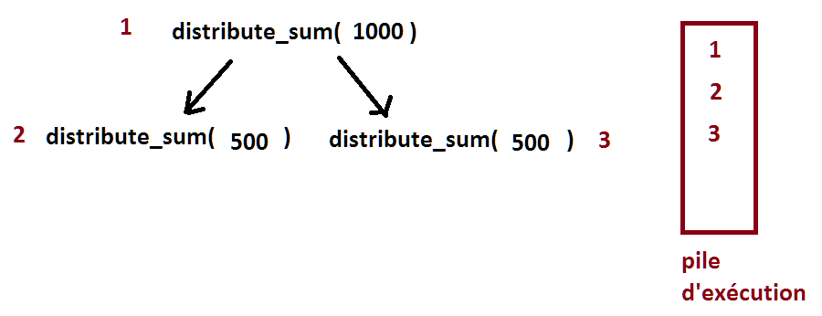
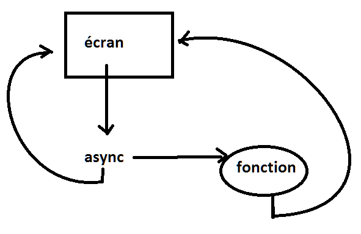

.. _l-thread:

=======
Threads
=======

.. contents::
    :local:
    :depth: 2

.. index:: thread, synchronisation, parallélisation

Jusqu'aux années 2003-2004, l'évolution des microprocesseurs
était une course vers une augmentation de la puissance, autant en terme
de nombre de transistors qu'en fréquence de fonctionnement. Arrivant
aux limites de la technologie actuelle, cette évolution s'est tournée
maintenant vers la construction de processeurs multicoeurs, c'est-à-dire des
machines capables d'exécuter des programmes simultanément, de maintenir
plusieurs *fils d'exécution* en parallèle.

Les `threads <https://fr.wikipedia.org/wiki/Thread_(informatique)>`_
ou fils d'exécution ont trois usages principaux. Le premier est
relié au `calcul distribué <https://fr.wikipedia.org/wiki/Calcul_distribu%C3%A9>`_ ou calcul parallèle.
Par exemple, le calcul d'une intégrale sur un intervalle peut être effectué sur
deux intervalles disjoints. Le résultat final est la somme des
deux résultats sur chacun des intervalles. De plus, ces deux calculs
sont indépendants et peuvent être menés de front. Le calcul intégral
sera donc deux fois plus rapide puisque les deux intervalles seront
traités en même temps. C'est la parallélisation des calculs : les deux calculs
sur chaque intervalle seront affectés à deux threads simultanés.

Le second usage est couplé aux interfaces graphiques. Lorsque
l'utilisateur entame un processus long après avoir cliqué sur un bouton,
l'interface graphique ne réagit plus jusqu'à ce que ce processus s'achève.
Afin d'éviter cet inconvénient, l'interface graphique va commencer un
thread qui va exécuter ce processus. L'interface graphique n'a plus
qu'à attendre la fin du thread, et pendant tout ce temps, elle sera
également capable de traiter tout autre événement provenant de l'utilisateur.

Le dernier usage concerne la communication entre ordinateurs ou plus généralement
la communication Internet. C'est une communication
`asynchrone <https://fr.wikipedia.org/wiki/Asynchronisme>`_ :
l'ordinateur effectue des tâches en même temps qu'il écoute
un `port <https://fr.wikipedia.org/wiki/Port_(logiciel)>`_
par lequel d'autres ordinateurs communiquent avec lui. Plus précisément,
le programme suit deux fils d'exécution : le fil principal et un
thread qui ne fait qu'attendre et traiter les messages qu'il
reçoit via un port.

La synchronisation est un point commun à ces trois usages. Ce terme
désigne la dépendance entre les threads. Lors d'un calcul distribué,
le résultat final dépend des résultats retournés par chaque thread,
il faut donc attendre que les deux fils d'exécution aient produit
le résultat attendu : il faut que les deux fils d'exécution se synchronisent.

Premier thread
==============

Le premier exemple consiste à exécuter un thread uniquement
destiné à faire des affichages. Deux fils d'exécution vont être
lancés en parallèle affichant chacun un message différent.
Les affichages vont s'entremêler. Il existe plusieurs manières
d'exécuter un thread, une seule sera présentée en utilisant la
classe ``Thread`` du module ``threading``.
Pour créer un thread, il suffit de surcharger la méthode ``run`` de la classe
``Thread``. Si le thread a besoin de données lors de son exécution,
il faut surcharger son constructeur sans oublier d'appeler le
constructeur de la classe mère. L'exécution de thread commence par
la création d'une instance et l'appel à la méthode ``start``.
En résumé, il faut retenir les éléments suivants :

#. surcharger la classe ``threading.Thread``,
#. surcharger le constructeur sans oublier d'appeler le constructeur
   ``threading.Thread.__init__``,
#. surcharger la méthode ``run``, c'est le code que devra exécuter le thread,
#. créer une instance de la nouvelle classe et appeler la méthode
   ``start`` pour lancer le thread secondaire qui formera le second fil d'exécution.

Le programme principal est appelé le thread principal. Voici ce que cela donne dans un exemple :

.. runpython::
    :process:
    :showcode:

    import threading, time

    class MonThread (threading.Thread) :
        def __init__ (self, jusqua) :      # jusqua = donnée supplémentaire
            threading.Thread.__init__(self)# ne pas oublier cette ligne
                                           # (appel au constructeur de la classe mère)
            self.jusqua = jusqua           # donnée supplémentaire ajoutée à la classe

        def run (self) :
            for i in range (0, self.jusqua) :
                print("thread ", i)
                time.sleep (0.08)   # attend 100 millisecondes sans rien faire
                                    # facilite la lecture de l'affichage

    m = MonThread (10)          # crée le thread
    m.start ()                  # démarre le thread,
                                # l'instruction est exécutée en quelques millisecondes
                                # quelque soit la durée du thread

    for i in range (0,10) :
        print("programme ", i)
        time.sleep (0.1)            # attend 100 millisecondes sans rien faire
                                    # facilite la lecture de l'affichage

Le programme affiche des lignes qui proviennent du thread principal et du
thread secondaire dont les affichages diffèrent.

Le précédent programme a été adapté pour lancer deux threads secondaires
en plus du thread principal. Les lignes modifiées
par rapport au programme précédent sont commentées.

.. runpython::
    :process:
    :showcode:

    import threading, time

    class MonThread (threading.Thread) :
        def __init__ (self, jusqua, s) :
            threading.Thread.__init__ (self)
            self.jusqua = jusqua
            self.s = s

        def run (self) :
            for i in range (0, self.jusqua) :
                print("thread ", self.s, " : ", i)
                time.sleep (0.09)

    m = MonThread (10, "A")
    m.start ()

    m2 = MonThread (10, "B")  # crée un second thread
    m2.start ()                 # démarre le thread,

    for i in range (0,10) :
        print("programme ", i)
        time.sleep (0.1)

.. index:: sleep

.. _sleep: https://docs.python.org/3/library/time.html#time.sleep

Tous les exemples présentés dans ce chapitre font souvent intervenir
l'instruction `time.sleep(...) <https://docs.python.org/3/library/time.html#time.sleep>`_.
A moins que ce ne soit explicitement précisé, elle sert la plupart du
temps à ralentir l'exécution du programme cité en exemple afin que celle-ci
soit humainement observable ou pour exagérer un défaut de synchronisation.
Cette fonction est d'ordinaire beaucoup moins fréquente.

Synchronisation
===============

Attente
+++++++

La première situation dans laquelle on a besoin de synchroniser
deux threads est l'attente d'un thread secondaire par le thread principal.
Et pour ce faire, on a besoin de l'accès par les deux fils d'exécution
à une même variable qui indiquera l'état du thread. Dans le programme suivant,
on ajoute l'attribut ``etat`` à la classe ``MonThread`` qui va indiquer l'état du thread :

* ``True`` pour en marche
* ``False`` pour à l'arrêt

Le thread principal va simplement vérifier l'état du thread
de temps en temps. Le premier point important est tout d'abord
d'attendre que le thread se lance car sans la première boucle,
le thread pourrait passer à l'état ``True`` après être passé dans la
seconde boucle d'attente.
Le second point important est de ne pas oublier d'insérer la fonction
`sleep`_ afin de permettre au thread principal de temporiser.
Dans le cas contraire, le thread principal passe l'essentiel de son temps à
vérifier l'état du thread secondaire, ce faisant, il ralentit
l'ordinateur par la répétition inutile de la même action un trop grand nombre
de fois. Ici, le thread principal vérifie l'état du thread secondaire
tous les 100 millisecondes. Cette durée dépend de ce que fait le thread secondaire.

.. runpython::
    :process:
    :showcode:

    import threading, time

    class MonThread (threading.Thread) :
        def __init__ (self, jusqua) :
            threading.Thread.__init__ (self)
            self.jusqua = jusqua
            self.etat = False       # l'état du thread est soit False (à l'arrêt)
                                    # soit True (en marche)

        def run (self) :
            self.etat = True                        # on passe en mode marche
            for i in range (0, self.jusqua) :
                print("thread itération ", i)
                time.sleep (0.1)
            self.etat = False                       # on revient en mode arrêt

    m = MonThread (10)          # crée un thread
    m.start ()                  # démarre le thread,

    print("début")

    while m.etat == False :
        # on attend que le thread démarre
        time.sleep (0.1)  # voir remarque ci-dessous

    while m.etat == True :
        # on attend que le thread s'arrête
        # il faut introduire l'instruction time.sleep pour temporiser, il n'est pas
        # nécessaire de vérifier sans cesse que le thread est toujours en marche
        # il suffit de le vérifier tous les 100 millisecondes
        # dans le cas contraire, la machine passe son temps à vérifier au lieu
        # de se consacrer à l'exécution du thread
        time.sleep (0.1)

    print("fin")

.. _Event: https://docs.python.org/3/library/threading.html?highlight=event#threading.Event

.. index:: Event

Ce mécanisme d'attente peut également être codé en utilisation les
objets `Condition <https://docs.python.org/3/library/threading.html?highlight=condition#threading.Condition>`_
et `Event`_.
Ces deux objets permettent d'éviter l'utilisation de la méthode `sleep`_.

.. runpython::
    :process:
    :showcode:

    import threading, time

    class MonThread (threading.Thread) :
        def __init__ (self, jusqua, event) :    # event = objet Event
            threading.Thread.__init__ (self)    #       = donnée supplémentaire
            self.jusqua = jusqua
            self.event  = event                 # on garde un accès à l'objet Event

        def run (self) :
            for i in range (0, self.jusqua) :
                print("thread itération ", i)
                time.sleep (0.1)
            self.event.set ()                   # on indique qu'on a fini :
                                                # on active l'object self.event
    print("début")

    event = threading.Event ()       # on crée un objet de type Event
    event.clear ()                   # on désactive l'ojet Event
    m = MonThread (10, event)        # crée un thread
    m.start ()                       # démarre le thread,
    event.wait ()                    # on attend jusqu'à ce que l'objet soit activé
                                     # event.wait (0.1) : n'attend qu'un
    print("fin")                     # seulement 1 dizième de seconde

La méthode `wait <https://docs.python.org/3.5/library/threading.html?highlight=condition#threading.Event.wait>`_
de l'objet `Event`_ attend que l'objet soit activé. Elle peut attendre
indéfiniment ou attendre pendant une durée donnée seulement.
Pour afficher la durée d'attente, on pourrait utiliser une boucle comme la suivante :

::

    m.start ()
    while not event.is_set():
        print("j'attends")
        event.wait (0.1)
    print("fin")

La méthode `is_set <https://docs.python.org/3.5/library/threading.html?highlight=condition#threading.Event.is_set>`_
permet de savoir si l'événement est bloquant ou non. Le programme affiche
``"j'attends"`` puis attend le thread un dixième de secondes.
Au delà de cette durée, il vérifie l'état de l'événement puis recommence si le thread n'est pas fini.

Ces objets de synchronisation sont plus efficaces que le mécanisme décrit
dans le premier programme car il fait appel aux fonctions du système d'exploitation.

Partage d'informations
++++++++++++++++++++++

La seconde situation dans laquelle on a besoin de synchroniser est
l'accès par deux fils d'exécution aux mêmes informations ou plutôt
aux mêmes variables. Un problème survient quand parfois un thread lit
ou modifie en même temps qu'un autre modifie la même variable.
Le second cas de synchronisation est l'ajout de verrous qui permettent
de protéger une partie du code d'un programme contre plusieurs accès
simultanés.\indexfrr{thread}{verrou} Ce verrou est également un objet du module
``threading`` : `Lock`_.

.. index:: Lock, verrou

.. _Lock: https://docs.python.org/3/library/threading.html?highlight=condition#threading.Lock

Dans cet exemple, l'information partagée est la chaîne de caractères
``message``, le verrou sert à protéger la fonction ``ajoute`` contre des
ajouts simultanés. Si les deux threads veulent modifier ``message`` en même temps,
un thread va entrer dans la fonction ``ajoute`` alors que l'autre n'en est
pas encore sorti. Les résultats seraient imprévisibles car cette fonction
modifie la variable qu'ils utilisent. On aboutit à l'exemple suivant :

.. runpython::
    :process:
    :showout:

    import threading, time

    message = ""
    verrou  = threading.Lock ()

    def ajoute (c) :
        global message     # message et verrou sont des variables gloables
        global verrou      # pour ne pas qu'elle disparaisse dès la fin de la fonction
        verrou.acquire ()  # on protège ce qui suit  (*)

        s = message + c    # instructions jamais exécutée simultanément par 2 threads
        message = s        # si verrou n'est pas utilisé

        verrou.release ()  # on quitte la section protégée  (*)

    class MonThread (threading.Thread) :
        def __init__ (self, jusqua, event, s) :
            threading.Thread.__init__ (self)
            self.jusqua = jusqua
            self.s      = s
            self.event  = event

        def run (self) :
            for i in range (0, self.jusqua) :
                ajoute (self.s)
            self.event.set ()

    print("début")

    # synchronisation attente
    e1 = threading.Event ()
    e2 = threading.Event ()
    e1.clear ()
    e2.clear ()

    m1 = MonThread (10, e1, "1")     # crée un thread
    m1.start ()                      # démarre le thread,
    m2 = MonThread (10, e2, "2")     # crée un second thread
    m2.start ()                      # démarre le second thread,

    e1.wait ()
    e2.wait ()

    print("longueur ", len(message)) # affiche 20
    print("message = ", message)     # affiche quelque chose comme 12212112211212121221

Les trois instructions protégées pourraient être résumées en une seule :
``message += c`` ; le résultat resterait inchangé.
En revanche, en commentant les instructions
`verrou.acquire() <https://docs.python.org/3.5/library/threading.html?highlight=condition#threading.Lock.acquire>`_
et `verrou.release() <https://docs.python.org/3.5/library/threading.html?highlight=condition#threading.Lock.release>`_
de ce programme (marquées d'une étoile).
La longueur du résultat final ``message`` est variable alors qu'elle devrait être de 20
puisque les deux threads appellent chacun 10 fois dans la fonction
``ajoute``. Le tableau suivant montre l'évolution des variables
``message``, ``c``, ``s`` durant deux premiers appels qui s'entremêlent.
Le résultat devrait être ``"12"`` pour message mais un caractère a été perdu.
Il faut retenir que si la variable ``message`` est globale,
les deux autres ``c``, ``s`` sont locales et donc différentes pour les deux threads.

.. list-table::
    :widths: 5 5 5 5 5 5
    :header-rows: 1

    * - ordre
      - thread 1
      - thread 2
      - ``message``
      - ``c``
      - ``s``
    * - 1
      - ``s = message + c``
      -
      - ``""``
      - ``"1"``
      - ``"1"``
    * - 2
      -
      - ``s = message + c``
      - ``""``
      - ``"2"``
      - ``"2"``
    * - 3
      - ``time.sleep (0.001)``
      -
      - ``""``
      - ``"1"``
      - ``"1"``
    * - 4
      -
      - ``time.sleep (0.001)``
      - ``""``
      - ``"2"``
      - ``"2"``
    * - 5
      - ``message = s``
      -
      - ``"1"``
      - ``"1"``
      - ``"1"``
    * - 6
      -
      - ``message = s``
      - ``"2"``
      - ``"2"``
      - ``"2"``

Le verrou empêche d'exécuter une même portion de code en même temps,
un code qui modifie des données partagées. C'est pourquoi le verrou
est souvent déclaré au même endroit que les données qu'il protège.
Le verrou de type `Lock`_ n'autorise qu'un seul thread à la fois à
l'intérieur de la portion de code protégée ce qui aboutit au schéma suivant :

.. list-table::
    :widths: 5 5 5 5 5 5
    :header-rows: 1

    * - ordre
      - thread 1
      - thread 2
      - ``message``
      - ``c``
      - ``s``
    * - 1
      - ``s = message + c``
      -
      - ``""``
      - ``"1"``
      - ``"1"``
    * - 2
      - ``time.sleep (0.001)``
      -
      - ``""``
      - ``"1"``
      - ``"1"``
    * - 3
      - ``message = s``
      -
      - ``"1"``
      - ``"1"``
      - ``"1"``
    * - 4
      -
      - ``s = message + c``
      - ``"1"``
      - ``"2"``
      - ``"12"``
    * - 5
      -
      - ``time.sleep (0.001)``
      - ``"1"``
      - ``"2"``
      - ``"12"``
    * - 6
      -
      - ``message = s``
      - ``"12"``
      - ``"2"``
      - ``"12"``

Le verrou de type `Semaphore <https://docs.python.org/3.5/library/threading.html?highlight=condition#threading.Semaphore>`_
autorise un nombre maximal de thread à parcourir le même code. Ce procédé est parfois utile si
le code en question permet d'imprimer un document. Cela permet de limiter sans
interdire les accès simultanés aux ressources de l'ordinateur.

Ce mécanisme de verrou peut aboutir à des blocages avec deux threads et
deux portions de code protégées. Chaque thread est "coincé" dans une section
attendant que l'autre libère la sienne. Dans ce cas de figure, il est conseillé d'utiliser
le même verrou pour protéger les deux sections. Ainsi, chaque thread ne pourra pas entrer dans
l'une ou l'autre des portions de code protégées tant que l'une d'entre
elles est visitée par l'autre thread.

.. _thread_interface_graphique:

Interface graphique
===================

Un programme bâti autour d'une interface graphique inclut nécessairement une
boucle de message. Celle-ci attend les messages en provenance de l'interface.
Lorsqu'un de ceux-ci lui commande de lancer un traitement long, l'interface
graphique n'est plus en mesure de réagir aux événements qui lui viennent pendant ce temps.
Afin de remédier cela, il suffit d'insérer le traitement dans un thread.
A la fin de ce dernier, un événement sera envoyé à l'interface afin de lui signifier
la fin du traitement.

Le paragraphe :ref:`parag_graph_bind` a montré comment associer un événement
particulier à une fenêtre. La différence ici est que l'événement accroché à la
fenêtre n'est pas prédéfini par le module
`Tkinter <https://docs.python.org/3.5/library/tkinter.html?highlight=tkinter#module-tkinter>`_
mais par le programme lui-même - dans cet exemple ``<<thread_fini>>`` -.
Les symboles ``<<>>`` au début et à la fin du nom de l'événement sont la seule contrainte.
La méthode ``event_generate`` permet d'insérer un message dans la boucle de
messages de façon à ce que celui-ci soit traité au même titre qu'un clic de souris, la pression d'une touche, ...

::

    import threading, time, random, copy

    # définition du thread
    class MonThread (threading.Thread) :
        def __init__ (self, win, res) :
            threading.Thread.__init__ (self)
            self.win = win  # on mémorise une référence sur la fenêtre
            self.res = res

        def run (self) :
            for i in range (0, 10) :
                print("thread ", i)
                time.sleep (0.1)

              # afin que le thread retourne un résultat
              # self.res désigne thread_resultat qui reçoit un nombre de plus
            h = random.randint (0,100)
            self.res.append (h)

              # on lance un événement <<thread_fini>> à la fenêtre principale
              # pour lui dire que le thread est fini, l'événement est ensuite
              # géré par la boucle principale de messages
              # on peut transmettre également le résultat lors de l'envoi du message
              # en utilisant un attribut de la classe Event pour son propre compte
            self.win.event_generate ("<<thread_fini>>", x = h)

    thread_resultat = []

    def lance_thread () :
        global thread_resultat
          # fonction appelée lors de la pression du bouton
          # on change la légnde de la zone de texte
        text .config (text = "thread démarré")
        text2.config (text = "thread démarré")
          # on désactive le bouton pour éviter de lancer deux threads en même temps
        bouton.config (state = TK.DISABLED)
          # on lance le thread
        m = MonThread (root, thread_resultat)
        m.start ()

    def thread_fini_fonction (e) :
        global thread_resultat
          # fonction appelée lorsque le thread est fini
        print("la fenêtre sait que le thread est fini")
          # on change la légende de la zone de texte
        text .config (text = "thread fini + résultat " + str (thread_resultat))
        text2.config (text = "thread fini + résultat (e.x) " + str (e.x))
          # on réactive le bouton de façon à pouvoir lancer un autre thread
        bouton.config (state = TK.NORMAL)

    import tkinter as TK

    # on crée la fenêtre
    root   = TK.Tk ()
    bouton = TK.Button (root, text = "thread départ", command = lance_thread)
    text   = TK.Label (root, text = "rien")
    text2  = TK.Label (root, text = "rien")
    bouton.pack ()
    text.pack ()
    text2.pack ()

    # on associe une fonction à un événement <<thread_fini>> propre au programme
    root.bind ("<<thread_fini>>", thread_fini_fonction)

    # on active la boucle principale de message
    root.mainloop ()

L'image suivante est la fenêtre affichée par le programme
lorsqu'elle attend la pression du bouton qui lance le thread
et lorsqu'elle attend la fin de l'exécution de ce thread.

.. list-table::
    :widths: 5 5
    :header-rows: 0

    * - .. image:: images/threadim1.png
      - .. image:: images/threadim2.png

Le programme précédent utilise une astuce pour retourner un résultat
autrement qu'un utilisant un paramètre global. On peut
adjoindre lors de l'appel à la méthode ``event_generate``
quelques informations supplémentaires attachées à l'événement
en utilisant les attributs prédéfinis de la classe `Event`_.
Dans cet exemple, on utilise l'attribut ``x`` pour retourner
le dernier entier tiré aléatoirement.

La première image est la fenêtre après trois exécutions du thread.
La liste ``thread_resultat`` contient
trois nombres. Une fois l'unique bouton pressé, la fenêtre change d'aspect pour devenir comme la seconde image.
Cette transition est assurée par la fonction ``lance_thread`` reliée au bouton.
La transition inverse est assurée par la fonction ``thread_fini_fonction``
qui est reliée à l'événement que génère le thread lorsqu'il a terminé.

    		
Files de messages
=================

Les trois usages principaux des threads sont le calcul distribué,
la conception d'une interface graphique réactive et l'attente
permanente d'événements. En ce qui concernent les deux premiers usages,
on peut considérer qu'il existe un thread principal qui lance
et attend l'exécution de threads secondaires. Les échanges
d'informations ont lieu au début et à la fin de chaque thread.
Il n'est pas toujours nécessaire de partager des variables en cours
d'exécution : l'usage de verrous est peu fréquent pour ces deux schémas
sauf pour partager des informations en cours d'exécution. Ils ralentissent
considérablement l'exécution d'un programme.

En ce qui concerne le troisième usage, c'est un cas où tout au long
du programme, il y a constamment au moins deux threads actifs :
un thread principal et un thread qui attend. Dans ce cas,
l'échange et la synchronisation d'informations est inévitable et
il est souvent fastidieux de concevoir la synchronisation.
C'est pourquoi on la conçoit presque toujours sous forme de messages
que les threads s'envoient.

Il existe un objet `Queue <https://docs.python.org/3.5/library/queue.html?highlight=queu#queue.Queue>`_
qui facilite cet aspect. C'est une liste qui possède son propre
verrou de sorte que n'importe quel thread peut ajouter ou retirer
des éléments de cette liste. Elle est utilisée principalement
via quatre méthodes. Deux méthodes
`get <https://docs.python.org/3.5/library/queue.html?highlight=queu#queue.Queue.get>`_
sont utilisées au sein du thread qui possède la pile.
Deux méthodes `put <https://docs.python.org/3.5/library/queue.html?highlight=queu#queue.Queue.put>`_
sont appelées par des threads étrangers.

.. _Empty: https://docs.python.org/3.5/library/queue.html?highlight=queu#queue.Empty

.. _Full: https://docs.python.org/3.5/library/queue.html?highlight=queu#queue.Full

.. list-table::
    :widths: 5 15
    :header-rows: 0

    * - ``get([timeout=...]``
      - Retourne un élément de la liste ou attend qu'il y en ait un,
        le supprime si elle en trouve un. Si ``timeout`` est renseigné,
        la fonction attend au plus ``timeout`` secondes, sinon,
        elle déclenche l'exception `Empty`_.
    * - ``get_nowait()``
      - Retourne un élément de la liste s'il y a en un, dans ce cas,
        cet élément est supprimé. Dans le cas contraire, la méthode déclenche
        l'exception `Empty`_.
    * - ``put(e[,timeout=...])``
      - Ajoute l'élément ``e`` à la liste ou attend qu'une place se
        libère si la liste est pleine. Si ``timeout`` est renseigné,
        la fonction attend au plus ``timeout`` secondes, sinon,
        elle déclenche l'exception
        `Full`_.
    * - ``put_nowait(e)``
      - Ajoute l'élément ``e`` à la liste ou déclenche l'exception
        `Full`_ si la liste est pleine.
    * - ``qsize()``
      - Retourne la taille de la pile.

.. index:: queue

Cette pile est utilisée dans l'exemple qui suit pour simuler deux joueurs
qui essaye de découvrir le nombre que l'autre joueur a tiré au hasard.
A chaque essai, un joueur envoie un message de type ``("essai", n)``
à l'autre joueur pour dire qu'il joue le nombre ``n``. Ce joueur lui répond
avec des messages de type ``("dessous", n)``, ``("dessus", n)``, ``("gagne", n)``.

.. runpython::
    :process:
    :showout:

    import threading, time, queue, random

    class Joueur (threading.Thread) :

        # initialisation
        def __init__ (self, nom, e, nb = 1000, temps = 0.1) :
            threading.Thread.__init__(self)
            self.nb    = nb
            self.queue = queue.Queue ()
            self.nom   = nom
            self.event = e
            self.temps = temps  # temps de réflexion
        def Joueur (self, autre_joueur) : self.autre = autre_joueur

        # méthodes : l'adversaire m'envoie un message
        def Joue    (self, nombre) : self.queue.put_nowait ( ("essai", nombre) )
        def Dessus  (self, nombre) : self.queue.put_nowait ( ("dessus", nombre) )
        def Dessous (self, nombre) : self.queue.put_nowait ( ("dessous", nombre) )
        def Gagne   (self, nombre) :
            while not self.queue.empty () :
                try :self.queue.get ()
                except : pass
            self.queue.put ( ("gagne", nombre) )

        # je joue
        def run (self) :
            x = random.randint (0,self.nb)
            print(self.nom, " : je joue (", x, ")")
            i = 0
            a = 0
            b = self.nb
            while True :
                time.sleep (self.temps)

                try :
                    m,n = self.queue.get_nowait ()       # désynchronisé
                    #m,n = self.queue.get (timeout = 0.5)# l'un après l'autre
                except queue.Empty:
                    m,n = None,None

                # traitement du message --> réponse à l'adversaire
                if m == "essai" :
                    if n == x :
                        self.autre.Gagne (n)
                        print(self.nom, " : j'ai perdu après ", i, " essais")
                        break
                    elif n < x : self.autre.Dessus  (n)
                    else       : self.autre.Dessous (n)
                elif m == "dessus" :
                    a = max (a, n+1)
                    continue  # assure l'équité en mode l'un après l'autre
                elif m == "dessous" :
                    b = min (b, n-1)
                    continue  # assure l'équité en mode l'un après l'autre
                elif m == "gagne" :
                    print(self.nom, " : j'ai gagné en ", i, " essais, solution ", n)
                    break

                # on fait une tentative
                if a == b : n = a
                else : n = random.randint (a,b)
                self.autre.Joue (n)
                i += 1
                print(self.nom, " : je tente ", n, " écart ", b-a, " à traiter ", self.queue.qsize ())

            # fini
            print(self.nom, " : j'arrête")
            self.event.set ()

    # on crée des verrous pour attendre la fin de la partie
    e1 = threading.Event ()
    e2 = threading.Event ()
    e1.clear ()
    e2.clear ()

    # création des joueurs
    A = Joueur ("A", e1, 10, temps = 0.1)
    B = Joueur ("B", e2, 10, temps = 0.3)

    # chaque joueur sait qui est l'autre
    A.Joueur (B)
    B.Joueur (A)

    # le jeu commence
    A.start ()
    B.start ()

    # on attend la fin de la partie
    e1.wait ()
    e2.wait ()

Les affichages se chevauchent parfois, il faudrait pour éviter cela synchroniser
l'affichage à l'aide d'un verrou.

Multithreading plus simple
==========================

Le module `threading <https://docs.python.org/3/library/threading.html>`_
a beaucoup été utilisé mais d'autres modules ont été ajoutés à la
distribution standard de python.

* `concurrent.futures <https://docs.python.org/3/library/concurrent.futures.html#module-concurrent.futures>`_ :
  le module propose une interface similaire pour paralléliser avec des threads ou des processus.
  La création des threads s'écrit plus rapidement.
* `asyncio <https://docs.python.org/3/library/asyncio-task.html>`_ :
  ce module fonctionne avec les mots-clés
  `async, await <https://docs.python.org/3/library/asyncio-task.html#example-hello-world-coroutine>`_
  et il est particulièrement adapté à la parallélisation à des accès aux ressources.

Le premier module est plus adapté à la parallélisation des calculs,
le second est particulière utile pour écrire des applications non bloquantes
qui gère pas mal d'accès à Internet.

concurrent.futures
++++++++++++++++++

Le module `concurrent.futures <https://docs.python.org/3/library/concurrent.futures.html#module-concurrent.futures>`_
implémente une classe `Executor <https://docs.python.org/3/library/concurrent.futures.html#concurrent.futures.Executor>`_
qui définit une interface pour l'exécution en parallèle. On peut soit :

* soumettre l'exécution d'une fonction avec
  `submit <https://docs.python.org/3/library/concurrent.futures.html#concurrent.futures.Executor.submit>`_,
* ou soumettre l'exécution de la même fonction appliquée à séquence de jeux de paramètres
  avec `map <https://docs.python.org/3/library/concurrent.futures.html#concurrent.futures.Executor.map>`_.

Cette classe est dérivée en un
`ThreadPoolExecutor <https://docs.python.org/3/library/concurrent.futures.html#concurrent.futures.ThreadPoolExecutor>`_
dont le principal argument *max_works* définit le nombre de threads à exécuter en parallèle.
Je reproduis ici l'`exemple <https://docs.python.org/3/library/concurrent.futures.html#processpoolexecutor-example>`_
de la documentation de *Python* qui détermine si un nombre est premier.

.. runpython::
    :showcode:

    import concurrent.futures
    import math

    PRIMES = [
        112272535095293,
        112582705942171,
        112272535095293,
        115280095190773,
        115797848077099,
        1099726899285419]

    def is_prime(n):
        if n % 2 == 0:
            return False

        sqrt_n = int(math.floor(math.sqrt(n)))
        for i in range(3, sqrt_n + 1, 2):
            if n % i == 0:
                return False
        return True

    def main():
        with concurrent.futures.ThreadPoolExecutor(2) as executor:
            for number, prime in zip(PRIMES, executor.map(is_prime, PRIMES)):
                print('%d is prime: %s' % (number, prime))

    main()

Débugger un programme en parallèle n'est pas chose facile car les exécutions s'entremêlent
et les instructions *print* si elles sont insérées dans la fonction parallélisée produisent
des résultats indéchiffrables.

.. runpython::
    :showcode:

    import concurrent.futures
    import math

    PRIMES = [
        112272535095293,
        112582705942171,
        112272535095293,
        115280095190773,
        115797848077099,
        1099726899285419]

    def is_prime(n):
        print("start", n, "*")
        if n % 2 == 0:
            return False

        sqrt_n = int(math.floor(math.sqrt(n)))
        for i in range(3, sqrt_n + 1, 2):
            if n % i == 0:
                return False
        print("end", n, "#")
        return True

    def main():
        with concurrent.futures.ThreadPoolExecutor(2) as executor:
            for number, prime in zip(PRIMES, executor.map(is_prime, PRIMES)):
                print('%d is prime: %s' % (number, prime))

    main()

Pour débugger, il faut utiliser le module `logging <https://docs.python.org/3/library/logging.html#module-logging>`_
(voir aussi `Ecrire des logs en Python <http://sametmax.com/ecrire-des-logs-en-python/>`_).
L'exemple suivant construit un *logger* par thread

.. runpython::
    :showcode:

    import concurrent.futures
    import math
    import logging
    import sys
    import threading

    loggers = {}

    def get_logger(name):
        if name in loggers:
            return loggers[name]
        logger = logging.getLogger(name)
        logger.setLevel(logging.DEBUG)
        fmt = '%(asctime)s - %(threadName)s - %(levelname)s - %(message)s'
        formatter = logging.Formatter(fmt)

        # Pour un affiche sur la sortie standard mais cela s'entremêle parfois.
        # ch = logging.StreamHandler(sys.stdout)
        # ch.setFormatter(formatter)
        # logger.addHandler(ch)

        # Pour une sortie dans un fichier.
        # Le mode "w" signifie que les logs de l'exécution précédente
        # seront effacés.
        fh = logging.FileHandler(name + ".log", "w")
        fh.setFormatter(formatter)
        logger.addHandler(fh)

        loggers[name] = logger
        return loggers[name]

    PRIMES = [
        112272535095293,
        112582705942171,
        112272535095293,
        115280095190773,
        115797848077099,
        1099726899285419]

    def is_prime(n):
        logger = get_logger(threading.current_thread().name)
        logger.info("start {}*".format(n))
        if n % 2 == 0:
            logger.info("end1 {}*".format(n))
            return False

        sqrt_n = int(math.floor(math.sqrt(n)))
        for i in range(3, sqrt_n + 1, 2):
            if n % i == 0:
                logger.info("end2 {}*".format(n))
                return False
        logger.info("end3 {}*".format(n))
        return True

    def main():
        with concurrent.futures.ThreadPoolExecutor(2, "thread") as executor:
            for number, prime in zip(PRIMES, executor.map(is_prime, PRIMES)):
                print('%d is prime: %s' % (number, prime))

    main()

    print("-----")

    with open("thread_0.log", "r") as f:
        print(f.read())

    print("-----")

    with open("thread_1.log", "r") as f:
        print(f.read())

Notion de futures
+++++++++++++++++

.. index:: futures, promises, promesses, tâches

Ce concept est apparu récemment dans les langages de programmation, non pas
qu'il n'est jamais été utilisé avant l'an 2000 mais l'usage de plus en plus
fréquent de la programmation parallélisée fait que certains concept sont
nommés et intègres les langages.
Les `futures ou promesses <https://fr.wikipedia.org/wiki/Futures_(informatique)>`_
font référence à un résultat dont le calcul est géré par un autre thread ou
processus. Le résultat n'est pas prêt au moment où ce second thread démarre mais il
le sera bientôt d'où son nom. On les retrouve en C#
`Programmation asynchrone avec Async et Await <https://msdn.microsoft.com/fr-fr/library/hh191443(v=vs.120).aspx>`_
ou C++ `std::async <http://en.cppreference.com/w/cpp/thread/async>`_.
Il y a deux objets *futures* en Python qui sont produits par différents
jeux de fonctions. On ne créé jamais un *futures*, c'est toujours une fonction
qui le fait.

* `concurrent.futures.Future <https://docs.python.org/3/library/concurrent.futures.html#concurrent.futures.Future>`_ :
  ils sont créés par le module
  `concurrent.futures <https://docs.python.org/3/library/concurrent.futures.html#module-concurrent.futures>`_.
* `asyncio.future <https://docs.python.org/3/library/asyncio-task.html#future>`_ :
  ils sont créés par le module
  `asyncio <https://docs.python.org/3/library/asyncio.html>`_.

Les deux objets possèdent la même interface et sont presque compatibles.
Cela dit, il vaut mieux éviter de les mélanger. Je cite la documentation :

    This class is not compatible with the
    `wait() <https://docs.python.org/3/library/concurrent.futures.html#concurrent.futures.wait>`_ and
    `as_completed() <https://docs.python.org/3/library/concurrent.futures.html#concurrent.futures.as_completed>`_
    functions in the concurrent.futures package.

Distribuer l'exécution d'une fonction est relativement facile. Les choses se compliquent
quand il s'agit de distribuer un calcul qui dépend d'un autre calcul distribué.
Il faut enchaîner ces fonctions qu'on dit
`asynchrones <https://en.wikipedia.org/wiki/Synchronous_programming_language>`_
puisque leur exécution n'est plus inscrite dans une seule et même séquence
mais dans plusieurs fils d'exécution parallèles.

Un problème de blocage
++++++++++++++++++++++

La fonction distribue le calcul de la somme des éléments d'un tableau.
et elle est récursive.

.. runpython::
    :showcode:

    import numpy
    import concurrent.futures as cf

    def parallel_numpy_dot(va, vb):
        with cf.ThreadPoolExecutor(max_workers=2) as e:
            m = va.shape[0] // 2
            f1 = e.submit(numpy.dot, va[:m], vb[:m])
            f2 = e.submit(numpy.dot, va[m:], vb[m:])
            return f1.result() + f2.result()

    va = numpy.random.randn(100000).astype(numpy.float64)
    vb = numpy.random.randn(100000).astype(numpy.float64)
    print(parallel_numpy_dot(va, vb))

Il faut voir l'objet *executor* comme un objet qui empile les fonctions
à exécuter. Le problème dans l'exemple précédent est que la fonction
*distribute_sum* est déjà dans la pile d'exécution et attend l'exécution
de deux autres appels à la même fonction placée après elle dans la pile d'exécution.

Si chaque appel à la fonction était effectué sur un thread différent,
cela pourrait fonctionner. Mais ce n'est pas le cas pour cette implémentation.
L'appel 1 attend la fin de 2 et 3 qui ne peuvent pas être exécutés tant
que 1 n'est pas fini. Pour résoudre le problème dans ce cas ci, il faut
remplacer le commentaire par la ligne suivante :

::

    executor = concurrent.futures.ThreadPoolExecutor(max_workers=2)

async - await - asyncio
+++++++++++++++++++++++

`asyncio <https://docs.python.org/3/library/asyncio.html>`_ a fait émerger
les mots-clés `async and await <https://docs.python.org/3/whatsnew/3.5.html?highlight=async#whatsnew-pep-492>`_
qui font partie du langage depuis la version 3.5 tout comme elles font partie
d'autres langages comme `C# <https://docs.microsoft.com/en-us/dotnet/csharp/async>`_
ou `C++ <http://www.cplusplus.com/reference/future/async/>`_.

Concrètement, ce n'est pas si difficile d'écrire une fonction
qui a vocation à être parallélisée. Ce qui devient compliqué est d'avoir
à sa disposition plein de fonctions à paralléliser. Il faut
synchroniser. Ces deux mots-clés permettent de définir une fonction
à vocation parallèle (``async``) et une façon d'attendre
qu'elles aient retourné un résultat (``await``).
Ces deux mots-clés sont une façon élégant de créer
des assemblages de fonctions indépendantes et parallélisées.

Les interfaces graphiques ne contiennent qu'un seul *await*
ou une seule boucle de messages qui attend inlassablement que
quelque chose se passe. Le mot-clé *async* agit comme un aiguillage.
Une action est enclenchée. Elle signalera sa fin et son résultat plus tard.

Le mot-clés *await* sert à chaîner les fonctions parallélisées.

GIL - Global Interpreter Lock
=============================

Le `Global Interpreter Lock <https://en.wikipedia.org/wiki/Global_interpreter_lock>`_
est un verrou qui évite à plusieurs threads de modifier le même objet en même temps.
Dans les langages bas niveau, on fait la distrinction entre un tableau ou une liste
qui supporte les accès concurrentiels ou non. Si elle ne les supporte pas, les accès
sont plus rapides mais suppose que le dévelopeur s'occupe de gérer les problèmes
de synchronisation si besoin.

Le langage Python protège listes et dictionnaires par l'intermédiaire de ce verrou
qui est unique pour toutes les listes afin de pouvoir gérer efficacement le
`garbage collector <https://fr.wikipedia.org/wiki/Ramasse-miettes_(informatique)>`_
(voir module `gc <https://docs.python.org/3/library/gc.html>`_). En conséquence,
si le langage Python est multithread par design, dans les faits, il ne l'est presque
pas car le *GIL* est sans cesse utilisé. Le notebook :ref:`gilexamplerst` finira
de vous convaincre.

cython
++++++

Tout est possible avec le langage C même si
`cython <http://cython.org/>`_
est un mélange des de *python* et *C*. Le contexte
`nogil <http://cython.readthedocs.io/en/latest/src/userguide/external_C_code.html#releasing-the-gil>`_
permet de relâcher la contrainte sur GIL pour une fonction ou une partie de code.
Plus de liberté veut dire aussi plus d'attention à apporter au code.
La page `Using parallelism <http://cython.readthedocs.io/en/latest/src/userguide/parallelism.html?highlight=nogil#using-parallelism>`_
donne quelques exemples simples de parallélisation.
Il est plus facile de paralléliser Python avec un autre langage
(voir aussi `Parallelizing numpy array loops with Cython and OpenMP <http://www.perrygeo.com/parallelizing-numpy-array-loops-with-cython-and-mpi.html>`_).

C#, Java
++++++++

L'intégration de langage C est supportée par Python car l'interpéteur
est implémenté en C. Utiliser d'autres langages peut se faire via une
interface en C et celle-ci existe pour certains langages.
C'est le cas du `C# <https://fr.wikipedia.org/wiki/C_sharp>`_
qui peut être utilisé via le module
`pythonnet <https://github.com/pythonnet/pythonnet>`_ ou encore
`Java <https://fr.wikipedia.org/wiki/Java>`_ via
`py4j <https://www.py4j.org/>`_,
`pyjnius <https://github.com/kivy/pyjnius>`_.
Les threads sont plus faciles à implémenter dans ces langages
même si le `garbage collector <https://fr.wikipedia.org/wiki/Ramasse-miettes_(informatique)>`_
peut nuire aux performances.

Bibliographie
=============

*articles*

* `Aynschonous API for Python <http://stevedower.id.au/blog/async-api-for-python/>`_
