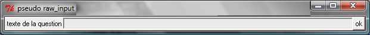

.. _chap_syntaxe:

.. _chap_boucle:

=====================================================
Syntaxe du langage Python (boucles, tests, fonctions)
=====================================================

.. contents::
    :local:
    :depth: 2

Avec les variables, les boucles et les fonctions, on connaît suffisamment d'éléments pour écrire
des programmes. Le plus difficile n'est pas forcément de les comprendre mais plutôt d'arriver
à découper un algorithme complexe en utilisant ces briques élémentaires. C'est l'objectif
des chapitres centrés autour des exercices. Toutefois, même si ce chapitre présente les
composants élémentaires du langage, l'aisance qu'on peut acquérir en programmation vient
à la fois de la connaissance du langage mais aussi de la connaissance d'algorithmes standards
comme celui du tri ou d'une recherche dichotomique. C'est cette connaissance tout autant
que la maîtrise d'un langage de programmation qui constitue l'expérience en programmation.

Les trois concepts des algorithmes
==================================

Les algorithmes sont composés d'instructions, ce sont des opérations
élémentaires que le processeur exécute selon trois schémas :

.. list-table::
    :widths: 5 10
    :header-rows: 0

    * - la séquence
      - enchaînement des instructions les unes à la suite des autres :
        passage d'une instruction à la suivante
    * - le saut
      - passage d'une instruction à une autre qui n'est pas forcément la suivante
        (c'est une rupture de séquence)
    * - le test
      - choix entre deux instructions

Le saut n'apparaît plus de manière explicite dans les langages évolués car
il est une source fréquente d'erreurs. Il intervient dorénavant de manière
implicite au travers des boucles qui combinent un saut et un test.
On écrit toujours ceci avec les langages les plus récents :

    | initialisation de la variable moy à 0
    | faire pour i allant de 1 à N
    |       moy reçoit moy + ni
    | moy reçoit moy / N

Et ceci est traduit par :

    | ligne 1 : initialisation de la variable moy à 0
    | ligne 2 : initialisation de la variable i à 1
    | ligne 3 : moy reçoit moy + ni
    | ligne 4 : i reçoit i + 1
    | ligne 5 : si i est inférieur ou égal à N alors aller à la ligne 3
    | ligne 6 : moy reçoit moy / N

Tout programme peut se résumer à ces trois concepts. Chaque langage les met en place
avec sa propre syntaxe et parfois quelques nuances mais il est souvent facile
de les reconnaître même dans des langages inconnus. Le calcul d'une somme décrit
plus haut et écrit en *python* correspond à l'exemple suivant :

.. runpython::
    :showcode:

    t = [0, 1, 2, 3, 4]
    N = 5
    moy = 0
    for i in range(1,N+1):      # de 1 à N+1 exclu --> de 1 à N inclus
        moy += t[i-1]           # le premier indice est 0 et non 1
    moy /= N
    print(moy)

Le premier élément de cette syntaxe est constituée de ses mots-clés
``for`` et ``in`` et des symboles ``=``, ``+=``, ``/=``,
``[``, ``]``, ``(``, ``)``, ``:``. La fonction
`iskeyword <https://docs.python.org/3/library/keyword.html#keyword.iskeyword>`_
permet de savoir si un mot-clé donné fait partie du langage *python*.
Même si les modules seront décrits plus tard, la syntaxe
suivante reste accessible :

.. runpython::
    :showcode:

    import keyword
    print(keyword.iskeyword("for"))     # affiche True
    print(keyword.iskeyword("until"))   # affiche False

Le programme suivant permet de récupérer la liste des
`mots-clés <https://docs.python.org/3/reference/lexical_analysis.html#keywords>`_ du langage :

.. runpython::
    :showcode:

    import keyword
    print("\n".join(keyword.kwlist))

A cela s'ajoute les symboles :

::

    +  -  *  **  /  //  %
    < > == <= >=  !=
    <<  >>  &  |  \  ~  ^
    =  +=  -=  *=  /=  //=  %=  **=
    |=  &=  <<=  >>=  ~=  ^=
    (  )  [  ]  {  }
    "  """  '  '''
    ,  :  .
    #
    @  @=

Les espaces entre les mots-clés et les symboles ont peu d'importance, il peut n'y en
avoir aucun comme dix. Les espaces servent à séparer un mot-clé, un nombre d'une variable.
Les mots-clés et les symboles définissent la grammaire du langage *python*.
Toutes ces règles sont décrites dans un langage un peu particuilier par
la page `Full Grammar specification <https://docs.python.org/3/reference/grammar.html>`_.

Les fonctions `builtin <https://docs.python.org/3/library/functions.html#built-in-functions>`_
ne font pas partie de la grammaire du langage même si elles sont directement accessibles
comme la fonction `abs <https://docs.python.org/3/library/functions.html#abs>`_
qui retourne la valeur absolue d'un nombre. C'est un choix d'implémentation
du programme qui interprète le langage mais absent de la grammaire.

Tests
=====

.. _label_test:

Définition et syntaxe
---------------------

.. index:: if, elif, else, test, :

.. mathdef::
    :title: test
    :tag: Définition

    Les tests permettent d'exécuter des instructions différentes
    selon la valeur d'une condition logique.

Syntaxe :

::

    if condition1 :
       instruction1
       instruction2
       ...
    else :
       instruction3
       instruction4
       ...

La clause ``else`` est facultative. Lorsque la condition ``condition1`` est fausse et qu'il
n'y a aucune instruction à exécuter dans ce cas, la clause ``else`` est inutile.
La syntaxe du test devient :

::

    if condition1 :
       instruction1
       instruction2
       ...

S'il est nécessaire d'enchaîner plusieurs tests d'affilée,
il est possible de condenser l'écriture avec le mot-clé ``elif`` :

::

    if condition1 :
       instruction1
       instruction2
       ...
    elif condition2 :
       instruction3
       instruction4
       ...
    elif condition3 :
       instruction5
       instruction6
       ...
    else :
       instruction7
       instruction8
       ...

Le décalage des instructions par rapport aux lignes contenant les mots-clés
``if``, ``elif``, ``else`` est très important : il fait partie de la syntaxe du langage
et s'appelle l'`indentation <https://fr.wikipedia.org/wiki/Style_d%27indentation>`_.
Celle-ci permet de grouper les instructions ensemble. Le programme suivant est syntaxiquement
correct même si le résultat n'est pas celui désiré.

.. runpython::
    :showcode:

    x = 1
    if x > 0 :
       signe = 1
       print("le nombre est positif")
    else :
       signe = -1
    print("le nombre est négatif")  # ligne mal indentée (au sens de l'algorithme)
    print("signe = ", signe)

Une ligne est mal indentée : ``print("le nombre est négatif")``.
Elle ne devrait être exécutée que si la condition ``x>0`` n'est pas vérifiée.
Le fait qu'elle soit alignée avec les premières instructions du programme fait que son
exécution n'a plus rien à voir avec cette condition. La programme répond de manière erronée.

Dans certains cas, l'interpréteur *python* ne sait pas à quel bloc attacher une instruction,
c'est le cas de l'exemple suivant, la même ligne a été décalée de deux espaces,
ce qui est différent de la ligne qui précède et de la ligne qui suit.

::

    x = 1
    if x > 0 :
        signe = 1
        print "le nombre est positif"
    else :
        signe = -1
      print "le nombre est négatif"     # ligne mal indentée (au sens de la grammaire)
    print "signe = ", signe

.. _l-indentation-error:

L'interpréteur retourne l'erreur suivante :

::

    File "test.py", line 7
        print("le nombre est négatif")
                                      ^
    IndentationError: unindent does not match any outer indentation level

.. _par_comparaison:

Comparaisons possibles
----------------------

Les comparaisons possibles entre deux entités sont avant tout numériques mais ces opérateurs
peuvent être définis pour tout type (voir :ref:`chap_classe`),
notamment sur les chaînes de caractères pour lesquelles les opérateurs de comparaison
transcrivent l'ordre alphabétique.

.. list-table::
    :widths: 5 10
    :header-rows: 0

    * - ``<``, ``>``
      - inférieur, supérieur
    * - ``<=``, ``>=``
      - inférieur ou égal, supérieur ou égal
    * - ``==``, ``!=``
      - égal, différent
    * - ``is``, ``not is``
      - ``x is y`` vérifie que ``x`` et ``y``
        sont égaux, ``not  is}, différents,
        l'opérateur ``is`` est différent de l'opérateur ``==``,
        il est expliqué au paragraphe :ref:`par_liste_copie`
    * - ``in``, ``not in``
      - appartient, n'appartient pas

.. _par_operateur_logique:

Opérateurs logiques
-------------------

Il existe trois opérateurs logiques qui combinent entre eux les conditions.

.. list-table::
    :widths: 5 10
    :header-rows: 0

    * - ``not``
      - négation
    * - ``and``
      - et logique
    * - ``or``
      - ou logique

.. index:: priorité des opérateurs

La priorité des opérations numériques est identique à celle rencontrée en mathématiques.
L'opérateur puissance vient en premier, la multiplication/division ensuite puis l'addition/soustraction.
Ces opérations sont prioritaires sur les opérateurs de comparaisons (``>``, ``<``, ``==``, ...)
qui sont eux-mêmes sur les opérateurs logiques ``not``, ``and``, ``or``.
Il est tout de même conseillé d'ajouter des parenthèses en cas de doute.
C'est ce qu décrit la page `Operator precedence <https://docs.python.org/3/reference/expressions.html#operator-precedence>`_.

Ecriture condensée
------------------

Il existe deux écritures condensées de tests.
La première consiste à écrire un test et l'unique instruction qui en dépend sur une seule ligne.

::

if condition :
    instruction1
else :
    instruction2

Ce code peut tenir en deux lignes :

::

    if condition : instruction1
    else : instruction2

Le second cas d'écriture condensée concerne les comparaisons enchaînées.
Le test ``if 3 < x and x < 5 : instruction`` peut être condensé par ``if 3 < x < 5 : instruction``.
Il est ainsi possible de juxtaposer autant de comparaisons que nécessaire :
``if  3 < x < y < 5 : instruction``.

Le mot-clé ``in`` permet également de condenser certains tests lorsque la
variable à tester est entière. ``if x == 1 or x == 6  or x == 50 :``
peut être résumé simplement par ``if x in (1,6,50) :`` ou ``if x in {1,6,50}:``
pour les grandes listes.

Exemple
-------

L'exemple suivant associe à la variable ``signe`` le signe de la variable ``x``.

.. runpython::
    :showcode:

    x = -5
    if x < 0:
       signe = -1
    elif x == 0:
       signe = 0
    else:
       signe = 1
    print(signe)

Son écriture condensée lorsqu'il n'y a qu'une instruction à exécuter :

.. runpython::
    :showcode:

    x = -5
    if x < 0: signe = -1
    elif x == 0: signe = 0
    else: signe = 1

Le programme suivant saisit une ligne au clavier et dit si c'est "oui" ou "non" qui a été saisi.
La fonction `input <https://docs.python.org/3/library/functions.html#input>`_ retourne
ce qui vient de l'utilisateur :

::

    s = input ("dites oui : ")    # voir remarque suivante
    if s == "oui" or s [0:1] == "o" or s [0:1] == "O" or s == "1" :
        print "oui"
    else:
        print "non"

La fonction `input <https://docs.python.org/3/library/functions.html#input>`_
invite l'utilisateur d'un programme à saisir une réponse lors de l'exécution du programme.
Tant que la touche entrée n'a pas été pressée, l'exécution du programme ne peut continuer.
Cette fonction est en réalité peu utilisée. Les interfaces graphiques sont
faciles d'accès en *python*, on préfère donc saisir une réponse via une fenêtre plutôt
qu'en ligne de commande. L'exemple suivant montre comment remplacer cette fonction à l'aide d'une fenêtre graphique.

.. _rawinput_programme_label:

::

    import Tkinter
    def question(legende):
        reponse = [""]
        root = Tkinter.Tk ()
        root.title("pseudo input")
        Tkinter.Label(text=legende).pack(side=Tkinter.LEFT)
        s = Tkinter.Entry(text="def", width=80)
        s.pack(side=Tkinter.LEFT)
        def rget():
            reponse[0] = s.get ()
            root.destroy()
        Tkinter.Button(text="ok", command=rget).pack(side=Tkinter.LEFT)
        root.mainloop()
        return(reponse[0])

    print("réponse ", question("texte de la question"))

On peut améliorer la fonction ``question``
en précisant une valeur par défaut par exemple (voir :ref:`chap_interface` à ce sujet).
Le programme affiche la fenêtre suivante :

None, True et 1
---------------

L'écriture de certains tests peut encore être réduite lorsqu'on
cherche à comparer une variable entière, booléenne ou ``None`` comme le précise
la table suivant :

.. list-table::
    :widths: 5 5 5
    :header-rows: 1

    * - type
      - test
      - test équivalent
    * - bool
      - ``if v:``
      - ``if v == True :``
    * - ``bool``
      - ``if not v:``
      - ``if v == False :``
    * - ``int``
      - ``if v:``
      - ``if v != 0:``
    * - ``int``
      - ``if not v :``
      - ``if v == 0 :``
    * - ``float``
      - ``if v :``
      - ``if v != 0.0 :``
    * - ``float``
      - ``if not v :``
      - ``if v == 0.0 :``
    * - ``list``, ``dict``, ``set``
      - ``if v:``
      - ``if v is not None and len(v) > 0:``
    * - ``list``, ``dict``, ``set``
      - ``if not v:``
      - ``if v is None or len(v) == 0:``
    * - ``object``
      - ``if v :``
      - ``if v is not None:``
    * - ``object``
      - ``if not v:``
      - ``if v is None :``

Passer, instruction ``pass``
----------------------------

.. index:: pass

Dans certains cas, aucune instruction ne doit être exécutée même si un
test est validé. En *python*, le corps d'un test ne peut être vide,
il faut utiliser l'instruction ``pass``. Lorsque celle-ci est manquante,
*python* affiche un message d'erreur.

::

    signe = 0
    x = 0
    if x < 0: signe = -1
    elif x == 0:
       pass          # signe est déjà égal à 0
    else :
        signe = 1

Dans ce cas précis, si l'instruction ``pass`` est oubliée,
l'interpréteur *python* génère l'erreur suivante :

::

    File "nopass.py", line 6
        else :
        ^
    IndentationError: expected an indented block

Boucles
=======

.. index:: boucle, while, for, in, :

.. mathdef::
    :title: test
    :tag: Boucle
    :lid: id-boucle-def

    Les boucles permettent de répéter une séquence d'instructions tant qu'une certaine condition
    est vérifiée.

Le langage *python* propose deux types de boucles.
La boucle ``while`` suit scrupuleusement la définition précédent.
La boucle ``for`` est une boucle ``while`` déguisée (voir :ref:`boucle_for`),
elle propose une écriture simplifiée pour répéter la même séquence
d'instructions pour tous les éléments d'un ensemble.

Boucle while
------------

L'implémentation d'une boucle de type ``while`` suit le schéma d'écriture suivant :

::

    while cond :
        instruction 1
        ...
        instruction n

Où ``cond`` est une condition qui détermine la poursuite de la répétition
des instructions incluses dans la boucle. Tant que celle-ci est vraie,
les instructions 1 à *n* sont exécutées.

Tout comme les tests, l'indentation joue un rôle important.
Le décalage des lignes d'un cran vers la droite par rapport à l'instruction ``while``
permet de les inclure dans la boucle comme le montre l'exemple suivant.

.. runpython::
    :showcode:

    n = 0
    while n < 3:
       print("à l'intérieur ", n)
       n += 1
    print("à l'extérieur ", n)

.. index:: boucle infinie

Les conditions suivent la même syntaxe que celles définies lors des
tests (voir :ref:`par_comparaison`). A moins d'inclure l'instruction :ref:`break <bbrak_instruction_par>`
qui permet de sortir prématurément d'une boucle, la condition qui régit cette boucle
doit nécessairement être modifiée à
l'intérieur de celle-ci. Dans le cas contraire, on appelle une telle boucle une
`boucle infinie <https://fr.wikipedia.org/wiki/Boucle_infinie>`_
puisqu'il est impossible d'en sortir.

L'exemple suivant contient une boucle infinie car le symbole ``=`` est manquant dans
la dernière instruction. La variable ``n`` n'est jamais modifiée et
la condition ``n<3`` toujours vraie.

::

    n = 0
    while n < 3 :
       print(n)
       n + 1        # n n'est jamais modifié, l'instruction correcte serait n += 1

.. _boucle_for:

Boucle for
----------

.. index:: for

L'implémentation d'une boucle de type ``for`` suit le schéma d'écriture suivant :

::

    for x in ensemble:
        instruction 1
        ...
        instruction n

Où ``x`` est un élément de l'ensemble ``ensemble``. Les instructions 1 à *n* sont exécutées pour
chaque élément ``x`` de l'ensemble ``ensemble``. Cet ensemble peut être une chaîne de caractères,
un tuple, une liste, un dictionnaire, un set ou tout autre type incluant des itérateurs
qui sont présentés au chapitre :ref:`chap_classe`.

Tout comme les tests, l'indentation est importante.
L'exemple suivant affiche tous les éléments d'un tuple à l'aide d'une boucle ``for``.

.. runpython::
    :showcode:

    t = (1,2,3,4)
    for x in t:       # affiche les nombres 1,2,3,4
        print(x)      # chacun sur une ligne différente

Lors de l'affichage d'un dictionnaire, les éléments n'apparaissent
pas triés ni dans l'ordre dans lequel ils y ont été insérés. L'exemple
suivant montre comment afficher les clés et valeurs d'un dictionnaire
dans l'ordre croissant des clés.

.. runpython::
    :showcode:

    d = { 1: 2, 3: 4, 5: 6, 7: -1, 8: -2 }
    print(d)                # affiche le dictionnaire {8: -2, 1: 2, 3: 4, 5: 6, 7: -1}
    k = list(d.keys())
    print(k)                # affiche les clés [8, 1, 3, 5, 7]
    k.sort()
    print(k)                # affiche les clés triées [1, 3, 5, 7, 8]
    for x in k:             # affiche les éléments du dictionnaire
        print(x, ":", d[x]) # triés par clés croissantes

Le langage *python* propose néanmoins la fonction ``sorted``
qui réduit l'exemple suivant en trois lignes:

.. runpython::
    :showcode:

    d = { 1: 2, 3: 4, 5: 6, 7: -1, 8: -2 }
    for x in sorted(d):    # pour les clés dans l'ordre croissant
        print(x, ":", d[x])

La boucle la plus répandue est celle qui parcourt des indices entiers
compris entre *0* et *n-1*. On utilise pour cela la boucle ``for`` et la fonction
`range <https://docs.python.org/3/library/functions.html#func-range>`_
comme dans l'exemple qui suit.

.. runpython::
    :showcode:

    sum = 0
    N   = 10
    for n in range(0, N):     # va de 0 à N exclu
       sum += n               # additionne tous les entiers compris entre 0 et N-1

Ou encore pour une liste quelconque :

.. runpython::
    :showcode:

    li  = [ 4, 5, 3, -6, 7, 9]
    sum = 0
    for n in range(0, len(li)):  # va de 0 à len(li) exclu
       sum += li[n]              # additionne tous les éléments de li

.. _liste_for_raccourci2:

Listes, boucle for, liste en extension
--------------------------------------

Le paragraphe :ref:`liste_for_raccourci` a montré comment le mot-clé ``for``
peut être utilisé pour simplifier la création d'une liste à partir d'une autre.
La syntaxe d'une `liste en extension <http://sametmax.com/python-love-les-listes-en-intention-partie/>`_
suit le schéma suivant :

::

    [ expression for x in ensemble ]

Où ``expression`` est une expression numérique incluant ou non ``x``,
la variable de la boucle, ``ensemble`` est un ensemble d'éléments, tuple, liste, dictionnaire, set
ou tout autre chose qui peut être parcouru.
Cette syntaxe permet de résumer en une ligne la création de la séquence
``y`` du programme suivant.

.. runpython::
    :showcode:

    y = list ()
    for i in range(0,5) :
       y.append(i+1)
    print(y)                            # affiche [1,2,3,4,5]

    y = [ i+1 for i in range(0,5) ]     # résume trois lignes du programme précédent
    print(y)                            # affiche [1,2,3,4,5]

Un autre exemple de cette syntaxe réduite a été présenté au paragraphe :ref:`liste_for_raccourci`.
Cette écriture condensée est bien souvent plus lisible même si
tout dépend des préférences de celui qui programme. Elle peut être étendue au dictionnaire.

.. runpython::
    :showcode:

    y = { i: i+1 for i in range(0,5) }
    print(y)

.. _paragraphe_tterafsd_syntaxe:

Itérateurs
----------

.. index:: itérateur, StopIteration

Toute boucle ``for`` peut s'appliquer sur un objet muni d'un itérateur
tels que les chaînes de caractères, tuples, les listes, les dictionnaires, les ensembles.

.. runpython::
    :showcode:

    d = ["un", "deux", "trois"]
    for x in d:
       print(x)          # affichage de tous les éléments de d

Cette syntaxe réduite a déjà été introduite pour les listes et les dictionnaires
au chapitre précédent. Il existe une version équivalente avec la boucle
``while`` utilisant de façon explicite les itérateurs. Il peut être utile de lire
le chapitre suivant sur les classes et le chapitre :ref:`chap_exception` sur les exceptions
avant de revenir sur la suite de cette section qui n'est de toutes façons pas essentielle.

L'exemple précédent est convertible en une boucle ``while`` en faisant apparaître
explicitement les itérateurs (voir :ref:`chap_iterateur`).
Un itérateur est un objet qui permet de parcourir aisément un ensemble.
La fonction ``it = iter(e)`` permet d'obtenir un itérateur ``it`` sur l'ensemble ``e``.
L'appel à l'instruction ``it.next()`` parcourt du premier élément jusqu'au
dernier en retournant la valeur de chacun d'entre eux. Lorsqu'il
n'existe plus d'élément, l'exception ``StopIteration`` est déclenchée
(voir :ref:`chap_exception`). Il suffit de l'intercepter pour
mettre fin au parcours.

.. runpython::
    :showcode:

    d = ["un", "deux", "trois"]
    it = iter(d)                        # obtient un itérateur sur d
    while True:
        try:
            x = next(it)                # obtient l'élément suivant, s'il n'existe pas
        except StopIteration:
            break                       # déclenche une exception
        print(x)                        # affichage de tous les éléments de d

Plusieurs variables de boucles
------------------------------

.. index:: affectations multiples

Jusqu'à présent, la boucle ``for`` n'a été utilisée qu'avec une seule variable de boucle,
comme dans l'exemple suivant où on parcourt une liste de tuple pour les afficher.

.. runpython::
    :showcode:

    d = [ (1,0,0), (0,1,0), (0,0,1) ]
    for v in d:
        print(v)

Lorsque les éléments d'un ensemble sont des tuples, des listes, des dictionnaires
ou des ensembles composés de taille fixe, il est possible d'utiliser une notation
qui rappelle les affectations multiples (voir :ref:`affectation_multiple`).
L'exemple précédent devient dans ce cas :

.. runpython::
    :showcode:

    d = [ (1,0,0), (0,1,0), (0,0,1) ]
    for x,y,z in d:
        print(x,y,z)

Cette écriture n'est valable que parce que chaque élément de la liste ``d``
est un tuple composé de trois nombres. Lorsqu'un des éléments est de taille
différente à celle des autres, comme dans l'exemple suivant, une erreur survient.

.. runpython::
    :showcode:
    :exception:

    d = [ (1,0,0), (0,1,0,6), (0,0,1) ]  # un élément de taille quatre
    for x,y,z in d:
        print(x,y,z)

Cette syntaxe est très pratique associée à la fonction ``zip`` (voir :ref:`fonction_zip`).
Il est alors possible de parcourir plusieurs séquences
(tuple, liste, dictionnaire, ensemble) simultanément.

.. runpython::
    :showcode:

    a = range(0,5)
    b = [x**2 for x in a]
    for x, y in zip (a,b):
        print(y), " est le carré de ", x
        # affichage à droite

Ecriture condensée
------------------

Comme pour les tests, lorsque les boucles ne contiennent
qu'une seule instruction, il est possible de l'écrire sur
la même ligne que celle de la déclaration de la boucle
``for`` ou ``while``.

.. runpython::
    :showcode:

    d = ["un", "deux", "trois"]
    for x in d:
        print(x)          # une seule instruction

Il existe peu de cas où la boucle ``while`` s'écrit sur une ligne
car elle inclut nécessairement une instruction permettant de
modifier la condition d'arrêt.

.. runpython::
    :showcode:

    d = ["un", "deux", "trois"]
    i = 0
    while d [i] != "trois":
        i += 1
    print("trois a pour position ", i)

Pilotage d'une boucle : continue
--------------------------------

.. index:: continue

Pour certains éléments d'une boucle, lorsqu'il n'est pas nécessaire
d'exécuter toutes les instructions, il est possible de passer
directement à l'élément suivant ou l'itération suivante.
Le programme suivant utilise le
`crible d'Eratosthène <https://fr.wikipedia.org/wiki/Crible_d'%C3%89ratosth%C3%A8ne>`_
pour dénicher tous les nombres premiers compris entre 1 et 99.

*Aparté sur crible d'Eratosthène*

Le crible d'Eratosthène est un algorithme permettant de
déterminer les nombres premiers. Pour un nombre premier *p*,
il paraît plus simple de considérer tous les entiers de :math:`p-1` à *1*
pour savoir si l'un d'eux divise *p*. C'est ce qu'on fait lorsqu'on doit
vérifier le caractère premier d'un seul nombre. Pour plusieurs nombres à la fois,
le crible d'Eratosthène est plus efficace : au lieu de s'intéresser
aux diviseurs, on s'intéresse aux multiples d'un nombre.
Pour un nombre *i*, on sait que :math:`2i`, :math:`3i`, ... ne sont pas premiers.
On les raye de la liste. On continue avec :math:`i+1`, :math:`2(i+1)`,
:math:`3(i+1)`...

.. runpython::
    :showcode:

    d = dict ()
    for i in range(1,100):            # d [i] est vrai si i est un nombre premier
        d [i] = True                  # au début, comme on ne sait pas, on suppose
                                      # que tous les nombres sont premiers
    for i in range(2,100):
                                      # si d [i] est faux,
        if not d [i]:
            continue                  # les multiples de i ont déjà été cochés
                                      # et peut passer à l'entier suivant
        for j in range(2,100):
            if i*j < 100:
                d [i*j] = False       # d [i*j] est faux pour tous les multiples de i
                                      # inférieurs à 100
    print("liste des nombres premiers")
    for i in d:
        if d [i]:
            print(i)

Ce programme est équivalent au suivant : 	

.. runpython::
    :showcode:

    d = dict ()
    for i in range(1,100):
        d[i] = True

    for i in range(2,100):
       if d[i]:
           for j in range(2,100):
               if i*j < 100:
                   d[i*j] = False

    print("liste des nombres premiers")
    for i in d:
        if d [i]:
            print(i)

Le mot-clé ``continue`` évite de trop nombreuses indentations et
rend les programmes plus lisibles.

.. _bbrak_instruction_par:

Pilotage d'une boucle : break
-----------------------------

.. index:: break

Lors de l'écriture d'une boucle ``while``, il n'est pas toujours
adéquat de résumer en une seule condition toutes les raisons pour
lesquelles il est nécessaire d'arrêter l'exécution de cette boucle.
De même, pour une boucle ``for}, il n'est pas toujours utile de
visiter tous les éléments de l'ensemble à parcourir. C'est le cas
par exemple lorsqu'on recherche un élément, une fois qu'il a été
trouvé, il n'est pas nécessaire d'aller plus loin.
L'instruction ``break`` permet de quitter l'exécution d'une boucle.

.. runpython::
    :showcode:

    l = [6,7,5,4,3]
    n = 0
    c = 5
    for x in l:
        if x == c:
            break   # l'élément a été trouvé, on sort de la boucle
        n += 1             # si l'élément a été trouvé, cette instruction
                          # n'est pas exécutée
    print("l'élément ", c, "est en position ", n)

Si deux boucles sont imbriquées, l'instruction ``break`` ne sort que
de la boucle dans laquelle elle est insérée. L'exemple suivant
vérifie si un entier est la somme des carrés de deux entiers
compris entre 1 et 20.

.. runpython::
    :showcode:

    ens = range (1,21)
    n = 53
    for x in ens:
        for y in ens:
            c = x*x + y*y
            if c == n:
                break
        if c == n:
            break   # cette seconde instruction break est nécessaire
                    # pour sortir de la seconde boucle
                    # lorsque la solution a été trouvée
    if c == n:
        # le symbole \ permet de passer à la ligne sans changer d'instruction
        print(n, " est la somme des carrés de deux entiers :",
              x, "*", x, "+", y, "*", y, "=", n)
    else:
        print(n, " n'est pas la somme des carrés de deux entiers")

Fin normale d'une boucle : else
-------------------------------

Le mot-clé ``else`` existe aussi pour les boucles et
s'utilise en association avec le mot-clé ``break``.
L'instruction ``else`` est placée à la fin d'une boucle,
indentée au même niveau que ``for`` ou ``while``. Les lignes
qui suivent le mot-clé ``else`` ne sont exécutées que si
aucune instruction ``break`` n'a été rencontrée dans le
corps de la boucle. On reprend l'exemple du paragraphe précédent.
On recherche cette fois-ci la valeur 1 qui ne se trouve pas dans
la liste ``L``. Les lignes suivant le test ``if x == c``
ne seront jamais exécutées au contraire de la dernière.

.. runpython::
    :showcode:

    L = [6,7,5,4,3]
    n = 0
    c = 1
    for x in L :
       if x == c :
           print("l'élément ", c, " est en position ", n)
           break
       n += 1
    else:
       print("aucun élément ", c, " trouvé")  # affiche aucun élément  1  trouvé

Les lignes dépendant de la clause ``else`` seront exécutées dans tous les cas où l'exécution de la boucle n'est pas interrompue par une instruction ``break`` ou une instruction ``return}\footnote{voir les fonctions au paragraphe~\ref{chap_fonction}`` ou par la levée d'une exception\footnote{voir paragraphe~\ref{chap_exception}}.

Suppression ou ajout d'éléments lors d'une boucle
-------------------------------------------------

En parcourant la liste en se servant des indices, il est possible de
supprimer une partie de cette liste. Il faut néanmoins faire
attention à ce que le code ne produise pas d'erreur comme
c'est le cas pour le suivant. La boucle ``for`` parcourt
la liste ``list(range(0, len (li)))`` qui n'est pas modifiée en
même temps que l'instruction ``del li [i:i+2]}.

.. runpython::
    :showcode:
    :exception:

    li = list(range (0,10))
    print(li)                # affiche [0, 1, 2, 3, 4, 5, 6, 7, 8, 9]
    for i in range(0, len (li)):
        if i == 5 :
            del li [i:i+2]
        print(li[i])        # affiche successivement 0, 1, 2, 3, 4, 7, 8, 9 et
                            # produit une erreur
    print(li)

Le programme suivant marche parfaitement puisque cette fois-ci la
boucle parcourt la liste ``li``. En revanche, pour la suppression
d'une partie de celle-ci, il est nécessaire de conserver en
mémoire l'indice de l'élément visité. C'est le rôle de la variable ``i``.

.. runpython::
    :showcode:

    li = list(range (0,10))
    print(li)               # affiche [0, 1, 2, 3, 4, 5, 6, 7, 8, 9]
    i = 0
    for t in li :
        if i == 5 :
            del li [i:i+2]
        i = i+1
        print(t)            # affiche successivement 0, 1, 2, 3, 4, 5, 8, 9
    print(li)               # affiche [0, 1, 2, 3, 4, 7, 8, 9]

Le langage *python* offre la possibilité de supprimer des éléments
d'une liste alors même qu'on est en train de la parcourir.
Le programme qui suit ne marche pas puisque l'instruction
``del i`` ne supprime pas un élément de la liste mais l'identificateur
``i`` qui prendra une nouvelle valeur lors du
passage suivant dans la boucle.

.. runpython::
    :showcode:

    li = list(range (0,10))
    print(li)               # affiche [0, 1, 2, 3, 4, 5, 6, 7, 8, 9]
    for i in li:
        if i == 5:
            del i
    print(li)               # affiche [0, 1, 2, 3, 4, 5, 6, 7, 8, 9]

On pourrait construire des exemples similaires dans le cadre de l'ajout
d'un élément à la liste. Il est en règle générale déconseillé de modifier
une liste, un dictionnaire pendant qu'on le parcourt. Malgré tout,
si cela s'avérait indispensable, il convient de faire plus attention
dans ce genre de situations.

.. _par_fonction:

.. _chap_fonction:

Fonctions
=========

Les fonctions sont des petits programmes qui effectuent des
tâches plus précises que le programme entier. On peut effectivement
écrire un programme sans fonction mais ils sont en général
illisibles. Utiliser des fonctions implique de découper un
algorithme en tâches élémentaires. Le programme final est ainsi
plus facile à comprendre. Un autre avantage est de pouvoir plus
facilement isoler une erreur s'il s'en produit une : il suffit de
tester une à une les fonctions pour déterminer laquelle retourne
un mauvais résultat. L'avantage le plus important intervient
lorsqu'on doit effectuer la même chose à deux endroits différentes
d'un programme : une seule fonction suffit et elle sera appelée
à ces deux endroits\footnote{Pour les utilisateurs experts :
en langage *python*, les fonctions sont également des variables,
elles ont un identificateur et une valeur qui est dans ce cas
un morceau de code. Cette précision explique certaines syntaxes du
chapitre :ref:`chap_interface` sur les interfaces graphiques
ou celle introduite en fin de chapitre au
paragraphe :ref:`paragraphe_fonction_variable`.

.. _par_fonction_syntaxe:

Définition, syntaxe
-------------------

.. mathdef::
    :tag: Définition
    :title: fonction

    Une fonction est une partie d'un programme - ou sous-programme -
    qui fonctionne indépendamment du reste
    du programme. Elle reçoit une liste de paramètres et retourne
    un résultat. Le corps de la fonction
    désigne toute instruction du programme qui est exécutée si la
    fonction est appelée.

Lorsqu'on écrit ses premiers programme, on écrit souvent des fonctions
plutôt longues avant de s'apercevoir que certains parties sont identiques
ailleurs. On extrait donc la partie répétée pour en faire une
fonction. Avec l'habitude, on finit par écrire des fonctions plus
petites et réutilisables.

::

    def fonction_nom (par_1, ..., par_n) :
        instruction_1
        ...
        instruction_n
        return res_1, ..., res_n

``fonction_nom`` est le nom de la fonction, il suit les mêmes règles
que le nom des variables. ``par_1`` à ``par_n`` sont les noms des
paramètres et ``res_1`` à ``res_n`` sont les résultats retournés par
la fonction. Les instructions associées à une fonction doivent
être indentées par rapport au mot-clé ``def``.

S'il n'y a aucun résultat, l'instruction ``return`` est facultative
ou peut être utilisée seule sans être suivie par une valeur ou une
variable. Cette instruction peut apparaître plusieurs fois dans le
code de la fonction mais une seule d'entre elles sera exécutée.
A partir de ce moment, toute autre instruction de la fonction sera
ignorée. Pour exécuter une fonction ainsi définie, il suffit de
suivre la syntaxe suivante :

::

    x_1, ..., x_n = fonction_nom (valeur_1, valeur_2, ..., valeur_n)

Où ``fonction_nom`` est le nom de la fonction,
``valeur_1`` à ``valeur_n`` sont les noms des paramètres,
``x_1`` à ``x_n`` reçoivent les résultats retournés par la
fonction. Cette affectation est facultative. Si on ne souhaite
pas conserver les résultats, on peut donc appeler la fonction comme suit :

::

    fonction_nom (valeur_1, valeur_2, ..., valeur_n)

Lorsqu'on commence à programmer, il arrive parfois qu'on confonde
le rôle des mots-clés ``print`` et ``return``. Il faut se souvenir
que l'instruction ``print`` n'a pas d'impact sur le déroulement
du programme. Elle sert juste à visualiser le contenu d'une variable.
Sans l'instruction ``return``, toute fonction retourne ``None``.

.. _para_fonction_exemple:

Exemple
-------

Le programme suivant utilise deux fonctions.
La première convertit des coordonnées cartésiennes en
coordonnées polaires. Elle prend deux réels en paramètres
et retourne deux autres réels. La seconde fonction affiche
les résultats de la première pour tout couple de valeurs
:math:`(x,y)`. Elle ne retourne aucun résultat.

.. runpython::
    :showcode:

    import math
    def coordonnees_polaires(x,y):
        rho     = math.sqrt(x*x+y*y)   # calcul la racine carrée de x*x+y*y
        theta   = math.atan2 (y,x)     # calcule l'arc tangente de y/x en tenant
                                       # compte des signes de x et y
        return rho, theta

    def affichage (x,y):
        r, t = coordonnees_polaires(x, y)
        print("cartésien (%f,%f) --> polaire (%f,%f degrés)" \
                      % (x,y,r,math.degrees(t)))

    affichage(1,1)
    affichage(0.5,1)
    affichage(-0.5,1)
    affichage(-0.5,-1)
    affichage(0.5,-1)

Paramètres avec des valeurs par défaut
--------------------------------------

Lorsqu'une fonction est souvent appelée avec les mêmes
valeurs pour ses paramètres, il est possible de spécifier
pour ceux-ci une valeur par défaut.

::

    def fonction_nom (param_1, param_2 = valeur_2, ..., param_n = valeur_n):
        ...

Où ``fonction_nom`` est le nom de la fonction.
``param_1`` à ``param_n`` sont les noms des paramètres,
``valeur_2`` à ``valeur_n`` sont les valeurs par défaut
des paramètres ``param_2`` à ``param_n``. La seule contrainte
lors de cette définition est que si une valeur par défaut
est spécifiée pour un paramètre, alors tous ceux qui
suivent devront eux aussi avoir une valeur par défaut.

Exemple :
%

.. runpython::
    :showcode:

    def commander_carte_orange(nom, prenom, paiement="carte", nombre=1, zone=2):
        print("nom : ", nom)
        print("prénom : ", prenom)
        print("paiement : ", paiement)
        print("nombre : ", nombre)
        print("zone :", zone)

    commander_carte_orange("Dupré", "Xavier", "chèque")
        # les autres paramètres nombre et zone auront pour valeur
        # leurs valeurs par défaut

Il est impossible qu'un paramètre sans valeur par défaut
associée se situe après un paramètre dont une valeur par
défaut est précisée. Le programme suivant ne pourra être
exécuté.

::

    def commander_carte_orange (nom, prenom, paiement="carte", nombre=1, zone):
        print("nom : ", nom)
        # ...

Il déclenche l'erreur suivante :

::

    File "problem_zone.py", line 1
        def commander_carte_orange (nom, prenom, paiement = "carte", nombre = 1, zone):
    SyntaxError: non-default argument follows default argument

Les valeurs par défaut de type modifiable (liste, dictionnaire, ensemble, classes)
peuvent introduire des erreurs inattendues dans les programmes
comme le montre l'exemple suivant :

.. runpython::
    :showcode:

    def fonction (l = [0,0]) :
        l[0] += 1
        return l

    print(fonction())        # affiche [1,0] : résultat attendu
    print(fonction())        # affiche [2,0] : résultat surprenant
    print(fonction([0,0]))   # affiche [1,0] : résultat attendu

L'explication provient du fait que la valeur par défaut est une
liste qui n'est pas recréée à chaque appel : c'est la même
liste à chaque fois que la fonction est appelée sans paramètre.
Pour remédier à cela, il faudrait écrire :

.. runpython::
    :showcode:

    import copy
    def fonction (l = [0,0]) :
        l = copy.copy (l)
        l[0] += 1
        return l

L'exercice :ref:`ex_hypercube`propose un exemple plus complet, voire retors.

Ordre des paramètres
--------------------

Le paragraphe :ref:`par_fonction_syntaxe` a présenté la syntaxe
d'appel a une fonction. Lors de l'appel, le nom des paramètres
n'intervient plus, supposant que chaque paramètre reçoit pour
valeur celle qui a la même position que lui lors de l'appel
à la fonction. Il est toutefois possible de changer cet ordre
en précisant quel paramètre doit recevoir quelle valeur.

::

    x_1, ..., x_n = fonction_nom (param_1 = valeur_1, ..., param_n = valeur_n)

Où ``fonction_nom`` est le nom de la fonction,
``param_1`` à ``param_n`` sont les noms des paramètres,
``valeur_1`` à ``valeur_n`` sont les valeurs que reçoivent
ces paramètres. Avec cette syntaxe, l'ordre d'écriture
n'importe pas. La valeur ``valeur_i`` sera toujours attribuée
à ``param_i``. Les variables ``x_1`` à ``x_n`` reçoivent les
résultats retournés par la fonction. L'ordre des résultats
ne peut pas être changé. S'il y a plusieurs résultats retournés,
il est impossible de choisir lesquels conserver : soit tous, soit aucun.

Exemple :

.. runpython::
    :showcode:

    def identite (nom, prenom):
        print("nom : ", nom, " prénom : ", prenom)

    identite("Xavier", "Dupré")                 # nom :  Xavier prénom :  Dupré
    identite(prenom = "Xavier", nom = "Dupré")  # nom :  Dupré  prénom :  Xavier

Cette possibilité est intéressante surtout lorsqu'il y a
de nombreux paramètres par défaut et que seule la valeur
d'un des derniers paramètres doit être changée.

.. runpython::
    :showcode:

    def commander_carte_orange (paiement="carte", nombre=1, zone=2):
        print("paiement : ", paiement)
        print("nombre : ", nombre)
        print("zone :", zone)

    commander_carte_orange (zone = 5)  # seule la valeur par défaut
                                       # du paramètre zone sera changée

Surcharge de fonction
---------------------

Contrairement à d'autres langages, *python* n'autorise pas
la surcharge de fonction. Autrement dit, il n'est pas
possible que plusieurs fonctions portent le même nom même
si chacune d'entre elles a un nombre différent de paramètres.

.. runpython::
    :showcode:
    :exception:

    def fonction (a,b):
        return a + b

    def fonction (a,b,c):
        return a + b + c

    print(fonction(5,6))
    print(fonction(5,6,7))

Le petit programme précédent est syntaxiquement correct mais
son exécution génère une erreur parce que la seconde définition
de la fonction ``fonction`` efface la première.

Commentaires
------------

.. index:: commentaire

Le langage *python* propose une fonction ``help`` qui retourne
pour chaque fonction un commentaire ou mode d'emploi qui indique
comment se servir de cette fonction. L'exemple suivant affiche
le commentaire associé à la fonction ``round``.

::

    >>> help (round)

    Help on built-in function round:

    round(...)
        round(number[, ndigits]) -> floating point number

        Round a number to a given precision in decimal digits (default 0 digits).
        This always returns a floating point number.  Precision may be negative.

Lorsqu'on utilise cette fonction ``help`` sur la fonction
``coordonnees_polaires`` définie dans l'exemple du paragraphe
précédent, le message affiché n'est pas des plus explicites.

::

    >>> help (coordonnees_polaires)

    Help on function coordonnees_polaires in module __main__:

    coordonnees_polaires(x, y)

Pour changer ce message, il suffit d'ajouter en première ligne du code
de la fonction une chaîne de caractères.

.. runpython::
    :showcode:

    import math
    def coordonnees_polaires(x,y):
        """
        convertit des coordonnées cartésiennes en coordonnées polaires
        (x,y) --> (pho,theta)
        """
        rho     = math.sqrt(x*x+y*y)
        theta   = math.atan2 (y,x)
        return rho, theta
    help(coordonnees_polaires)

Le programme affiche alors un message d'aide nettement plus explicite.
Il est conseillé d'écrire ce commentaire pour toute nouvelle fonction
avant même que son corps ne soit écrit. L'expérience montre qu'on oublie
souvent de l'écrire après.

Paramètres modifiables
----------------------

Les paramètres de types immuables et modifiables se comportent de
manières différentes à l'intérieur d'une fonction. Ces paramètres
sont manipulés dans le corps de la fonction, voire modifiés parfois.
Selon le type du paramètre, ces modifications ont des répercussions
à l'extérieur de la fonction.

Les types immuables ne peuvent être modifiés et cela reste vrai.
Lorsqu'une fonction accepte un paramètre de type immuable,
elle ne reçoit qu'une copie de sa valeur. Elle peut donc
modifier ce paramètre sans que la variable ou la valeur
utilisée lors de l'appel de la fonction n'en soit affectée.
On appelle ceci un passage de paramètre par valeur. A l'opposé,
toute modification d'une variable d'un type modifiable à
l'intérieur d'une fonction est répercutée à la variable qui
a été utilisée lors de l'appel de cette fonction. On appelle ce
second type de passage un passage par adresse.

L'exemple suivant utilise une fonction ``somme_n_premier_terme``
qui modifie ces deux paramètres. Le premier ``n``, est immuable,
sa modification n'a aucune incidence sur la variable ``nb``.
En revanche, le premier élément du paramètre ``liste`` reçoit
la valeur 0. Le premier élément de la liste ``l`` n'a plus la
même valeur après l'appel de la fonction ``somme_n_premier_terme``
que celle qu'il avait avant.

.. runpython::
    :showcode:

    def somme_n_premier_terme(n,liste):
        """calcul la somme des n premiers termes d'une liste"""
        somme = 0
        for i in liste:
            somme += i
            n -= 1             # modification de n (type immuable)
            if n <= 0: break
        liste[0] = 0           # modification de liste (type modifiable)
        return somme

    l = [1,2,3,4]
    nb = 3
    print("avant la fonction ", nb, l)  # affiche   avant la fonction  3 [1, 2, 3, 4]
    s = somme_n_premier_terme(nb,l)
    print("après la fonction ", nb, l)  # affiche   après la fonction  3 [0, 2, 3, 4]
    print("somme : ", s)                # affiche   somme :  6

La liste ``l`` est modifiée à l'intérieur de la fonction
``somme_n_premier_terme`` comme l'affichage suivant le
montre. En fait, à l'intérieur de la fonction, la liste
``l`` est désignée par l'identificateur ``liste``, c'est
la même liste. La variable ``nb`` est d'un type immuable.
Sa valeur a été recopiée dans le paramètre ``n`` de la
fonction ``somme_n_premier_terme``. Toute modification de ``n``
à l'intérieur de cette fonction n'a aucune répercussion
à l'extérieur de la fonction.

.. index:: passage par adresse

*Passage par adresse*

Dans l'exemple précédent, il faut faire distinguer le fait que
la liste passée en paramètre ne soit que modifiée et
non changée. L'exemple suivant inclut une fonction
qui affecte une nouvelle valeur au paramètre ``liste``
sans pour autant modifier la liste envoyée en paramètre.

::

    def fonction (liste):
        liste = []

    liste = [0,1,2]
    print(liste)       # affiche [0,1,2]
    fonction(liste)
    print(liste)       # affiche [0,1,2]

Il faut considérer dans ce programme que la fonction ``fonction``
reçoit un paramètre appelé ``liste`` mais utilise tout de suite
cet identificateur pour l'associer à un contenu différent.
L'identificateur ``liste`` est en quelque sorte passé du statut
de paramètre à celui de variable locale. La fonction associe
une valeur à ``liste`` - ici, une liste vide - sans toucher
à la valeur que cet identificateur désignait précédemment.

Le programme qui suit est différent du précédent mais produit les
mêmes effets. Ceci s'explique par le fait que le mot-clé ``del``
ne supprime pas le contenu d'une variable mais seulement son
identificateur. Le langage *python* détecte ensuite qu'un objet
n'est plus désigné par aucun identificateur pour le supprimer.
Cette remarque est à rapprocher de celles du paragraphe
:ref:`par_copie_objet`.

.. runpython::
    :showcode:

    def fonction (liste):
        del liste

    liste = [0,1,2]
    print(liste)       # affiche [0,1,2]
    fonction (liste)
    print(liste)       # affiche [0,1,2]

Le programme qui suit permet cette fois-ci de vider la liste
``liste`` passée en paramètre à la fonction ``fonction``.
La seule instruction de cette fonction modifie vraiment le
contenu désigné par l'identificateur ``liste`` et cela se
vérifie après l'exécution de cette fonction.

.. runpython::
    :showcode:

    def fonction (liste):
        del liste[0:len(liste)]  # on peut aussi écrire : liste[:] = []

    liste = [0,1,2]
    print(liste)       # affiche [0,1,2]
    fonction (liste)
    print(liste)       # affiche []

Fonction récursive
------------------

.. index:: fonction récursive, récursivité

.. mathdef::
    :tag: Définition
    :title: fonction récursive

    Une fonction récursive est une fonction qui s'appelle elle-même.

La fonction récursive la plus fréquemment citée en exemple est la
fonction factorielle. Celle-ci met en évidence les deux composantes
d'une fonction récursive, la récursion proprement dite et la
condition d'arrêt.

::

    def factorielle(n):
        if n == 0: return 1
        else: return n * factorielle(n-1)

La dernière ligne de la fonction ``factorielle`` est la
récursion tandis que la précédente est la condition d'arrêt,
sans laquelle la fonction ne cesserait de s'appeler, empêchant
le programme de terminer son exécution. Si celle-ci est mal
spécifiée ou absente, l'interpréteur *python* affiche une suite
ininterrompue de messages. *python* n'autorise pas plus de
1000 appels récursifs : ``factorielle(999)`` provoque nécessairement
une erreur d'exécution même si la condition d'arrêt est bien spécifiée.

::

    Traceback (most recent call last):
      File "fact.py", line 5, in <module>
        factorielle(999)
      File "fact.py", line 3, in factorielle
        else : return n * factorielle(n-1)
      File "fact.py", line 3, in factorielle
        else : return n * factorielle(n-1)
      ...

La liste des messages d'erreurs est aussi longue qu'il y a eu
d'appels à la fonction récursive. Dans ce cas, il faut
transformer cette fonction en une fonction non récursive
équivalente, ce qui est toujours possible.

::

    def factorielle_non_recursive(n):
        r = 1
        for i in range (2, n+1) :
            r *= i
        return r

Portée des variables, des paramètres
------------------------------------

Lorsqu'on définit une variable, elle n'est pas utilisable
partout dans le programme. Par exemple, elle n'est pas utilisable
avant d'avoir été déclarée au moyen d'une affectation.
Le court programme suivant déclenche une erreur.

.. runpython::
    :showcode:
    :exception:

    print(x)   # déclenche une erreur

Il est également impossible d'utiliser une variable à
l'extérieur d'une fonction où elle a été déclarée.
Plusieurs fonctions peuvent ainsi utiliser le même nom de
variable sans qu'à aucun moment, il n'y ait confusion.
Le programme suivant déclenche une erreur identique à
celle reproduite ci-dessus.

.. runpython::
    :showcode:
    :exception:

    def portee_variable(x):
        var = x
        print(var)

    portee_variable(3)
    print(var)          # déclenche une erreur car var est déclarée dans
                        # la fonction portee_variable

.. mathdef::
    :tag: Définition
    :title: portée d'un variable

    La portée d'une variable associée à un identificateur
    recouvre la portion du programme à l'intérieur de laquelle ce même identificateur
    la désigne. Ceci implique que, dans cette portion de code, aucune autre variable,
    aucune autre fonction, aucune autre classe, ne peut porter le même identificateur.

Une variable n'a donc d'existence que dans la fonction dans
laquelle elle est déclarée. On appelle ce type de variable
une variable locale. Par défaut, toute variable utilisée
dans une fonction est une variable locale.

.. mathdef::
    :tag: Définition
    :title: variable locale

    Une variable locale est une variable dont la portée est réduite à une fonction.

Par opposition aux variables locales, on définit les variables
globales qui sont déclarées à l'extérieur de toute fonction.

.. mathdef::
    :tag: Définition
    :title: variable globale

    Une variable globale est une variable dont la portée est l'ensemble du programme.

L'exemple suivant mélange variable locale et variable globale.
L'identificateur ``n`` est utilisé à la fois pour désigner une
variable globale égale à 1 et une variable locale égale à 1.
A l'intérieur de la fonction, ``n`` désigne la variable locale
égale à 2. A l'extérieur de la fonction, ``n`` désigne la
variable globale égale à 1.

.. runpython::
    :showcode:

    n = 1                   # déclaration d'une variable globale
    def locale_globale():
        n = 2               # déclaration d'une variable locale
        print(n)            # affiche le contenu de la variable locale

    print(n)                # affiche 1
    locale_globale()        # affiche 2
    print(n)                # affiche 1

Il est possible de faire référence aux variables globales
dans une fonction par l'intermédiaire du mot-clé ``global``.
Celui-ci indique à la fonction que l'identificateur ``n``
n'est plus une variable locale mais désigne une variable
globale déjà déclarée.

.. runpython::
    :showcode:

    n = 1                   # déclaration d'une variable globale
    def locale_globale():
        global n            # cette ligne indique que n désigne la variable globale
        n = 2               # change le contenu de la variable globale
        print(n)            # affiche le contenu de la variable globale

    print(n)                # affiche 1
    locale_globale()        # affiche 2
    print(n)                # affiche 2

Cette possibilité est à éviter le plus possible car on
peut considérer que ``locale_globale`` est en fait une fonction avec
un paramètre caché. La fonction ``locale_globale`` n'est
plus indépendante des autres fonctions puisqu'elle modifie une
des données du programme.

Portée des fonctions
--------------------

Le langage *python* considère les fonctions également comme des variables
d'un type particulier. La portée des fonctions obéit aux mêmes
règles que celles des variables. Une fonction ne peut être
appelée que si elle a été définie avant son appel.

.. runpython::
    :showcode:

    def factorielle(n):
        # ...
        return 1
    print(type(factorielle))  # affiche <type 'function'>

Comme il est possible de déclarer des variables locales,
il est également possible de définir des fonctions locales ou
fonctions imbriquées. Une fonction locale n'est appelable
qu'à l'intérieur de la fonction dans laquelle elle est définie.
Dans l'exemple suivant, la fonction ``affiche_pair`` inclut une
fonction locale qui n'est appelable que par cette fonction ``affiche_pair``.

.. runpython::
    :showcode:
    :exception:

    def affiche_pair():
        def fonction_locale(i):            # fonction locale ou imbriquée
            if i % 2 == 0: return True
            else: return False
        for i in range(0, 10):
            if fonction_locale(i):
                print(i)

    affiche_pair()
    fonction_locale(5)      # l'appel à cette fonction locale
                            # déclenche une erreur d'exécution

A l'intérieur d'une fonction locale, le mot-clé ``global`` désigne
toujours les variables globales du programme et non les variables
de la fonction dans laquelle cette sous-fonction est définie.

.. _nombr_eparam_variable_ref:

Nombre de paramètres variable
-----------------------------

Il est possible de définir des fonctions qui prennent un nombre
indéterminé de paramètres, lorsque celui-ci n'est pas connu à l'avance.
Hormis les paramètres transmis selon le mode présenté dans les
paragraphes précédents, des informations peuvent être ajoutées à cette
liste lors de l'appel de la fonction, ces informations sont regroupées
soit dans une liste de valeurs, soit dans une liste de couples
(identificateur, valeur). La déclaration d'une telle fonction obéit à la
syntaxe suivante :

::

    def fonction (param_1, ..., param_n, *liste, **dictionnaire) :

Où ``fonction`` est un nom de fonction, ``param_1`` à ``param_n``
sont des paramètres de la fonction, ``liste`` est le nom de la liste
qui doit recevoir la liste des valeurs seules envoyées à la fonction
et qui suivent les paramètres (plus précisément, c'est un tuple),
``dictionnaire`` reçoit la liste des couples (identificateur, valeur).
L'appel à cette fonction suit quant à lui la syntaxe suivante :

::

    fonction (valeur_1, ..., valeur_n, \
              liste_valeur_1, ..., liste_valeur_p, \
              nom_1 = v_1, ..., nom_q = v_q)

Où ``fonction`` est un nom de fonction, ``valeur_1`` à
``valeur_n`` sont les valeurs associées aux paramètres
``param_1`` à ``param_n``, ``liste_valeur_1`` à
``liste_valeur_p`` formeront la liste ``liste``, les couples
``nom_1 : v_1`` à ``nom_q : v_q`` formeront le dictionnaire
``dictionnaire``.

Exemple :

.. runpython::
    :showcode:

    def fonction(p,*l,**d):
        print("p = ", p)
        print("liste (tuple) l :", l)
        print("dictionnaire d :", d)

    fonction (1,2,3,a=5,b=6) # 1 est associé au paramètre p
                             # 2 et 3 sont insérés dans la liste l
                             # a=5 et b=6 sont insérés dans le dictionnaire d

A l'instar des paramètres par défaut, la seule contrainte de
cette écriture est la nécessité de respecter l'ordre dans
lequel les informations doivent apparaître. Lors de l'appel,
les valeurs sans précision de nom de paramètre seront placées
dans une liste (ici le tuple ``l``). Les valeurs associées à un nom
de paramètre seront placées dans un dictionnaire (ici ``d``).
Les valeurs par défaut sont obligatoirement placées après les paramètres
non nommés explicitement.

Une fonction qui accepte des paramètres en nombre variable peut à son
tour appeler une autre fonction acceptant des paramètres en nombre variable.
Il faut pour cela se servir du symbole ``*`` afin de transmettre à
``fonction`` les valeurs reçues par ``fonction2``.

.. runpython::
    :showcode:

    def fonction(p,*l,**d):
        print("p = ", p)
        print("liste l :", l)
        print("dictionnaire d :", d)

    def fonction2 (p, *l, **d) :
        l += (4,)              # on ajoute une valeur au tuple
        d ["c"] = 5            # on ajoute un couple (paramètre,valeur)
        fonction (p, *l, **d)  # ne pas oublier le symbole *

    fonction2 (1,2,3,a=5,b=6)

Ecriture simplifiée pour des fonctions simples : lambda
-------------------------------------------------------

.. index:: lambda

Lorsque le code d'une fonction tient en une ligne et est le
résultat d'une expression, il est possible de condenser son
écriture à l'aide du mot-clé ``lambda``.

::

    nom_fonction = lambda param_1, ..., param_n : expression

``nom_fonction`` est le nom de la fonction, ``param_1`` à ``param_n``
sont les paramètres de cette fonction (ils peuvent également
recevoir des valeurs par défaut), ``expression`` est l'expression
retournée par la fonction.

L'exemple suivant utilise cette écriture pour définir la fonction
``min`` retournant le plus petit entre deux nombres positifs.

.. runpython::
    :showcode:

    min = lambda x,y : (abs (x+y) - abs (x-y))/2

    print(min(1,2))      # affiche 1
    print(min(5,4))      # affiche 4

Cette écriture correspond à l'écriture non condensée suivante :

.. runpython::
    :showcode:

    def min(x,y):
        return (abs (x+y) - abs (x-y))/2

    print(min(1,2))      # affiche 1
    print(min(5,4))      # affiche 4

La fonction ``lambda`` considère le contexte de fonction qui
la contient comme son contexte. Il est possible de créer des
fonctions ``lambda`` mais celle-ci utiliseront le contexte
dans l'état où il est au moment de son exécution et
non au moment de sa création.

.. runpython::
    :showcode:

    fs = []
    for a in range (0,10) :
        f = lambda x : x + a
        fs.append(f)
    for f in fs :
        print(f(1))   # le programme affiche 10 fois 10 de suite
                      # car la variable a vaut dix à la fin de la boucle

Pour que le programme affiche les entiers de 1 à 10, il faut
préciser à la fonction ``lambda`` une variable ``y`` égale à ``a``
au moment de la création de la fonction et qui sera intégrée au contexte
de la fonction ``lambda`` :

.. runpython::
    :showcode:

    fs = []
    for a in range (0,10) :
        f = lambda x,y=a : x + y   # ligne changée
        fs.append (f)
    for f in fs :
        print(f(1))

.. _l-fonction-generateur:

Fonctions générateur
--------------------

.. index:: yield, générateur, itérateur

Le mot-clé ``yield`` est un peu à part. Utilisé à l'intérieur d'une fonction,
il permet d'interrompre le cours de son exécution à un endroit
précis de sorte qu'au prochain appel de cette fonction,
celle-ci reprendra le cours de son exécution exactement au
même endroit avec des variables locales inchangées. Le mot-clé
``return`` ne doit pas être utilisé. Ces fonctions ou
`générateurs <https://docs.python.org/3/glossary.html#term-generator>`_
sont utilisées en couple avec le mot-clé ``for`` pour simuler un ensemble.
L'exemple suivant implémente une fonction ``fonction_yield`` qui simule
l'ensemble des entiers compris entre 0 et *n* exclu

.. runpython::
    :showcode:

    def fonction_yield(n):
        i = 0
        while i < n-1:
            print("yield 1") # affichage : pour voir ce que fait le programme
            yield i          # arrête la fonction qui reprendra
            i = i+1          # à la ligne suivante lors du prochain appel
        print("yield 2")     # affichage : pour voir ce que fait le programme
        yield i              # arrête la fonction qui ne reprendra pas
                             # lors du prochain appel car le code de la fonction
                             # prend fin ici

    for a in fonction_yield(2):
        print(a)                # affiche tous les éléments que retourne la
                                # fonction fonction_yield, elle simule la liste
                                # [0,1]
    print("-----------------------------------------------")
    for a in fonction_yield(3):
        print(a)                # nouvel appel, l'exécution reprend
                                # au début de la fonction,
                                # affiche tous les éléments que retourne la
                                # fonction fonction_yield, elle simule la liste
                                # [0,1,2]

Le programme affiche tous les entiers compris entre~0 et 4 inclus ainsi que le
texte ``"yield 1"`` ou ``"yield 2"`` selon l'instruction ``yield`` qui a
retourné le résultat. Lorsque la fonction a finalement terminé
son exécution, le prochain appel agit comme si c'était la première
fois qu'on l'appelait.

Identificateur appelable
------------------------

La fonction ``callable`` retourne un booléen permettant de savoir si un
identificateur est une fonction (voir :ref:`chap_classe`),
de savoir par conséquent si tel identificateur est appelable comme une fonction.

.. runpython::
    :showcode:

    x = 5
    def y() :
        return None
    print(callable(x))  # affiche False car x est une variable
    print(callable(y))  # affiche True car y est une fonction

Compilation dynamique (eval)
----------------------------

.. index:: eval

Cette fonction a déjà été abordée lors des paragraphes
::ref:`fonction_print_eval` ou :ref:`fonction_eval`. Elle évalue toute
chaîne de caractères contenant une expression écrite avec la syntaxe du
langage *python*. Cette expression peut utiliser toute variable ou
toute fonction accessible au moment où est appelée la fonction ``eval``.

.. runpython::
    :showcode:

    x = 3
    y = 4
    print(eval ("x*x+y*y+2*x*y"))  # affiche 49
    print((x+y)**2)                # affiche 49

Si l'expression envoyée à la fonction ``eval`` inclut une
variable non définie, l'interpréteur *python* génère une erreur
comme le montre l'exemple suivant.

.. runpython::
    :showcode:
    :exception:

    x = 3
    y = 4
    print(eval ("x*x+y*y+2*x*y+z"))

La variable ``z`` n'est pas définie et l'expression n'est pas évaluable.
L'erreur se produit dans une chaîne de caractères traduite en programme
informatique, c'est pourquoi l'interpréteur ne peut pas situer
l'erreur dans un fichier. L'erreur ne se produit dans aucun fichier,
cette chaîne de caractères pourrait être définie dans un autre.

.. _par_compilation_fonction:

Compilation dynamique (compile, exec)
-------------------------------------

.. index:: compile, exec

Plus complète que la fonction
`eval <https://docs.python.org/3/library/functions.html?highlight=eval#eval>`_,
la fonction `compile <https://docs.python.org/3/library/functions.html?highlight=eval#compile>`_
permet d'ajouter une ou plusieurs fonctions au programme, celle-ci étant
définie par une chaîne de caractères. Le code est d'abord compilé
(fonction ``compile``) puis incorporé au programme
(fonction `exec <https://docs.python.org/3/library/functions.html?highlight=eval#exec>`_)
comme le montre l'exemple suivant.

.. runpython::
    :showcode:
    :process:

    import math
    str = """def coordonnees_polaires(x,y):
        rho     = math.sqrt(x*x+y*y)
        theta   = math.atan2 (y,x)
        return rho, theta"""          # fonction définie par une chaîne de caractères

    obj = compile(str,"","exec")      # fonction compilée
    exec(obj)                         # fonction incorporée au programme
    print(coordonnees_polaires(1,1))  # affiche (1.4142135623730951, 0.78539816339744828)

La fonction ``compile`` prend en fait trois arguments. Le premier est la
chaîne de caractères contenant le code à compiler. Le second paramètre
(``""`` dans l'exemple) contient un nom de fichier dans lequel seront
placées les erreurs de compilation. Le troisième paramètre est une chaîne de
caractères à choisir parmi "exec" ou "eval". Selon ce choix, ce sera la
fonction ``exec`` ou ``eval`` qui devra être utilisée pour agréger le
résultat de la fonction ``compile`` au programme. L'exemple suivant donne
un exemple d'utilisation de la fonction ``compile`` avec la fonction ``eval``.

.. runpython::
    :showcode:

    import math
    str = """math.sqrt(x*x+y*y)"""  # expression définie par une chaîne de caractères

    obj = compile(str,"","eval")    # expression compilée
    x = 1
    y = 2
    print(eval(obj))                # résultat de l'expression

.. _par_indentation:

Indentation
===========

.. index:: indentation

L'indentation est synonyme de décalage. Pour toute boucle,
test, fonction, et plus tard, toute définition de classe,
le fait d'indenter ou décaler les lignes permet de définir
une dépendance d'un bloc de lignes par rapport à un autre.
Les lignes indentées par rapport à une boucle ``for``
dépendent de celle-ci puisqu'elle seront exécutées à chaque
passage dans la boucle. Les lignes indentées par rapport au
mot-clé ``def`` sont considérées comme faisant partie du
corps de la fonction.

`IndentationError <https://docs.python.org/3/library/exceptions.html?highlight=indentationerror#IndentationError>`_
est l'erreur que l'interpréteur *python* retourne en cas de mauvaise indentation
(voir :ref:`tests <l-indentation-error>`).

Contrairement à d'autres langages comme le
`C <https://fr.wikipedia.org/wiki/C_(langage)>`_ ou
`PERL <https://fr.wikipedia.org/wiki/Perl_(langage)>`_,
*python* n'utilise pas de délimiteurs pour regrouper les lignes.
L'indentation, souvent présentée comme un moyen de rendre
les programmes plus lisibles, est ici intégrée à la syntaxe du
langage. Il n'y a pas non plus de délimiteurs entre deux
instructions autre qu'un passage à la ligne. Le caractère ``\``
placé à la fin d'une ligne permet de continuer l'écriture
d'une instruction à la ligne suivante.

.. _paragraphe_fonction_usuelles:

Fonctions usuelles
==================

Certaines fonctions sont communes aux dictionnaires et aux listes,
elles sont également définis pour de nombreux objets présents
dans les extensions du langages. Quelque soit le contexte, le
résultat attendu à la même signification. Les plus courantes
sont présentées :ref:`plus bas <table_fonction_communes>`.

.. index:: map

La fonction `map <https://docs.python.org/3/library/functions.html?highlight=map#map>`_
permet d'écrire des boucles de façon simplifiée.
Elle est utile dans le cas où on souhaite appliquer la même fonction
à tous les éléments d'un ensemble. Par exemple les deux dernières
lignes du programme suivant sont équivalentes.

.. runpython::
    :showcode:

    def est_pair(n):
        return n % 2 == 0

    l = [0,3,4,4,5,6]
    print([ est_pair (i) for i in l ])  # affiche [0, 1, 0, 0, 1, 0]
    print(map(est_pair, l))
    print(list(map(est_pair, l)))       # affiche [0, 1, 0, 0, 1, 0]

La fonction `map <https://docs.python.org/3/library/functions.html?highlight=map#map>`_
retourne un itérateur et non un ensemble. Cela explique le second résultat du programme
précédent. Pour obtenir les résultats, il faut explicitement parcourir l'ensemble des
résultats. C'est ce que fait la dernière instruction. La fonction
`map <https://docs.python.org/3/library/functions.html?highlight=map#map>`_
est une :ref:`fonction générateur <l-fonction-generateur>`.
Elle peut aider à simplifier l'écriture lorsque plusieurs listes sont impliquées.
Ici encore, les deux dernières lignes sont équivalentes.

.. runpython::
    :showcode:

    def addition (x,y):
        return x + y
    li = [0,3,4,4,5,6]
    mo = [1,3,4,5,6,8]
    print([ addition(li[i], mo[i]) for i in range (0, len(li)) ])
    print(list(map(addition, li, mo)))   # affiche [1, 6, 8, 9, 11, 14]

.. index:: zip

Il est possible de substituer d'utiliser la fonction ``map``
pour obtenir l'équivalent de la fonction
`zip <https://docs.python.org/3/library/functions.html?highlight=map#zip>`_.

.. runpython::
    :showcode:

    li = [0,3,4,4,5,6]
    mo = [1,3,4,5,6,8]
    print(list(map((lambda x,y: (x,y)), li, mo)))
    print(list(zip(li, mo)))

.. _fonction_sorted_enumerate:

.. index:: sorted

Comme pour les dictionnaires, la fonction
`sorted <https://docs.python.org/3/library/functions.html?highlight=map#sorted>`_
permet de parcourir les éléments d'une liste de façon ordonnée.
Les deux exemples qui suivent sont presque équivalents. Dans le second,
la liste ``li`` demeure inchangée alors qu'elle est triée dans le premier programme.

.. runpython::
    :showcode:

    li = [ 4, 5, 3, -6, 7, 9]

    for n in sorted(li):    # on parcourt la liste li
        print(n)            # de façon triée
    print(li)               # la liste li n'est pas triée

    li.sort()               # la liste est triée
    for n in li:
        print(n)

.. index:: enumerate

La fonction `enumerate <https://docs.python.org/3/library/functions.html?highlight=map#enumerate>`_
permet d'éviter l'emploi de la fonction
`range <https://docs.python.org/3/library/functions.html?highlight=map#func-range>`_
lorsqu'on souhaite parcourir une liste alors que l'indice et l'élément sont nécessaires.

.. runpython::
    :showcode:

    li = [ 4, 5, 3, -6, 7, 9]

    for i in range (0, len(li)):
        print(i, li[i])

    print("--")

    for i, v in enumerate(li):
        print(i, v)

.. _table_fonction_communes:

Voici la liste non exhaustive de fonctions définies par le langage *python* sans
qu'aucune extension ne soit nécessaire.

.. list-table::
    :widths: 5 10

    * - ``abs (x)``
      - Retourne la valeur absolue de ``x``.
    * - ``callable (x)``
      - Dit si la variable ``x`` peut être appelée.
    * - ``chr (i)``
      - Retourne le caractère associé au code numérique ``i``.
    * - ``cmp (x,y)``
      - Compare ``x`` et ``y``, retourne -1 si ``x<y``,
        0 en cas d'égalité, 1 sinon.
    * - ``dir (x)``
      - Retourne l'ensemble des méthodes associées à ``x``
        qui peut être un objet, un module, un variable, ...
    * - ``enumerate(x)``
      - Parcourt un ensemble itérable (voir paragraphe :ref:`fonction_sorted_enumerate`.
    * - ``help(x)``
      - Retourne l'aide associée à ``x``.
    * - ``id(x)``
      - Retourne un identifiant unique associé à l'objet ``x``.
        Le mot-clé ``is`` est relié à cet identifiant.
    * - ``isinstance(x, classe)``
      - Dit si l'objet ``x`` est de type ``classe``
        (voir le chapitre :ref:`chap_classe`).
    * - ``issubclass(cl1, cl2)``
      - Dit si la classe ``cl1`` hérite de la classe ``cl2``
        (voir le chapitre :ref:`chap_classe`).
    * - ``len(l)``
      - Retourne la longueur de ``l``.
    * - ``map(f,l1,l2,...)``
      - Applique la fonction ``f`` sur les listes ``l1``, ``l2``...
    * - ``max(l)``
      - Retourne le plus grand élément de ``l``.
    * - ``min(l)``
      - Retourne le plus petit élément de ``l``.
    * - ``ord(s)``
      - Fonction réciproque de ``chr``.
    * - ``range(i,j[,k])``
      - Construit la liste des entiers de ``i`` à ``j``.
        Si ``k`` est précisé, va de ``k`` en ``k`` à partir de ``i``.
    * - ``reload(module)``
      - Recharge un module (voir :ref:`chap_module`).
    * - ``repr(o)``
      - Retourne une chaîne de caractères qui représente l'objet ``o``.
    * - ``round(x[,n])``
      - Arrondi ``x`` à ``n`` décimales près ou aucune si ``n`` n'est pas précisé.
    * - ``sorted(x [, cmp[, key[, reverse]]])``
      - Tri un ensemble itérable (voir paragraphe :ref:`fonction_sorted_enumerate`)
    * - ``str(o)``
      - Retourne une chaîne de caractères qui représente l'objet ``o``.
    * - ``sum(l)``
      - Retourne la somme de l'ensemble ``l``.
    * - ``type(o)``
      - Retourne le type de la variable ``o``.
    * - ``zip(l1,l2,...)``
      - Construit une liste de tuples au lieu d'un tuple de listes.

Constructions classiques
========================

Il fait aller à
:ref:`l-constructions-classiques`.

Ces paragraphes qui suivent décrivent des schémas qu'on retrouve dans les
programmes dans de nombreuses situations. Ce sont des combinaisons simples
d'une ou deux boucles, d'un test, d'une liste, d'un dictionnaire.
