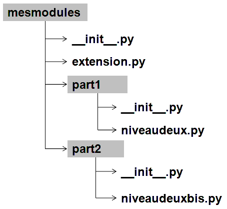

.. _l-module:

.. _chap_module:

=======
Modules
=======

.. contents::
    :local:
    :depth: 2

.. index:: module

Il est souvent préférable de répartir le code d'un grand programme
sur plusieurs fichiers. Parmi tous ces fichiers, un seul est considéré comme
fichier principal, il contient son point d'entrée, les premières instructions
exécutées. Les autres fichiers sont considérés comme des modules, en quelque
sorte, des annexes qui contiennent tout ce dont le fichier principal a besoin.

Modules et fichiers
===================

Exemple
-------

.. index:: point d'entrée

Cet exemple montre comment répartir un programme sur deux fichiers.
Le premier est appelé \textit{module} car il n'inclut pas le point d'entrée du programme.

.. mathdef::
    :title: point d'entrée du programme
    :tag: Définition

    Le point d'entrée d'un programme est la première instruction
    exécutée par l'ordinateur lors de l'exécution
    de ce programme.

.. index:: import

Cet exemple de module contient une fonction, une classe et une
variable. Ces trois éléments peuvent être utilisés par n'importe
quel fichier qui importe ce module. Le nom d'un module correspond
au nom du fichier sans son extension.

.. runpython::
    :showcode:

    """
    exemple de module, aide associée
    """

    exemple_variable = 3

    def exemple_fonction () :
        """exemple de fonction"""
        return 0

    class exemple_classe :
        """exemple de classe"""
        def __str__ (self) :
            return "exemple_classe"

Pour l'utiliser, il suffit de l'importer avec le mot clé
`import <https://docs.python.org/3.6/library/functions.html#__import__>`_ :

::

    import module_exemple

    c = module_exemple.exemple_classe ()
    print(c)
    print(module_exemple.exemple_fonction())
    help(module_exemple)

Et le résultat est :

.. runpython::

    exemple_variable = 3

    def exemple_fonction () :
        return 0

    class exemple_classe :
        def __str__ (self) :
            return "exemple_classe"

    c = exemple_classe ()
    print(c)
    print(exemple_fonction())

La dernière instruction affiche l'aide du module :

::

    Help on module module_exemple:

    NAME
        module_exemple - exemple de module, aide associée

    CLASSES
        builtins.object
            exemple_classe

        class exemple_classe(builtins.object)
         |  exemple de classe
         |
         |  Methods defined here:
         |
         |  __str__(self)
         |      Return str(self).
         |
         |  ----------------------------------------------------------------------
         |  Data descriptors defined here:
         |
         |  __dict__
         |      dictionary for instance variables (if defined)
         |
         |  __weakref__
         |      list of weak references to the object (if defined)

    FUNCTIONS
        exemple_fonction()
            exemple de fonction

    DATA
        exemple_variable = 3

    FILE
        module_exemple.py

Pour importer un module, il suffit d'insérer l'instruction \
``import nom_module`` avant d'utiliser une des choses qu'il définit.
Ces importations sont souvent regroupées au début du programme, elles
sont de cette façon mises en évidence même s'il est possible de les
faire n'importe où. L'exemple ci-dessus à droite importe le module
défini à gauche. Les modules commencent le plus souvent par une chaîne de
caractères comme dans l'exemple précédent, celle-ci contient l'aide
associée à ce module. Elle apparaît avec l'instruction ``help(module_exemple)``.

Rien ne différencie les deux fichiers ``module_exemple.py`` et
``exemple.py`` excepté le fait que le second utilise des éléments
définis par le premier. Dans un programme composé de plusieurs
fichiers, un seul contient le point d'entrée et tous les autres
sont des modules.

La syntaxe d'appel d'un élément d'un module est identique à celle
d'une classe. On peut considérer un module comme une classe avec
ses méthodes et ses attributs à la seule différence qu'il ne peut
y avoir qu'une seule instance d'un même module. La répétition de
l'instruction ``import module_exemple`` n'aura aucun effet : un module
n'est importé que lors de la première instruction ``import nom_module``
rencontré lors de l'exécution du programme.

.. index:: py, pyc

L'utilisation d'un module qu'on a soi-même conçu provoque l'apparition
d'un répertoire ``__pycache__`` qui contient des fichiers d'extension
``pyc``. Il correspond à la traduction du module en
`bytecode <https://docs.python.org/3/glossary.html#term-bytecode>`_
plus rapidement exploitable par l'interpréteur *python*. Ce fichier
est généré à chaque modification du module. Lorsqu'un module est importé,
*python* vérifie la date des deux fichiers d'extension ``py`` et ``pyc``.
Si le premier est plus récent, le second est recréé. Cela permet
un gain de temps lorsqu'il y a un grand nombre de modules. Il faut
faire attention lorsque le fichier source d'extension ``py`` est
supprimé, il est alors encore possible de l'importer tant que sa
version d'extension ``pyc`` est présente.

Le module ``module_exemple`` contient une variable ``exemple_variable`` peut
être modifiée au cours de l'exécution du programme. Il est possible de
revenir à sa valeur initiale en forçant *python* à recharger le
module grâce à la fonction `import.reload <https://docs.python.org/3/library/importlib.html#importlib.reload>`_
elle même implémentée dans le module
`importlib <https://docs.python.org/3/library/importlib.html?highlight=reload#module-importlib>`_.

::

    import importlib
    import module_exemple
    module_exemple.exemple_variable = 10
    importlib.reload(module_exemple)
    print(module_exemple.exemple_variable)      # affiche 3

Autres syntaxes
---------------

Il existe trois syntaxes différentes pour importer un module.
La première est décrite au paragraphe précédent. Il en existe une
autre qui permet d'affecter à un module un identificateur
différent du nom du fichier dans lequel il est décrit. En ajoutant
l'instruction ``as`` suivi d'un autre nom ``alias``, le module sera
désigné par la suite par l'identificateur ``alias`` comme le
montre l'exemple suivant.

::

    import module_exemple as alias

    c = alias.exemple_classe()
    print(c)
    print(alias.exemple_fonction())

La syntaxe suivante n'est pas recommandée car elle masque le module d'où
provient une fonction en plus de tout importer.

::

    from module_exemple import *  # décommmandé
    from module_exemple import exemple_classe, exemple_fonction

    c = exemple_classe()
    print(c)
    print(exemple_fonction())

De plus, la partie ``import *`` permet d'importer toutes les classes,
attributs ou fonctions d'un module mais il est possible d'écrire
``from module_exemple import exemple_class`` pour n'importer que cette classe.
Dernier moyen, il est possible d'importer un module dont on ne connaît le
nom que lors de l'exécution :

::

    alias = __import__("module_exemple")

    c = alias.exemple_classe()
    print(c)
    print(alias.exemple_fonction())

Nom d'un module
---------------

Le nom d'un module est défini par le nom du fichier sous
lequel il est enregistré. Dans l'exemple du paragraphe précédent,
le module avait pour nom de fichier ``module_exemple.py``,
le nom de ce module est donc ``module_exemple``.

Néanmoins, ce module peut également être exécuté comme un
programme normal. Si tel est le cas, son nom devient ``__main__``.
C'est pourquoi, les quelques lignes qui suivent apparaissent souvent.
Elles ne sont exécutées que si ce fichier a pour nom ``__main__``.
Un seul fichier peut porter ce nom : celui qui contient le point d'entrée.

::

    if __name__ == "__main__":
        print("ce fichier est le programme principal")

Cette astuce est régulièrement utilisée pour tester les fonctions
et classes définies dans un module. Etant donné que cette partie n'est
exécutée que si ce fichier est le programme principal, ajouter du code
après le test ``if __name__ == "__main__":`` n'a aucune incidence sur
tout programme incluant ce fichier comme module.

Emplacement d'un module
-----------------------

Lorsque le module est placé dans le même répertoire que
le programme qui l'utilise, l'instruction ``import nom_module_sans_extension``
suffit. Cette instruction suffit également si ce module est placé
dans le répertoire ``site-packages`` présent dans le répertoire
d'installation de *python*. Si ce n'est pas le cas, il faut préciser
à l'interpréteur *python* où il doit chercher ce module :

::

    import sys
    sys.path.append("répertoire où se trouve le module à importer")
    import nom_module

La variable `sys.path <https://docs.python.org/3/library/sys.html#sys.path>`_
contient les répertoires où *python* va chercher les modules. Le premier
d'entre eux est le répertoire du programme. Il suffit d'ajouter à
cette liste le répertoire désiré.
Il est conseillé d'utiliser le plus souvent possible des
chemins relatifs et non absolus. Il est aussi déconseillé d'utiliser cette technique.
Il vaut mieux utiliser des *import* relatifs.

    *Aparté.* Depuis un répertoire, les chemins relatifs permettent de faire référence
    à d'autres répertoires sans avoir à prendre en compte leur emplacement
    sur le disque dur contrairement aux chemins absolus comme
    ``C:\Python36_x64\python.exe`` qui parte de la racine.
    De cette façon, on peut recopier
    le programme et ses modules à un autre endroit du disque dur sans
    altérer leur fonctionnement.

Ce qui ne marche pas : les import cycliques
-------------------------------------------

Deux modules ne peuvent s'importer l'un l'autre.

::

    # module1.py
    from .module2 import B
    def A():
        return ...

::

    # module2.py
    from .module1 import A
    def B():
        return ...

Le module ``module1`` import le module ``module2`` qui cherche à son tour à importer
le module ``module1`` et c'est sans fin. Il est possible d'éviter de cela
en retardant l'un des deux imports.

::

    # module1.py
    from .module2 import B
    def A():
        return ...

::

    # module2.py
    def B():
        from .module1 import A
        return ...

Le second import n'a lieu qu'à la première exécution de la fonction ``B``.
Ca marche mais cela veut dire aussi que la fonction ``B`` contiendra une
instruction de plus.

Ajouter un module en cours d'exécution
--------------------------------------

De la même façon que *python* est capable d'inclure de nouvelles
portions de code en cours d'exécution
(fonction `exec <https://docs.python.org/3/library/functions.html#exec>`_),
il est également capable d'inclure en cours d'exécution des
modules dont on ne connaît pas le nom au début de l'exécution.
Cela s'effectue grâce à la fonction ``__import__`` déjà présentée
ci-dessus. Néanmoins, cette fonction ne peut pas importer un
module si celui-ci est désigné par un nom de fichier incluant
son répertoire. Il faut d'abord déterminer le répertoire où est
le module grâce à la fonction
`split <https://docs.python.org/3.6/library/stdtypes.html#str.split>`_
du module
`os.path <https://docs.python.org/3.6/library/os.path.html?highlight=os.path#module-os.path>`_.
Le programme suivant illustre cette possibilité en proposant une
fonction qui importe un module connaissant le nom du fichier qui le contient.
Il ne faut pas oublier d'enlever l'extension et ne pas garder aucun répertoire.

::

    alias = __import__("module_exemple.py".replace(".py", ""))

    c = alias.exemple_classe()
    print(c)
    print(alias.exemple_fonction())

Liste des modules importés
--------------------------

Le dictionnaire `modules <https://docs.python.org/3/library/sys.html?highlight=modules#sys.modules>`_
du module `sys <https://docs.python.org/3/library/sys.html>`_ contient l'ensemble
des modules importés. Le programme suivant affiche cette liste.

.. runpython::
    :showcode:

    import sys
    i = 0
    for m in sys.modules :
        print(m, " " * (14 - len(str(m))), sys.modules[m])
        if i > 5:
            break
        i += 1

Lorsque le programme stipule l'import d'un module, *python* vérifie
s'il n'est pas déjà présent dans cette liste. Dans le cas contraire,
il l'importe. Chaque module n'est importé qu'une seule fois. La première
instruction ``import module_exemple`` rencontrée introduit une nouvelle
entrée dans le dictionnaire `modules <https://docs.python.org/3/library/sys.html?highlight=modules#sys.modules>`_ :

::

    module_exemple  <module 'module_exemple' from 'D:\python_cours\module_exemple.py'>

Le dictionnaire `modules <https://docs.python.org/3/library/sys.html?highlight=modules#sys.modules>`_
peut être utilisé pour vérifier la présence d'un module ou lui assigner un autre
identificateur. Un module est un objet qui n'autorise qu'une seule instance.

::

    if "module_exemple" in sys.modules:
        m = sys.modules["module_exemple"]
        m.exemple_fonction()

Attributs communs à tout module
-------------------------------

Une fois importés, tous les modules possèdent cinq attributs qui contiennent
des informations comme leur nom, le chemin du fichier correspondant, l'aide associée.

.. list-table::
    :widths: 5 10
    :header-rows: 0

    * - ``__all__``
      - Contient toutes les variables, fonctions, classes du module
    * - ``__builtins__``
      - Ce dictionnaire contient toutes les fonctions et classes inhérentes au langage *python*
        utilisées par le module.
    * - ``__doc__``
      - Contient l'aide associée au module.
    * - ``__file__``
      - Contient le nom du fichier qui définit le module.
    * - ``__name__``
      - Cette variable contient a priori le nom du module sauf si le module
        est le point d'entrée du programme auquel cas cette variable
        contient ``__main__``.

Ces attributs sont accessibles si le nom du module est utilisé
comme préfixe. Sans préfixe, ce sont ceux du module lui-même.

.. runpython::
    :showcode:

    import os
    print(os.__name__, os.__doc__)
    if __name__ == "__main__":
        print("ce fichier est le point d'entrée")
    else:
        print("ce fichier est importé")

Arborescence de modules, paquetage
----------------------------------

Lorsque le nombre de modules devient conséquent, il est parfois
souhaitable de répartir tous ces fichiers dans plusieurs répertoires.
Il faudrait alors inclure tous ces répertoires dans la liste
`sys.path <https://docs.python.org/3/library/sys.html#sys.path>`_
ce qui paraît fastidieux. *python* propose la définition de paquetage,
ce dernier englobe tous les fichiers *python* d'un répertoire à
condition que celui-ci contienne un fichier ``__init__.py`` qui peut
être vide. La figure suivante présente une telle organisation et
l'exemple suivant explicite comment importer chacun de ces fichiers
sans avoir à modifier les chemins d'importation.

Les répertoires sont grisées tandis que les fichiers apparaissent avec leur extension.

::

    import mesmodules.extension
    import mesmodules.part1.niveaudeux
    import mesmodules.part2.niveaudeuxbis

Lors de la première instruction ``import mesmodules.extension``, le langage *python*
ne s'intéresse pas qu'au seul fichier ``extension.py``, il exécute également le
contenu du fichier ``__init__.py``. Si cela est nécessaire, c'est ici
qu'il faut insérer les instructions à exécuter avant l'import de n'importe
quel module du paquetage.

Import relatif
--------------

Les modules permettent d'écrire des programmes dans une succession de petits
fichiers et c'est plus lisible comme cela.
Les `imports relatifs <http://stackoverflow.com/questions/14132789/relative-imports-for-the-billionth-time>`_
Voici un ensemble de fichier avec une fonction implémentée dans chacun.

::

    package/
        __init__.py       # fonction A
        subpackage1/
            __init__.py   # fonction B
            moduleX.py    # fonction C
        subpackage2/
            __init__.py   # fonction D
            moduleY.py    # fonction E
        moduleA.py        # fonction F

La fonction ``A`` peut utiliser la fonction ``B`` ou ``C`` en les important
de la façon suivante :

::

    from .subpackage1 import B
    from .subpackage1.moduleX import C

La fonction ``E`` peut utiliser la fonction ``F`` ou ``A`` ou ``C`` en les important
de la façon suivante :

::

    from ..moduleA import F
    from .. import A
    from ..subpackage1.moduleX import C

Ce qu'il faut retenir :

* Le symbole ``.`` permet d'importer un module dans le même répertoire.
* Le symbole ``..`` permet d'importer un module dans le répertoire parent.
* Le fichier ``__init__.py`` est essentiel pour signifier qu'un répertoire
  contient des fichiers *python*.
* Il n'existe qu'une syntaxe : ``from .<module> import``.

Modules internes
================

*python* dispose de nombreux modules préinstallés.
La page `Python Module Index <https://docs.python.org/3/py-modindex.html>`_
recense tous les modules disponibles par défaut avec *python*.
Cette liste est trop longue pour figurer dans ce document, elle est aussi
susceptible de s'allonger au fur et à mesure du développement du langage
*python*. La table qui suit regroupe les modules les plus utilisés.

.. list-table::
    :widths: 5 10
    :header-rows: 0

    * - `asyncio <https://docs.python.org/3/library/asyncio.html>`_
      - Thread, socket, protocol.
    * - `calendar <https://docs.python.org/3/library/calendar.html>`_
      - Gérer les calendriers, les dates.
    * - `cgi <https://docs.python.org/3/library/cgi.html>`_
      - Utilisé dans les scripts CGI (programmation Internet).
    * - `cmath <https://docs.python.org/3/library/cmath.html>`_
      - Fonctions mathématiques complexes.
    * - `copy <https://docs.python.org/3/library/copy.html>`_
      - Copies d'instances de classes.
    * - `csv <https://docs.python.org/3/library/csv.html>`_
      - Gestion des fichiers au format CSV
    * - `datetime <https://docs.python.org/3/library/datetime.html>`_
      - Calculs sur les dates et heures
    * - `gc <https://docs.python.org/3/library/gc.html>`_
      - Gestion du garbage collector
    * - `getopt <https://docs.python.org/3/library/getopt.html>`_
      - Lire les options des paramètres passés en arguments d'un programme *python*
    * - `glob <https://docs.python.org/3/library/glob.html>`_
      - Chercher des fichiers
    * - `hashlib <https://docs.python.org/3/library/hashlib.html>`_
      - Fonctions de cryptage
    * - `htmllib <https://docs.python.org/3/library/htmllib.html>`_
      - Lire le format HTML
    * - `importlib <https://docs.python.org/3/library/importlib.html>`_
      - Pour importer des modules.
    * - `math <https://docs.python.org/3/library/math.html>`_
      - Fonctions mathématiques standard telles que
        `cos <https://docs.python.org/3/library/math.html?highlight=cos#math.cos>`_,
        `exp <https://docs.python.org/3/library/math.html?highlight=exp#math.exp>`_,
        `log <https://docs.python.org/3/library/math.html?highlight=exp#math.log>`_...
    * - `os <https://docs.python.org/3/library/os.html>`_
      - Fonctions systèmes dont certaines fonctions permettant de gérer les fichiers
    * - `os.path <https://docs.python.org/3/library/os.path.html>`_
      - Manipulations de noms de fichiers
    * - `pathlib <https://docs.python.org/3/library/pathlib.html>`_
      - Manipulation de chemins.
    * - `pickle <https://docs.python.org/3/library/pickle.html>`_
      - Sérialisation d'objets, la sérialisation consiste à convertir des données
        structurées de façon complexe en une structure linéaire facilement enregistrable dans un fichier
    * - `profile <https://docs.python.org/3/library/profile.html>`_
      - Etudier le temps passé dans les fonctions d'un programme
    * - `random <https://docs.python.org/3/library/random.html>`_
      - Génération de nombres aléatoires
    * - `re <https://docs.python.org/3/library/re.html>`_
      - Expressions régulières
    * - `shutil <https://docs.python.org/3/library/shutil.html>`_
      - Copie de fichiers
    * - `sqlite3 <https://docs.python.org/3/library/sqlite3.html>`_
      - Accès aux fonctionnalités du gestionnaire de base de données SQLite3
    * - `string <https://docs.python.org/3/library/string.html>`_
      - Manipulations des chaînes de caractères
    * - `sys <https://docs.python.org/3/library/sys.html>`_
      - Fonctions systèmes, fonctions liées au langage *python*
    * - `threading <https://docs.python.org/3/library/threading.html>`_
      - Utilisation de threads
    * - `time <https://docs.python.org/3/library/time.html>`_
      - Accès à l'heure, l'heure système, l'heure d'une fichier
    * - `tkinter <https://docs.python.org/3/library/tkinter.html>`_
      - Interface graphique
    * - `unittest <https://docs.python.org/3/library/unittest.html>`_
      - Tests unitaires (ou comment améliorer la fiabilité d'un programme)
    * - `urllib <https://docs.python.org/3/library/urllib.html>`_
      - Pour lire le contenu de page HTML sans utiliser un navigateur
    * - `xml.dom <https://docs.python.org/3/library/xml.dom.html>`_
      - Lecture du format XML.
    * - `xml.sax <https://docs.python.org/3/library/xml.sax.html>`_
      - Lecture du format XML.
    * - `zipfile <https://docs.python.org/3/library/zipfile.html>`_
      - Lecture de fichiers ZIP.

Certains de ces modules sont présentés dans les chapitres qui suivent.
Le programme suivant par exemple utilise les modules
`random <https://docs.python.org/3/library/random.html>`_
`math <https://docs.python.org/3/library/math.html>`_
pour estimer le nombre :math:`\pi`.
Pour cela, on tire aléatoirement deux nombres :math:`x,y` dans l'intervalle
:math:`[0,1]`, si :math:`\sqrt{x^2+y^2} \infegal 1`,
on compte 1 sinon 0. Au final,
:math:`\hat{\pi} = \esp{\indicatrice{\sqrt{x^2+y^2} \infegal 1}}`.

.. runpython::
    :showcode:

    import random
    import math

    somme = 0
    nb    = 1000000
    for i in range (0,nb) :
        x = random.random()         # nombre aléatoire entre [0,1]
        y = random.random()
        r = math.sqrt(x*x + y*y)    # racine carrée
        if r <= 1:
            somme += 1

    print("estimation ", 4 * float (somme) / nb)
    print("PI = ", math.pi)

Le programme suivant calcule l'intégrale de
`Monte Carlo <https://fr.wikipedia.org/wiki/M%C3%A9thode_de_Monte-Carlo>`_
de la fonction :math:`f(x)=\sqrt{x}` qui consiste à tirer des nombres
aléatoires dans l'intervalle :math:`[a,b]`
puis à faire la moyenne des :math:`\sqrt{x}` obtenu.

.. runpython::
    :showcode:

    import random  # import du module random : simulation du hasard
    import math    # import du module math : fonctions mathématiques

    def integrale_monte_carlo (a,b,f,n):
        somme = 0.0
        for i in range(0,n):
            x = random.random() * (b-a) + a
            y = f(x)
            somme += f(x)
        return somme / n

    def racine(x):
        return math.sqrt(x)

    print(integrale(0,1,racine,100000))

Modules externes
================

Les modules externes ne sont pas fournis avec *python*, ils nécessitent
une installation supplémentaire. Il serait impossible de couvrir tous les
thèmes abordés par ces extensions. La simplicité d'utilisation du langage
*python* et son interfaçage facile avec le langage `C <https://en.wikipedia.org/wiki/C_(programming_language)>`_
contribue à sa popularité. Il permet de relier entre eux des
projets conçus dans des environnements différents, dans des langages
différents. Depuis les versions 2.3, 2.4 du langage *python*,
la plupart des modules externes sont faciles à installer, faciles
à utiliser d'après les exemples que fournissent de plus en plus
les sites Internet qui les hébergent. De plus, il s'écoule peu de
temps entre la mise à disposition d'une nouvelle version du langage
*python* et la mise à jour du module pour cette version

De nombreux modules ont été conçus pour un besoin spécifique et ne sont
plus maintenus. Cela convient lors de l'écriture d'un programme qui
remplit un besoin ponctuel. Pour une application plus ambitieuse, il
est nécessaire de vérifier quelques informations comme la date
de création, celle de la dernière mise à jour, la présence d'une
documentation, une prévision pour la sortie de la future version,
si c'est une personne lambda qui l'a conçu ou si c'est une organisation
comme celle qui fournit le module
`tensorflow <https://pypi.python.org/pypi/tensorflow/>`_.
Tout va souvent très vite. Le nombre de modifications est
un critère assez simple pour s'assurer qu'un module
est maintenu : `commit <https://github.com/etetoolkit/ete/commits/master>`_.
La plupart des modules sont sur Github aujourd'hui. S'il ne l'est pas,
passez votre chemin.

L'installation de modules externes n'est pas toujours simple, certains comme
`scipy <https://pypi.python.org/pypi/scipy>`_ incluent des fichiers C++ qui doivent être compilés.
Dans tous les cas, le code source des fichiers inclut un fichier ``setup.py``.
Le langage *python* fournit une procédure d'installation standard :

::

    python setup.py install

Ce procédé marche la plupart du temps. Il échoue lorsque le module
inclut des fichiers écrits dans un autre langage.
L'installation dépend alors du système d'exploitation.
Il est plus simple dans le cas d'installation des modules
précmopilés. Sous Windows, beaucoup sont accessibles sur cette page :
`Unofficial Windows Binaries for Python Extension Packages <http://www.lfd.uci.edu/~gohlke/pythonlibs/>`_.
